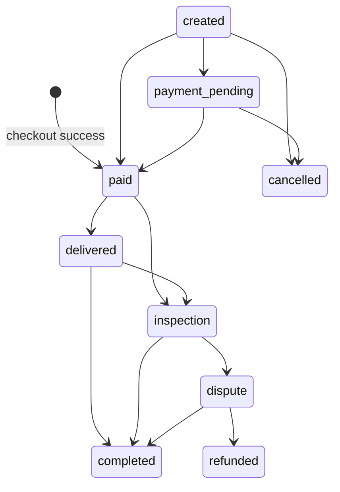

# Orders lifecycle

## Main order routes

| Method | Route |
| --- | --- |
| `GET` | `/api/client/orders` |
| `GET` | `/api/client/orders/:id` |
| `PUT` | `/api/client/orders/:id/received` |
| `POST` | `/api/client/orders/:id/complete-delivery` |
| `POST` | `/api/client/orders/:id/confirm-inspection` |

## Order detail response

The buyer app should render:

- `id`, `order_id`
- `merchant_slug`, `merchant_store_name`
- `delivery_address_id`
- `delivery_address_location`
- `status`, `payment_status`
- `status_rendering.label`, `status_rendering.available_action`
- `items`
- `paid_at`, `delivered_at`, `inspection_ends_at`, `completed_at`, `cancelled_at`

## Status model

| Status | Meaning | Typical action |
| --- | --- | --- |
| `created` | waiting for payment | refresh / payment status |
| `payment_pending` | provider pending | refresh / payment status |
| `merchant_pending` | merchant approval hold | passive wait |
| `paid` | paid and preparing delivery | track delivery |
| `delivered` | delivered but not yet inspected | start inspection or complete delivery |
| `inspection` | inspection period is open | confirm inspection or open dispute |
| `completed` | terminal success | read-only, but dispute opening is still allowed |
| `dispute` | dispute is active | open dispute detail |
| `refunded` | buyer-favor terminal state | read-only |
| `cancelled` | terminal cancel/failure state | read-only |

## Transition summary

## UI rules

- Use order UUID `id` for detail pages and actions.
- Show `order_id` only as the public display number.
- Delivery movement belongs to delivery state, not to extra custom order statuses.
- The client may open a dispute only when the order status is `delivered`, `inspection`, or `completed`.
- Refresh order detail after client-side order mutations and when related notification/dispute events matter.
