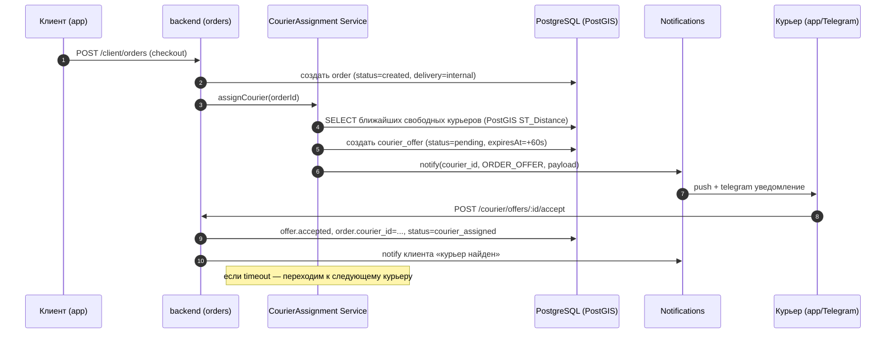
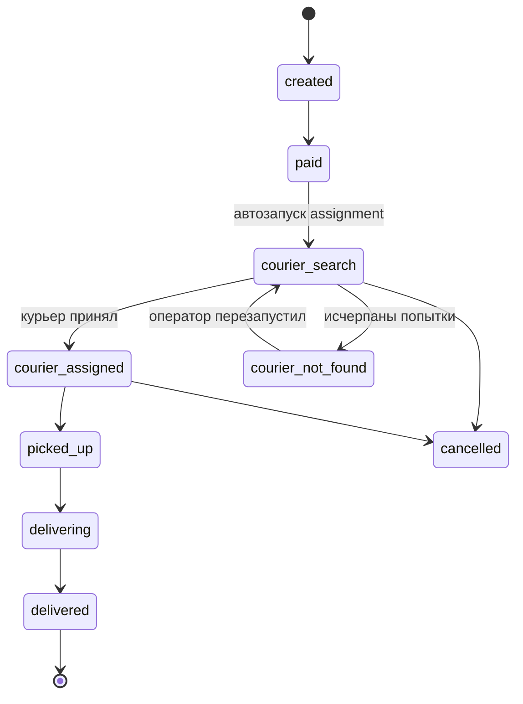

# План: упрощение клиентских заказов — отказ от JuraTaxi, доставка собственными курьерами

## 1. Контекст и постановка

Сейчас клиентский заказ оформляется по схеме «корзина → checkout → внешний провайдер доставки **JuraTaxi**». Провайдер получает заказ, ищет водителя/курьера, шлёт нам webhook'и о статусе. Это даёт лишнюю внешнюю зависимость, задержки, расходы и сложный пайплайн вебхуков.

**Цель:** убрать JuraTaxi из клиентского флоу заказа и заменить его на собственный механизм:
- сразу после оформления заказа находим **ближайшего свободного курьера** из нашей системы;
- пушим ему уведомление с предложением принять заказ;
- курьер принимает/отклоняет → дальше идут наши собственные статусы доставки.

Вход (UX): без изменений — клиент так же оформляет заказ, выбирает адрес/время. Меняется только то, что происходит «под капотом» после checkout.

### Что уже есть (по результатам разведки кода)

- `app/backend/src/modules/client/orders` — клиентский pipeline заказа с провайдером `jurataxi-delivery.provider.ts` за интерфейсом `delivery-provider.interface.ts`.
- `app/backend/src/modules/merchant/delivery` + `app/backend/src/modules/admin/orders/services/admin-order-delivery.service.ts` — серверная сторона JuraTaxi.
- `app/backend/src/modules/client/delivery` — webhook-приёмник от JuraTaxi (`delivery-webhook.controller.ts`).
- `UserRole.COURIER` уже определён, есть `current-courier.decorator.ts` — значит, инфраструктура для курьера частично заложена.
- `warehouses` имеют координаты (миграция `merchant-warehouse-coordinates-required.psql`), `orders` имеют delivery location (`require-order-delivery-location.psql`).

---

## 2. Целевой поток



---

## 3. Доменная модель (новые/изменённые таблицы)

### 3.1 `couriers`
| Поле | Тип |
|---|---|
| `id` | uuid PK (= users.id или отдельный) |
| `user_id` | uuid FK → users (role=courier) |
| `status` | enum(`offline`,`online`,`busy`) |
| `current_location` | geography(Point, 4326) NULL |
| `location_updated_at` | timestamptz NULL |
| `vehicle_type` | enum(`foot`,`bike`,`scooter`,`car`) |
| `service_warehouse_ids` | uuid[] | склады/зоны, к которым прикреплён курьер |
| `max_active_orders` | int DEFAULT 1 |
| `telegram_chat_id` | bigint NULL | для Telegram-бота |
| `created_at`/`updated_at` | timestamptz |

Индекс GIST на `current_location` для быстрого `ST_Distance`/`ST_DWithin`.

### 3.2 `courier_offers`
| Поле | Тип |
|---|---|
| `id` | uuid PK |
| `order_id` | uuid FK |
| `courier_id` | uuid FK |
| `status` | enum(`pending`,`accepted`,`declined`,`expired`,`cancelled`) |
| `offered_at` | timestamptz |
| `expires_at` | timestamptz |
| `responded_at` | timestamptz NULL |
| `decline_reason` | text NULL |
| `attempt_no` | int | номер попытки в рамках заказа |

Индексы: `(order_id, status)`, `(courier_id, status)`.

### 3.3 `orders` — изменения
- `delivery_provider` enum: добавить значение `internal` (станет дефолтом). `jurataxi` помечаем как `deprecated` (но не удаляем — старые заказы должны открываться).
- Новое поле `courier_id` uuid NULL FK → couriers.
- Новый статус `courier_search` (между `paid`/`accepted` и `delivering`).
- Новое поле `courier_assigned_at` timestamptz NULL.

### 3.4 `courier_location_history` (опционально)
Логируем точки трекинга (для отладки и ETA), TTL ~7 дней.

---

## 4. Алгоритм назначения курьера

### Параметры (конфигурируемые)
- `OFFER_TTL_SECONDS` = 60
- `MAX_ATTEMPTS_PER_ORDER` = 5
- `SEARCH_RADIUS_KM_STEPS` = `[2, 5, 10, 20]` — расширяем радиус, если никого нет
- `BLACKLIST_ON_DECLINE_MINUTES` = 15 (курьер, отказавшийся от заказа, не получает его повторно)

### Шаги
1. Берём `orders.warehouse_id` → координаты склада (точка пикапа).
2. SQL: `SELECT couriers WHERE status='online' AND warehouse_id IN service_warehouse_ids AND active_orders < max_active_orders AND id NOT IN (already_offered) ORDER BY ST_Distance(current_location, warehouse_point) LIMIT 1`.
3. Создаём `courier_offer(pending, expires_at=now+60s)`, шлём уведомление.
4. Курьер `accept` → атомарно: `UPDATE orders SET courier_id=?, status='courier_assigned' WHERE id=? AND courier_id IS NULL` (защита от гонки), `UPDATE courier_offers SET status='accepted'`. Все остальные pending offers по этому заказу → `cancelled`.
5. Курьер `decline` или таймаут → следующая итерация (новый offer).
6. После `MAX_ATTEMPTS` — заказ → `status=courier_not_found`, уведомляем оператора (manual reassignment через админ-панель).

### Гонки и идемпотентность
- Принятие offer'а — через `SELECT ... FOR UPDATE` или CAS-update по `orders.courier_id IS NULL`.
- Cron `courier-offers-expiry` каждые 10 секунд переводит просроченные offers в `expired` и инициирует следующую попытку.

---

## 5. Бэкенд — изменения по модулям

### 5.1 Удаляем/деактивируем JuraTaxi из клиентского флоу
- `client/orders/services/providers/jurataxi-delivery.provider.ts` → удалить из DI (модуль), сам файл архивируем (можно оставить под флагом для legacy-заказов).
- `client/delivery/controllers/delivery-webhook.controller.ts` — оставляем endpoint, но в новом флоу он не вызывается. Возвращает 410 Gone, если приходит после даты cutover (для безопасности).
- `client/orders/services/order-delivery.service.ts` — переписываем: вместо вызова провайдера → вызов `CourierAssignmentService`.
- `merchant/delivery` и `admin/orders/admin-order-delivery.service.ts` — оставляем для совместимости со старыми заказами; новые заказы туда не попадают.

### 5.2 Новый модуль `client/courier-assignment` (или `core/courier-dispatch`)
Структура:
```
core/courier-dispatch/
  ├── services/
  │   ├── courier-assignment.service.ts       # основной алгоритм
  │   ├── courier-offer.service.ts            # CRUD offers, accept/decline
  │   ├── courier-availability.service.ts     # status/location updates
  │   └── courier-search.service.ts           # SQL поиска ближайших
  ├── sql/
  │   ├── couriers.sql / couriers.queries.ts
  │   └── courier-offers.sql / courier-offers.queries.ts
  ├── dto/
  ├── tests/
  └── courier-dispatch.module.ts
```

### 5.3 Новый модуль `courier/*` (приложение курьера)
- `courier/auth` — отдельный auth flow по OTP (telegram chat_id привязка).
- `courier/orders/controllers/courier-orders.controller.ts`:
  - `GET /courier/offers/active` — текущее предложение.
  - `POST /courier/offers/:id/accept`
  - `POST /courier/offers/:id/decline`
  - `GET /courier/orders/active` — мои активные.
  - `POST /courier/orders/:id/picked-up`
  - `POST /courier/orders/:id/delivered`
- `courier/profile/controllers/courier-profile.controller.ts`:
  - `PATCH /courier/profile/status` (`online`/`offline`)
  - `POST /courier/profile/location` (lat, lng) — батч-эндпоинт.

### 5.4 Админ-панель API
- `admin/couriers` — CRUD курьеров, привязка к складам, ручное переназначение заказа: `POST /admin/orders/:id/assign-courier {courierId}`.
- `admin/orders` — просмотр истории offers по заказу.

### 5.5 Изменения в state machine заказа


### 5.6 Cron-worker
- Новый job `courier-offers-expiry` (каждые 10 сек) — экспирация offers + триггер следующей попытки.
- Новый job `courier-stale-locations` (раз в минуту) — переводит курьеров с `location_updated_at < now-5m` в `offline`.

---

## 6. Зависимости

- **PostGIS** — расширение PostgreSQL для геозапросов. Если ещё не подключено — миграция `CREATE EXTENSION postgis`.
- **Notifications** — нужны новый event `ORDER_OFFER`, `ORDER_ASSIGNED`, `ORDER_PICKED_UP`, `ORDER_DELIVERED_TO_COURIER` и **роль получателя `courier`** (см. отдельный план `notifications-courier-telegram.md`).
- **Auth** — расширить sessions/JWT для роли COURIER (декоратор уже есть, но нужно проверить регистрацию guard'ов).
- **Mobile-приложение курьера** — отдельный трек (вне backend). На первое время можно обойтись только Telegram-ботом для accept/decline через inline-кнопки.

---

## 7. Поэтапная реализация

### Фаза 0 — предусловия
- PostGIS + миграции `couriers`, `courier_offers`, расширение `orders`.
- Роль `courier` в notifications + Telegram-провайдер (см. соседний план).
- Базовый `courier/auth` (OTP).

### Фаза 1 — MVP диспетчеризации
- `CourierAssignmentService` + SQL поиска ближайших.
- `courier-offer` accept/decline endpoints.
- Замена клиентского `order-delivery.service.ts`: вместо JuraTaxi — внутренний assignment.
- Cron `courier-offers-expiry`.
- Обновление state machine заказа (новые статусы).
- Уведомления курьеру (push + telegram).
- Тесты (TDD): unit на сервисы, integration на алгоритм назначения и гонки, e2e на полный сценарий.

### Фаза 2 — операторский контроль
- Админ-панель: список курьеров, ручное переназначение, история offers.
- Сценарий `courier_not_found` → уведомление оператору.

### Фаза 3 — полировка
- Шаги расширения радиуса, blacklist отказов.
- Трекинг геопозиции с историей, ETA.
- Аналитика: средняя скорость принятия, % отказов на курьера.
- Отключение JuraTaxi-кода (после полного перехода всех активных заказов).

---

## 8. Тесты (TDD Backend)

- Unit: `CourierAssignmentService.assign` — приоритеты, расширение радиуса, blacklist, исчерпание попыток.
- Integration (Testcontainers + PostGIS): корректность гео-сортировки, гонки на accept (два курьера одновременно нажимают «принять»).
- E2E: полный путь checkout → offer → accept → delivered.
- Регрессия: старые JuraTaxi-заказы остаются открываемыми и не падают.

---

## 9. Открытые вопросы

1. Использовать **PostGIS** или ограничиться формулой Haversine в SQL? (PostGIS даёт индексы и точность.)
2. Привязка курьера к **складу** (мерчанту) или к **зоне доставки** (полигоны)? В MVP предлагаю склад.
3. Что показывать клиенту в момент `courier_search`? «Ищем курьера…» с таймаутом N секунд.
4. Что делать при `courier_not_found`: автоматическая отмена заказа или ручная обработка оператором? Предлагаю — оператор.
5. Можно ли курьеру держать **несколько активных заказов** одновременно (батчинг)? В MVP — 1.
6. Хранить ли историю геопозиций (для прозрачности/споров) или только текущую точку?
7. Для аутентификации курьера — отдельное мобильное приложение, веб-приложение или достаточно Telegram-бота на старте?
