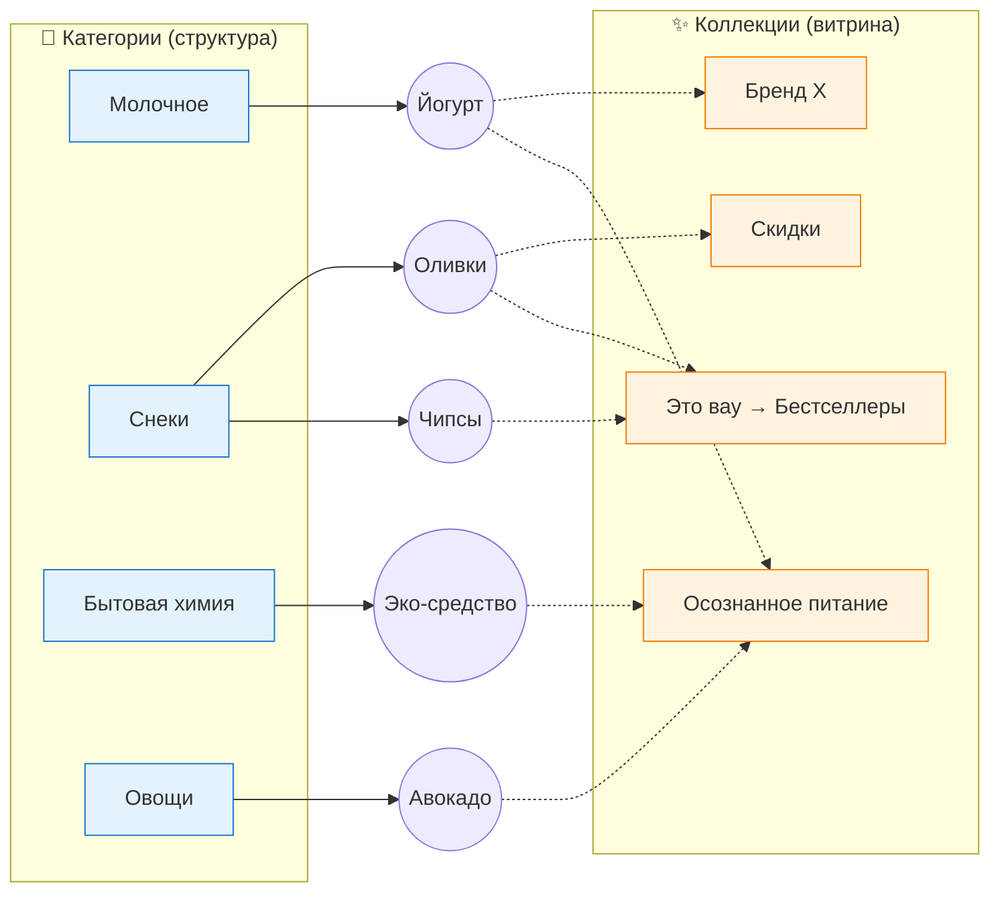
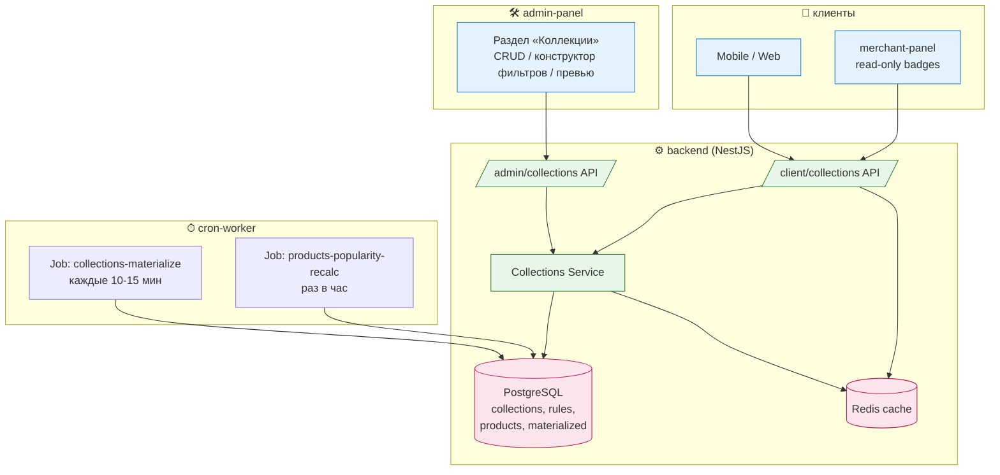
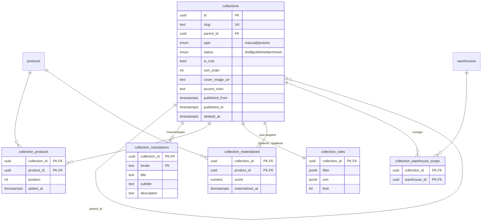
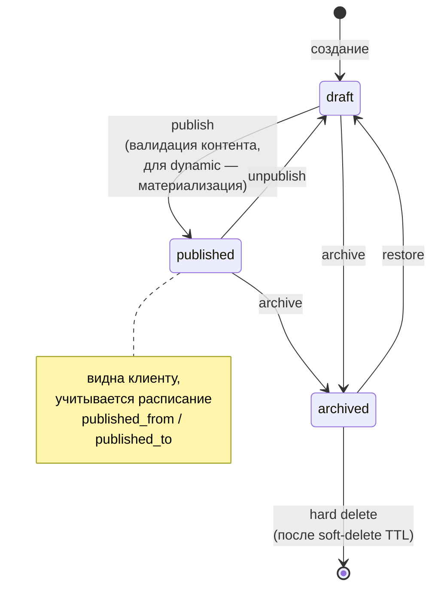
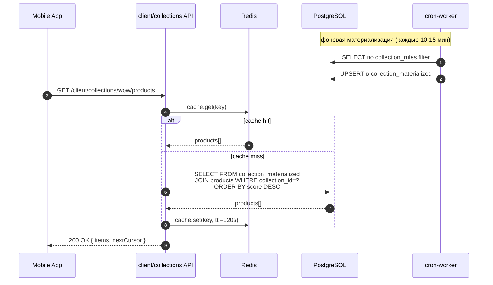
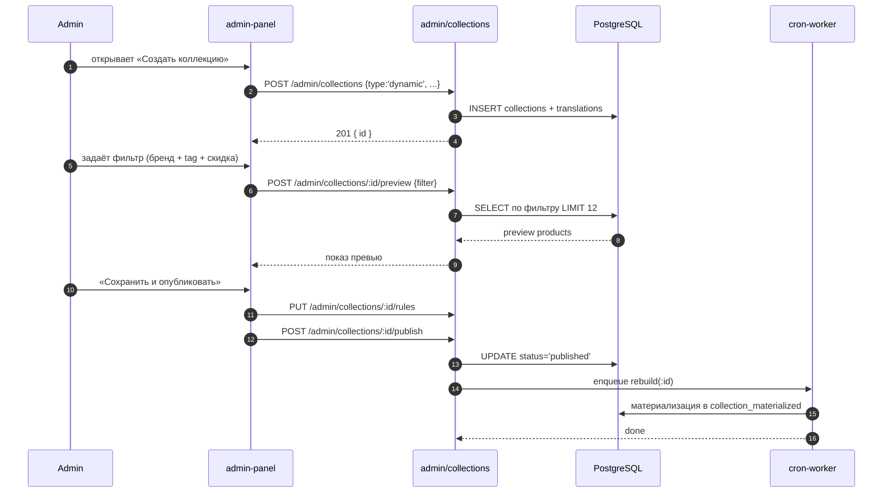

# План реализации фичи «Collections» (Коллекции / Подборки товаров)

## 1. Контекст и постановка задачи

В качестве референса взята Яндекс Лавка. Помимо обычной иерархии категорий, у Лавки есть отдельный механизм группировки товаров — **коллекции** (они же подборки / динамические каталоги / shelves). Примеры:

- «Осознанное питание» (с подгруппами: «Сбалансированное меню» и т.п.)
- «Помогаем выбрать»
- «Это вау» → «Редкие находки», «Уютные мелочи», «Бестселлеры»
- Брендовые подборки
- «Скидки», «Новинки», тематические сезонные подборки

Референсные ссылки:
- https://lavka.yandex.ru/catalog/grocery/category/unique_assortment_wow?context_id=_r_na_
- https://lavka.yandex.ru/adv-shelf-products?id=ac5ca93f-b18f-4b7f-9688-b27dfe257bf4

### Ключевое отличие от категорий

- **Категория** — это структурное место товара в каталоге (один товар = одна категория-лист, обычная иерархия).
- **Коллекция** — это маркетинговая/витринная группировка. Один товар может входить в несколько коллекций. Коллекции не влияют на «физическое» расположение товара в категории.

### Типы коллекций

1. **Ручная (manual)** — админ вручную добавляет товары в коллекцию.
   Примеры: «Подборка от редакции», «Лучшее за неделю».
2. **Динамическая (dynamic / smart)** — задаётся набор фильтров, товары подтягиваются автоматически.
   Примеры: «Все товары бренда X», «Все organic», «Со скидкой», «Новинки за 30 дней».
3. **Гибридная (опционально, фаза 2)** — динамическая выборка + ручные `pinned` / `excluded` товары.

### Структурные особенности

- Коллекция может иметь **подколлекции** (дерево, как у «Это вау» → «Редкие находки», «Бестселлеры»). Ограничиваем глубину (например, 2 уровня).
- Коллекция может быть **корневой** (видна в каталоге как отдельный «entry point») или **встроенной** (видна только внутри родителя / на витрине).
- Коллекции должны быть **локализуемыми** (RU/UZ/EN — как и остальной контент).
- Коллекции должны быть **видимы по складам/городам** (warehouse/region scope), чтобы можно было запускать локальные подборки.
- Поддержка **расписания публикации** (`publishedFrom` / `publishedTo`) для сезонных подборок.

### Концептуальная схема: Категория vs Коллекция



> Сплошная стрелка — структурная принадлежность (1 категория). Пунктир — членство в коллекции (M:N).

---

## 2. Решение, которое мы реализуем

Реализуем отдельную сущность `Collection` со связью many-to-many с `Product`, поддержкой иерархии и динамических правил. Категории и рецепты остаются независимыми механизмами.

### Затрагиваемые сервисы

- `app/backend` — основная схема, админский CRUD, клиентский readside, привязка к `products`, `categories`, `merchants`, `warehouses`.
- `app/cron-worker` — пересчёт динамических коллекций, прогрев кэша, материализация выборок.
- `app/admin-panel` — UI управления коллекциями (CRUD, ручной выбор товаров, конструктор фильтров, дерево, расписание, превью).
- `app/merchant-panel` — **только просмотр** того, в какие коллекции попадают товары мерчанта (по правилу backend ownership). Никакого CRUD коллекций мерчанту не даём в фазе 1.

---

### Карта сервисов и потоков данных



---

## 3. Доменная модель

### ER-диаграмма



### 3.1 Таблица `collections`

| Поле | Тип | Описание |
|---|---|---|
| `id` | uuid PK | |
| `slug` | text UNIQUE NOT NULL | Используется в URL (`/collections/wow`) |
| `parent_id` | uuid NULL FK → collections.id | Иерархия (макс. глубина = 2) |
| `type` | enum(`manual`,`dynamic`) NOT NULL | |
| `status` | enum(`draft`,`published`,`archived`) NOT NULL DEFAULT 'draft' | |
| `is_root` | boolean NOT NULL DEFAULT false | Видна как самостоятельный entry point в каталоге |
| `sort_order` | int NOT NULL DEFAULT 0 | Сортировка среди соседей |
| `cover_image_url` | text NULL | |
| `icon_url` | text NULL | |
| `accent_color` | text NULL | Для брендового оформления |
| `published_from` | timestamptz NULL | |
| `published_to` | timestamptz NULL | |
| `created_at` / `updated_at` / `deleted_at` | timestamptz | Soft delete |

### 3.2 Таблица `collection_translations`

| Поле | Тип |
|---|---|
| `collection_id` | uuid FK |
| `locale` | text (ru/uz/en) |
| `title` | text NOT NULL |
| `subtitle` | text NULL |
| `description` | text NULL |
| PK | (collection_id, locale) |

### 3.3 Таблица `collection_products` (только для `manual`)

| Поле | Тип |
|---|---|
| `collection_id` | uuid FK |
| `product_id` | uuid FK |
| `position` | int NOT NULL DEFAULT 0 |
| `added_at` | timestamptz NOT NULL DEFAULT now() |
| PK | (collection_id, product_id) |
| Индекс | (collection_id, position) |

### 3.4 Таблица `collection_rules` (для `dynamic`)

Хранит JSONB с фильтром.

| Поле | Тип |
|---|---|
| `collection_id` | uuid PK FK |
| `filter` | jsonb NOT NULL |
| `sort` | jsonb NOT NULL DEFAULT `{"by":"popularity","dir":"desc"}` |
| `limit` | int NULL (макс кол-во товаров; NULL = без лимита) |

Структура `filter` (пример):
```json
{
  "op": "and",
  "conditions": [
    { "field": "brand_id", "op": "in", "value": ["..."] },
    { "field": "tags", "op": "contains_any", "value": ["organic"] },
    { "field": "discount", "op": "gt", "value": 0 },
    { "field": "created_at", "op": "gte", "value": "now-30d" }
  ]
}
```

Поддерживаемые поля фильтра в фазе 1:
- `brand_id`, `category_id` (включая всех потомков), `merchant_id`
- `tags` (нужны теги — см. раздел 7)
- `discount` (есть/нет, %)
- `price` (диапазон)
- `created_at` (новинки)
- `popularity` (вычисляемый рейтинг — см. cron)
- `attributes.*` (если уже есть product-attributes)

### 3.5 Таблица `collection_materialized` (кэш динамики)

Чтобы не гонять тяжёлые фильтры на каждом запросе — материализуем результат и обновляем по cron.

| Поле | Тип |
|---|---|
| `collection_id` | uuid FK |
| `product_id` | uuid FK |
| `score` | numeric(12,4) NOT NULL | Для стабильной сортировки |
| `materialized_at` | timestamptz NOT NULL |
| PK | (collection_id, product_id) |
| Индекс | (collection_id, score DESC) |

### 3.6 Таблица `collection_warehouse_scope` (опционально, фаза 1.5)

| Поле | Тип |
|---|---|
| `collection_id` | uuid FK |
| `warehouse_id` | uuid FK |
| PK | (collection_id, warehouse_id) |

Если строк нет — коллекция доступна везде. Если есть — только в указанных складах.

---

## 4. Бэкенд (`app/backend`)

### 4.1 Структура модулей

- `src/modules/admin/collections/` — админский CRUD.
  - `controllers/` — REST + `*api.decorators.ts`.
  - `dto/` — DTO + Zod схемы по правилам `dto.instructions.md`.
  - `services/` — бизнес-логика, без сырого SQL (см. `no-raw-sql-services.instructions.md`).
  - `sql/` — все запросы вынесены сюда (`sql.instructions.md`).
  - `tests/` — unit + e2e (TDD-подход, см. ниже).
- `src/modules/client/collections/` — публичные read-only эндпоинты.
- `src/modules/admin/products/` — расширяем: возвращать `collections[]` для товара, поиск товаров для добавления в коллекцию.
- `src/modules/client/catalog/` — расширяем: на главной/в каталоге возвращать список корневых коллекций; на странице категории — связанные коллекции (опционально).

### 4.2 Админские эндпоинты (черновик)

- `POST   /admin/collections` — создать (manual или dynamic).
- `GET    /admin/collections` — список с фильтрами (status, type, parent_id, search).
- `GET    /admin/collections/tree` — дерево.
- `GET    /admin/collections/:id` — детали.
- `PATCH  /admin/collections/:id` — обновить (включая переводы, расписание, обложку).
- `DELETE /admin/collections/:id` — soft delete.
- `POST   /admin/collections/:id/publish` / `unpublish` / `archive`.
- `POST   /admin/collections/:id/reorder` — изменить `sort_order` среди соседей.

Manual-коллекции:
- `GET    /admin/collections/:id/products` — товары с `position`.
- `POST   /admin/collections/:id/products` — добавить (массово).
- `DELETE /admin/collections/:id/products/:productId`.
- `PATCH  /admin/collections/:id/products/reorder` — массовый reorder (массив `{productId, position}`).

Dynamic-коллекции:
- `PUT    /admin/collections/:id/rules` — обновить фильтр + sort + limit.
- `POST   /admin/collections/:id/preview` — превью без сохранения (валидирует фильтр и возвращает первые N товаров).
- `POST   /admin/collections/:id/rebuild` — форс-пересчёт материализации.

Warehouse scope (фаза 1.5):
- `PUT    /admin/collections/:id/warehouses` — заменить список складов.

### 4.3 Клиентские эндпоинты

- `GET /client/collections` — корневые опубликованные коллекции (с учётом склада/города пользователя, расписания, языка).
- `GET /client/collections/:slug` — детали + подколлекции + первая страница товаров.
- `GET /client/collections/:slug/products?cursor=...&limit=...` — пагинация товаров (для manual — по `position`, для dynamic — из `collection_materialized` по `score`).
- Расширение `GET /client/catalog/products/:slug` — добавить `collections: [{slug, title}]` в ответ, чтобы карточка товара могла показывать «бейджи».

### 4.4 Бизнес-правила

- Нельзя сделать коллекцию сама себе родителем; нельзя цикл; глубина ≤ 2.
- При смене `type` (manual ↔ dynamic) предупреждать админа; при переходе на dynamic данные из `collection_products` не удаляются, но игнорируются (либо мигрируются в `pinned` в фазе 2).
- При удалении товара (soft delete) — он автоматически выпадает из выдачи коллекций.
- При архивации/снятии с публикации — из клиентской выдачи коллекция исчезает, но админу видна.
- Уважать `published_from` / `published_to`.
- Для динамики — выдача всегда из `collection_materialized`. Если материализация устарела (`materialized_at < now() - threshold`), помечать в админке.

### 4.5 Производительность

- Все клиентские запросы — через `collection_materialized` (и для manual материализуем тоже, для единообразия пагинации/сортировки — опционально).
- Индексы: `collections(slug)`, `collections(parent_id, sort_order)`, `collection_materialized(collection_id, score DESC)`, `collection_products(collection_id, position)`.
- Кэширование на уровне Redis для `GET /client/collections` и `GET /client/collections/:slug` (TTL 1–5 минут, инвалидация при publish/unpublish/rebuild).

---

### Жизненный цикл коллекции (state machine)



### Поток запроса клиента (dynamic-коллекция)



### Поток создания dynamic-коллекции в админке



---

## 5. Cron-worker (`app/cron-worker`)

Новый job: `collections-materialize`.

- Расписание: каждые 10–15 минут (конфигурируется).
- Логика:
  1. Берёт все `dynamic` коллекции в статусе `published` (и те, у которых истёк TTL).
  2. Для каждой выполняет SQL по правилу из `collection_rules.filter` + `sort` + `limit`.
  3. Транзакционно обновляет `collection_materialized` (delete + insert или upsert).
  4. Обновляет `materialized_at`.
- Отдельный job для тяжёлых пересчётов (например, `popularity_score` товаров) — если ещё нет, добавляем `products-popularity-recalc` (раз в час), пишет результат в `products.popularity_score`.
- Алерты/логи при ошибках валидации фильтра (например, неизвестное поле).

---

## 6. Admin Panel (`app/admin-panel`)

Новый раздел **«Коллекции»** в навигации (рядом с «Категории»).

### Экраны

1. **Список коллекций**
   - Таблица: название (ru), slug, тип (manual/dynamic), статус, parent, кол-во товаров, дата публикации.
   - Фильтры: статус, тип, parent, поиск по названию/slug.
   - Действия: создать, редактировать, опубликовать/снять, архивировать, удалить.
   - Переключатель «Список / Дерево».

2. **Создание/редактирование коллекции**
   - Вкладки:
     - **Основное**: slug, parent, тип, is_root, sort_order, расписание, обложка, иконка, accent_color.
     - **Контент** (переводы): title/subtitle/description для ru/uz/en.
     - **Товары** (для manual): поиск, добавление по штрихкоду/SKU/имени, drag-and-drop reorder, массовое удаление.
     - **Правила** (для dynamic): визуальный конструктор условий (and/or, поля из 3.4), выбор сортировки, лимит, кнопка **«Превью»** (вызывает `/preview`).
     - **Склады** (фаза 1.5): мульти-селект складов.
     - **Превью на витрине**: рендер карточки + первые 12 товаров.

3. **Карточка товара** (расширение)
   - Блок «Коллекции, в которые входит товар» — показ списка с указанием manual/dynamic и быстрой кнопкой «Добавить в коллекцию» (для manual).

### UX-нюансы

- Drag-and-drop для дерева коллекций и для товаров внутри manual-коллекции.
- Конструктор фильтров — модульный компонент: каждый condition = строка с выбором поля + оператора + значения; группы and/or.
- Валидация slug (kebab-case, уникальность).
- Подсказка «Материализация устарела: 2 часа назад» + кнопка «Пересчитать сейчас».

---

## 7. Зависимости и предусловия

Для полноценной работы коллекций желательно (но не блокирует фазу 1) иметь:

- **Бренды** как сущность (`brands` таблица + связь с `products.brand_id`). Если нет — добавляем в рамках этой фичи (мини-CRUD).
- **Теги** товаров (`product_tags` + `tags`). Если нет — добавляем минимальный механизм.
- **Popularity score** товара (агрегат по заказам/просмотрам). Если нет — считаем простым cron'ом (заказы за 30 дней).
- **i18n инфраструктура** — уже есть, переиспользуем подход из категорий.
- **Warehouse scoping** — уже частично есть в каталоге, переиспользуем.

Каждая из этих зависимостей — потенциальный отдельный todo.

---

## 8. Тесты

По правилу TDD Backend (NestJS + Jest + Supertest + Testcontainers):

- Unit-тесты сервисов: создание/обновление коллекции, валидация дерева (циклы, глубина), валидация фильтра, materialization-логика.
- Integration-тесты для cron-job материализации (на реальной БД через Testcontainers).
- E2E-тесты:
  - Админский CRUD (включая публикацию, reorder, добавление товаров).
  - Клиентские эндпоинты: видимость только опубликованных, уважение расписания и склада, корректная пагинация.
  - Превью dynamic-коллекции.
- Frontend admin-panel — smoke-тесты ключевых форм (если есть инфраструктура; иначе ручное QA).

---

### Макет витрины (wireframe)

```
┌──────────────────────────────────────────────────┐
│  🔍 Поиск                                  🛒 0  │
├──────────────────────────────────────────────────┤
│                                                  │
│  ▶ Категории                                     │
│  ┌────┐ ┌────┐ ┌────┐ ┌────┐ ┌────┐  →           │
│  │Мол.│ │Овощ│ │Снек│ │Хим.│ │... │              │
│  └────┘ └────┘ └────┘ └────┘ └────┘              │
│                                                  │
│  ✨ Это вау                       Все →          │
│  ┌─────────┐ ┌─────────┐ ┌─────────┐             │
│  │  IMG    │ │  IMG    │ │  IMG    │   →         │
│  │ Product │ │ Product │ │ Product │             │
│  │ 24 900  │ │ 18 500  │ │ 32 000  │             │
│  └─────────┘ └─────────┘ └─────────┘             │
│   ↑ collection_materialized для slug='wow'       │
│                                                  │
│  🥗 Осознанное питание           Все →           │
│  ┌─────────┐ ┌─────────┐ ┌─────────┐             │
│  │   ...   │ │   ...   │ │   ...   │   →         │
│  └─────────┘ └─────────┘ └─────────┘             │
│                                                  │
│  🔥 Скидки                       Все →           │
│  ...                                             │
└──────────────────────────────────────────────────┘
```

Страница коллекции `/collections/wow`:

```
┌──────────────────────────────────────────────────┐
│ ← Это вау                                        │
│ [           cover_image_url             ]        │
│  Подборка необычных товаров                      │
│                                                  │
│  Подколлекции:                                   │
│  [ Редкие находки ] [ Уютные мелочи ]            │
│  [ Бестселлеры   ] [ Новинки       ]             │
│                                                  │
│  ┌─────┐ ┌─────┐ ┌─────┐ ┌─────┐                 │
│  │ ... │ │ ... │ │ ... │ │ ... │   ← grid       │
│  └─────┘ └─────┘ └─────┘ └─────┘                 │
│                                                  │
│           [ Показать ещё ]                       │
└──────────────────────────────────────────────────┘
```

---

## 9. Поэтапная реализация (фазы)

### Фаза 0 — подготовка (зависимости)
- Бренды, теги, popularity score (если их ещё нет).

### Фаза 1 — MVP коллекций
- Миграции: `collections`, `collection_translations`, `collection_products`, `collection_rules`, `collection_materialized`.
- Backend admin CRUD (manual + dynamic, без warehouse scope).
- Cron материализации.
- Backend client read API.
- Admin Panel: список, создание manual, конструктор dynamic с превью, привязка товаров.
- Тесты.

### Фаза 1.5 — расширения
- Warehouse / region scope.
- Расписание публикации.
- Дерево (подколлекции).
- Кэш в Redis.

### Фаза 2 — продвинутое
- Гибридные коллекции (`pinned` + `excluded` поверх dynamic).
- A/B тесты подборок.
- Аналитика по коллекциям (CTR, выручка с подборки) — отдельный модуль.
- Персонализация выдачи коллекций для пользователя.

---

### Roadmap по фазам

```mermaid
gantt
    title Roadmap фичи Collections
    dateFormat X
    axisFormat %s

    section Фаза 0 — предусловия
    Бренды (CRUD + миграция)         :p0a, 0, 2
    Теги товаров                     :p0b, 0, 2
    Popularity score (cron)          :p0c, 1, 2

    section Фаза 1 — MVP
    Миграции collections.*           :p1a, after p0a, 1
    Backend admin CRUD (manual+dyn)  :p1b, after p1a, 3
    Cron материализации              :p1c, after p1a, 2
    Backend client read API          :p1d, after p1b, 2
    Admin panel UI                   :p1e, after p1b, 3
    Тесты (unit + e2e)               :p1f, after p1d, 2

    section Фаза 1.5 — расширения
    Warehouse / region scope         :p15a, after p1f, 2
    Расписание + дерево              :p15b, after p1f, 2
    Redis cache                      :p15c, after p1d, 1

    section Фаза 2 — продвинутое
    Hybrid (pinned/excluded)         :p2a, after p15a, 2
    A/B тесты подборок               :p2b, after p2a, 3
    Аналитика по коллекциям          :p2c, after p2a, 3
    Персонализация выдачи            :p2d, after p2c, 3
```



---

## 10. Открытые вопросы (нужно подтверждение перед стартом)

1. Делаем ли сразу подколлекции (дерево) или в фазе 1 только плоский список?
2. Делаем ли warehouse scope в фазе 1 или 1.5?
3. Нужен ли мерчанту просмотр коллекций со своими товарами (read-only) уже в фазе 1?
4. Брендовые страницы — это коллекции с фильтром `brand_id` или отдельная сущность `brands` со своей страницей? (Предлагаю: бренд = сущность, страница бренда = автогенерируемая dynamic-коллекция.)
5. Нужна ли поддержка ручной сортировки внутри dynamic-коллекции (pinned-товары наверху) уже в фазе 1?
6. Какая глубина дерева достаточна — 2 или 3?
7. Сколько локалей поддерживаем сразу: ru/uz/en или только ru?
