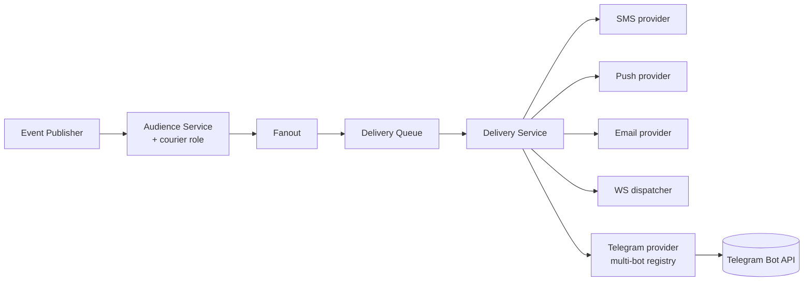

# План: расширение системы уведомлений — роль `courier` и Telegram-провайдер

## 1. Контекст

Текущая система уведомлений (`app/backend/src/core/notifications/`) поддерживает:
- роли получателей: `client`, `merchant`, `operator`, `admin` (см. `NotificationRecipientRole`);
- каналы: `in_app`, `ws`, `sms`, `push`, `email` (см. `NotificationChannel`);
- провайдеров: SMS HTTP (`http-sms.provider.ts`) за интерфейсом `INotificationSmsProvider`;
- pipeline: `NotificationPublishPipelineService` → `NotificationFanoutService` → `NotificationDeliveryQueueService` → `NotificationDeliveryService` → конкретный provider.

Что нужно добавить:
1. Новая **роль получателя `courier`** — уведомления о новых офферах заказов, изменениях статуса, операционные алерты.
2. Новый канал/провайдер **Telegram** — отправка сообщений через бота. API провайдера должен принимать опциональный «объект бота», чтобы можно было отправить сообщение конкретному курьеру через **конкретного** бота (несколько ботов могут существовать одновременно: основной, тестовый, региональный, бренд-специфичный).

## 2. Цели

- Поддержать роль `courier` сквозно: события, audience-резолвинг, channel-preferences, доставка.
- Поддержать Telegram как полноценный канал доставки.
- Сделать Telegram-провайдер **multi-bot**: вызывающий код может явно указать, через какого бота слать (по `botId` или передав инстанс/конфиг бота).
- Сохранить совместимость с уже существующими уведомлениями (никаких breaking changes для client/merchant/operator/admin).

---

## 3. Изменения в типах (`core/notifications/types.ts`)

### 3.1 Роль получателя
```ts
export enum NotificationRecipientRole {
  CLIENT = 'client',
  MERCHANT = 'merchant',
  OPERATOR = 'operator',
  ADMIN = 'admin',
  COURIER = 'courier', // <-- новое
}
```

### 3.2 Канал
```ts
export enum NotificationChannel {
  IN_APP = 'in_app',
  WS = 'ws',
  SMS = 'sms',
  PUSH = 'push',
  EMAIL = 'email',
  TELEGRAM = 'telegram', // <-- новое
}
```

### 3.3 Новые события (для курьерского флоу)
```ts
ORDER_OFFER_CREATED = 'order.offer.created',
ORDER_OFFER_EXPIRED = 'order.offer.expired',
ORDER_OFFER_CANCELLED = 'order.offer.cancelled',
ORDER_COURIER_ASSIGNED = 'order.courier.assigned',
ORDER_COURIER_PICKED_UP = 'order.courier.picked_up',
ORDER_COURIER_DELIVERED = 'order.courier.delivered',
COURIER_SHIFT_REMINDER = 'courier.shift.reminder',
```

Каждое событие регистрируется в notification event registry с указанием:
- supported recipient roles (например, `ORDER_OFFER_CREATED` → `[COURIER]`);
- default channels (например, `[TELEGRAM, PUSH, IN_APP]`);
- priority (для офферов — `HIGH` или `CRITICAL`).

---

## 4. Audience-резолвер для роли `courier`

В `notification-audience.service.ts` добавить ветку резолвинга `recipientRole === COURIER`:
- по `userId` (стандартно);
- по `orderId` → текущий назначенный `order.courier_id`;
- по `warehouseId` → все курьеры, прикреплённые к складу (broadcast — например, для shift reminder);
- по списку `courierIds` (для массового события).

Сохранять записи в `notifications` таблицу с `recipient_role='courier'` и нужным `recipient_id`.

---

## 5. Telegram-провайдер

### 5.1 Интерфейс
```
core/notifications/services/providers/telegram-provider.interface.ts
```
```ts
export interface ITelegramBotRef {
  /** Стабильный ID бота в нашем реестре (например, 'primary', 'courier-uz'). */
  botId: string;
  /** Опционально: уже инициализированный инстанс/токен. Если не передан — берём из реестра по botId. */
  token?: string;
  /** Произвольная мета (например, переопределение parseMode). */
  parseMode?: 'HTML' | 'MarkdownV2';
}

export interface INotificationTelegramSendInput {
  chatId: string | number;
  message: string;
  /**
   * Опциональный объект бота. Если не задан — провайдер берёт дефолтного бота
   * по env (NOTIFICATIONS_TELEGRAM_DEFAULT_BOT_ID).
   */
  bot?: ITelegramBotRef;
  /** Inline keyboard (для accept/decline по офферам). */
  inlineKeyboard?: TelegramInlineButton[][];
  /** Идемпотентность (на случай ретраев). */
  dedupeKey?: string;
}

export interface INotificationTelegramSendResult {
  providerMessageId: string | null;
  botId: string;
}

export interface INotificationTelegramProvider {
  readonly providerName: string;
  isConfigured(botId?: string): boolean;
  send(input: INotificationTelegramSendInput): Promise<INotificationTelegramSendResult>;
}
```

### 5.2 Реализация
```
core/notifications/services/providers/telegram.provider.ts
```
- Реестр ботов: `TelegramBotRegistry` — синглтон-сервис, который читает env конфиг (см. ниже) и хранит словарь `botId → { token, username, parseMode }`.
- При `send`:
  1. Если в `input.bot.token` указан токен — используем его напрямую.
  2. Иначе берём из реестра по `input.bot.botId` (или дефолтный).
  3. Если бота нет — кидаем `Error('Telegram bot not configured: <botId>')`.
  4. Делаем `fetch('https://api.telegram.org/bot<token>/sendMessage', { ... })`.
  5. На ошибки HTTP/Telegram (`ok=false`) — кидаем, чтобы pipeline ретраил через `notification-delivery-retry.service.ts`.
  6. Логируем `botId` в delivery log.

### 5.3 Конфигурация (env)
```
NOTIFICATIONS_TELEGRAM_ENABLED=true
NOTIFICATIONS_TELEGRAM_DEFAULT_BOT_ID=primary
NOTIFICATIONS_TELEGRAM_BOTS=[
  { "id": "primary",     "token": "${TELEGRAM_PRIMARY_TOKEN}",     "username": "easygrocery_bot" },
  { "id": "courier",     "token": "${TELEGRAM_COURIER_TOKEN}",     "username": "easygrocery_courier_bot" },
  { "id": "operator",    "token": "${TELEGRAM_OPERATOR_TOKEN}",    "username": "easygrocery_ops_bot" }
]
```
Парсится при старте, валидируется Zod-схемой. Альтернатива — отдельные env-переменные на каждого бота (`NOTIFICATIONS_TELEGRAM_BOT_<ID>_TOKEN`).

### 5.4 Канал-preferences
В таблице `notification_channel_preferences` (или эквиваленте) добавить:
- `channel='telegram'` — поддержка для всех ролей, но **по умолчанию включена только для `courier`**.
- Хранение `telegram_chat_id` на уровне получателя (для курьера — в `couriers.telegram_chat_id`, для других ролей — отдельная таблица `user_telegram_links` если потребуется).

### 5.5 Привязка chat_id (onboarding)
Микро-флоу:
1. Курьер пишет боту `/start <one-time-code>`.
2. Бот webhook'ом отправляет код + `chat_id` на наш backend.
3. Backend находит курьера по коду, пишет `couriers.telegram_chat_id`.
4. С этого момента уведомления уходят в Telegram.

Webhook-эндпоинт: `POST /internal/telegram/webhook/:botId` (защищён secret token из настроек Telegram setWebhook).

### 5.6 Inline-кнопки accept/decline
Для события `ORDER_OFFER_CREATED` payload содержит `offerId`. Telegram-сообщение строится с двумя кнопками:
- `✅ Принять` → callback_data `offer:accept:<offerId>`
- `❌ Отказаться` → callback_data `offer:decline:<offerId>`

Webhook бота принимает callback_query, валидирует, дергает `courier-offer.service.ts` (см. план `client-orders-internal-courier.md`).

---

## 6. Изменения в pipeline



`NotificationDeliveryService` получает новый switch-case для `channel === TELEGRAM`. Извлекает `chat_id` получателя + опциональный `bot` из payload события (если событие явно указывает, через какого бота слать) → вызывает `TelegramProvider.send`.

Поведение при отсутствии `chat_id`:
- channel `telegram` помечается `skipped` (не ошибка), pipeline не падает, переходит к остальным каналам.

---

## 7. БД: миграции

### 7.1 `notification_channel_preferences`
- Добавить значение `telegram` в enum/check-constraint.

### 7.2 `notifications` (events log)
- Поле `channel` уже enum — добавить `telegram`.
- Поле `recipient_role` — добавить `courier`.

### 7.3 Новая таблица `telegram_bots` (опционально вместо env)
| Поле | Тип |
|---|---|
| `id` | text PK | (`primary`, `courier`, ...) |
| `token` | text NOT NULL | (зашифровано) |
| `username` | text |
| `default_parse_mode` | text DEFAULT 'HTML' |
| `is_active` | boolean DEFAULT true |
| `created_at` | timestamptz |

При наличии этой таблицы реестр читается из БД с in-memory кэшем, env остаётся как fallback. Для MVP можно ограничиться env, эту таблицу — фаза 2.

### 7.4 `couriers.telegram_chat_id`
Уже описано в плане заказов; здесь напоминаем зависимость.

---

## 8. Безопасность

- Токены ботов — только через env / зашифрованное хранилище. Никогда не логируем.
- Webhook'и Telegram — проверка `secret_token` (заголовок `X-Telegram-Bot-Api-Secret-Token`), индивидуальный secret на каждого бота.
- Rate limiting на webhook-эндпоинт.
- Идемпотентность по `update_id` Telegram (хранить последние N в Redis на 24ч).

---

## 9. Тесты (TDD Backend)

- Unit:
  - `TelegramBotRegistry` — корректный парсинг конфига, fallback на дефолтного бота, ошибки при отсутствии бота.
  - `TelegramProvider.send` — мок `fetch`, проверка URL/тела/обработки `ok=false`, прокидывание `botId`.
  - `NotificationAudienceService` — резолвинг получателей с ролью `courier`.
- Integration:
  - Pipeline end-to-end: публикация события `ORDER_OFFER_CREATED` → запись в `notifications` → доставка через Telegram (мок API) → лог.
  - Idempotency: повторный publish не приводит к повторному sendMessage при том же `dedupeKey`.
- E2E:
  - Webhook `/internal/telegram/webhook/:botId` обрабатывает `/start <code>` и привязывает `chat_id`.
  - Callback `offer:accept` действительно меняет статус оффера (через `CourierOfferService`).

Mocks: внешний Telegram API мокаем (правило — мокать только внешние сервисы).

---

## 10. Поэтапная реализация

### Фаза 0
- Расширение enum'ов: `NotificationRecipientRole.COURIER`, `NotificationChannel.TELEGRAM`.
- Миграции БД.

### Фаза 1 — Telegram MVP
- `TelegramBotRegistry` (из env).
- `TelegramProvider` + интеграция в `NotificationDeliveryService`.
- Onboarding-флоу `/start <code>` → привязка `chat_id`.
- События для курьерских офферов с inline-кнопками accept/decline.
- Тесты.

### Фаза 2 — расширения
- Таблица `telegram_bots` + админ-CRUD.
- Шаблонизатор сообщений (i18n — ru/uz/en) с поддержкой Telegram MarkdownV2/HTML.
- Поддержка медиа (фото товаров в офферах).
- Channel preferences UI: пользователь сам выбирает каналы.

### Фаза 3
- Поддержка Telegram для других ролей (operator, merchant) — если будет спрос.
- Метрики: delivery rate per bot, ошибки Telegram API, среднее время от отправки до прочтения.

---

## 11. Открытые вопросы

1. Где хранить конфиг ботов — только env (быстрее) или таблица `telegram_bots` (гибче)? Для MVP предлагаю env.
2. Один общий бот для всех ролей или отдельные боты на роль (курьер/оператор/мерчант)? Архитектурно разрешаем оба варианта; стартуем с одного «courier» бота.
3. Привязка `chat_id` через `/start <code>` или через ввод номера телефона + Telegram Login Widget? `/start <code>` проще.
4. Нужна ли отправка медиа (фото товара/чек) в фазе 1 или только текст?
5. Шаблоны сообщений — в коде, в БД (`notification_templates`) или в файлах (Handlebars/MJML-аналог)? Если есть существующая система — переиспользуем.
6. Локализация Telegram-сообщений — берём из `users.locale` / `couriers.locale`?
7. Ретраи: использовать общий `notification-delivery-retry.service.ts` или у Telegram своя политика (например, при `429 Too Many Requests` — backoff из заголовка `Retry-After`)?
