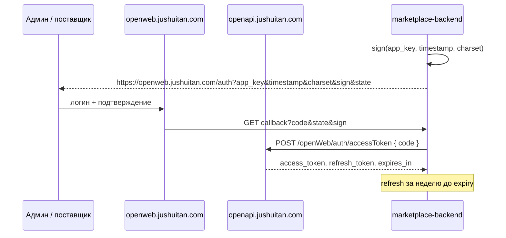
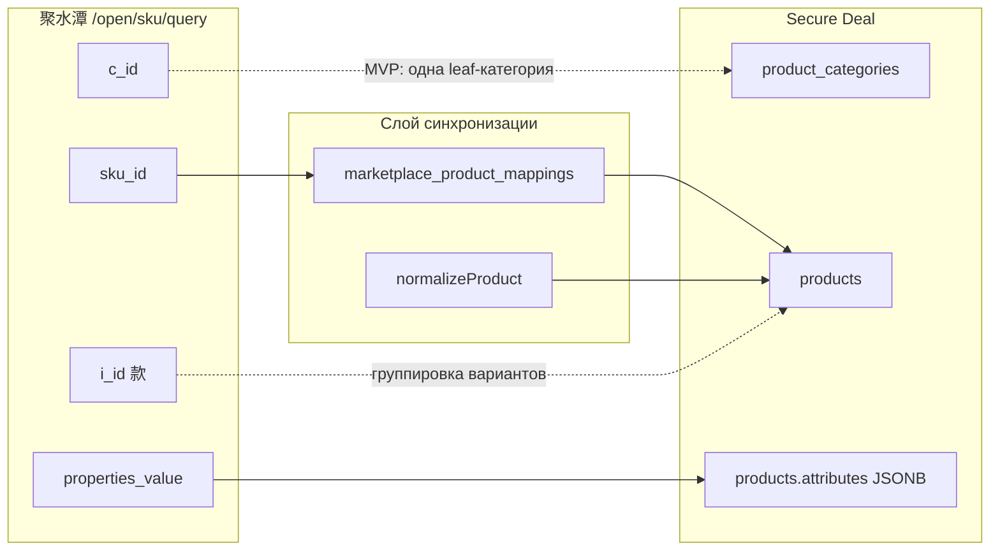
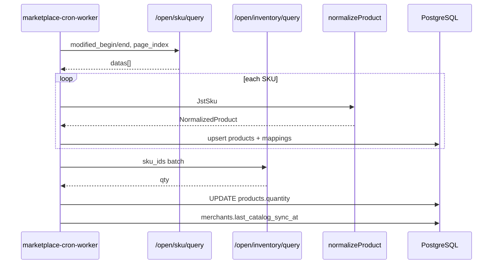
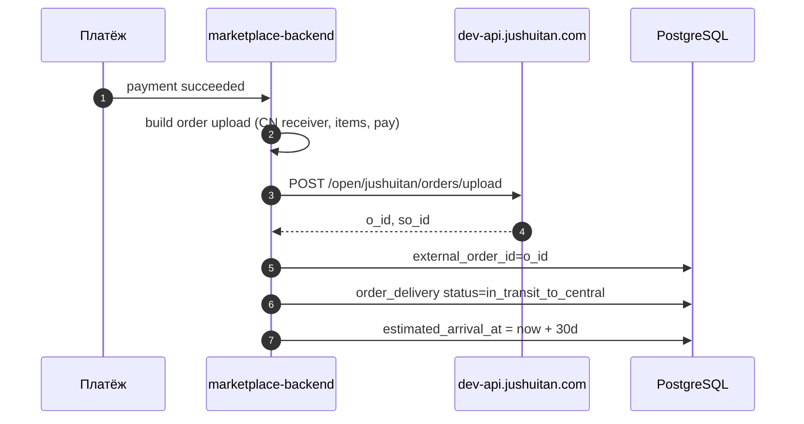

# Интеграция 聚水潭 (Jushuitan) Open Platform

Документ описывает внешний API китайского marketplace-поставщика на базе [聚水潭开放平台](https://openweb.jushuitan.com/) для проекта [marketplace-merchants-and-warehouse-network](./marketplace-merchants-and-warehouse-network.md).

**MVP-провайдер:** `provider_code = jushuitan`  
**Роль в нашей архитектуре:** поставщик ведёт каталог и приём заказов в ERP 聚水潭; наш backend работает **только исходящими** вызовами (каталог + создание заказа). Webhook/callback от JST в MVP не используем.

---

## 1. Обзор платформы

聚水潭 — SaaS ERP/OMS для e-commerce в Китае (склады, заказы, закупки, логистика). Открытая платформа даёт REST-подобный API: единый транспорт, подпись запросов, OAuth-подобная авторизация магазина.

| Среда | Base URL бизнес-API | Auth URL |
|-------|---------------------|----------|
| **Sandbox (тест)** | `https://dev-api.jushuitan.com/` | `https://openweb.jushuitan.com/auth` |
| **Production** | `https://openapi.jushuitan.com/` | `https://openweb.jushuitan.com/auth` |

> С 2021-12-15 новые интеграции ведутся через [openweb.jushuitan.com](https://openweb.jushuitan.com/management/apps). Старый шлюз `https://open.erp321.com/api/open/query.aspx` — legacy, не использовать для нового кода.

**Официальные ссылки:**

| Тема | URL |
|------|-----|
| Документация (новая) | [openweb.jushuitan.com/doc](https://openweb.jushuitan.com/doc?docId=2) |
| Тестовая среда (沙箱) | [docId=110 — 测试环境说明](https://openweb.jushuitan.com/doc?docId=110) |
| Старая документация API | [open.jushuitan.com](https://open.jushuitan.com/document/2325.html) |
| SDK (PHP 8.1+) | [zmoyi/JsTan](https://github.com/zmoyi/JsTan) |
| FAQ | [常见问题总结](https://open.jushuitan.com/document/2289.html) |

---

## 2. Онбординг и доступ

### 2.1. Цепочка подключения (openweb)

| Шаг | docId | Действие |
|-----|-------|----------|
| 1 | [260](https://openweb.jushuitan.com/doc?docId=260) | Регистрация аккаунта разработчика |
| 2 | [110](https://openweb.jushuitan.com/doc?docId=110) | Тестовая среда: sandbox credentials |
| 3 | [270](https://openweb.jushuitan.com/doc?docId=270) | Создание приложения, `app_key` / `app_secret` |
| 4 | [280](https://openweb.jushuitan.com/doc?docId=280) | Заявка на права вызова API |
| 5 | [20](https://openweb.jushuitan.com/doc?docId=20) | Переключение на production |

API — **платная услуга** (см. [FAQ](https://open.jushuitan.com/document/2289.html)): enterprise часто бесплатно, pro — лимит вызовов по договору.

### 2.2. Sandbox (docId=110)

**ERP для ручной проверки заказов/товаров:**

| Версия | URL | Логин | Пароль |
|--------|-----|-------|--------|
| 企业版 | https://b.jushuitan.com/epaas | `kfcs@jst.com` | `!kfptqy0414@` |
| 专业版 | https://b.jushuitan.com/epaas | `kfcszy@jst.com` | `!kfptzy0414@` |

> Общие тестовые аккаунты: не загружать реальные PII; тестовые данные удалять самостоятельно.

**Сценарий 1 — вызов бизнес-API без OAuth (достаточно для MVP-разработки):**

```
POST https://dev-api.jushuitan.com/{path}
```

| Параметр | Sandbox value |
|----------|---------------|
| `app_key` | `b0b7d1db226d4216a3d58df9ffa2dde5` |
| `app_secret` | `99c4cef262f34ca882975a7064de0b87` |
| `access_token` (企业版) | `b7e3b1e24e174593af8ca5c397e53dad` |
| `access_token` (专业版) | `8db141b6d724211b28d2eff2c93fe918` |

**Сценарий 2 — полный OAuth:** авторизация магазина → `code` → `access_token` → refresh. Нужен для production и когда поставщик выдаёт свой token.

### 2.3. Авторизация (production)



| Endpoint | Method | Назначение |
|----------|--------|------------|
| `/openWeb/auth/getInitToken` | POST | Self-developed merchant flow |
| `/openWeb/auth/accessToken` | POST | Third-party: обмен `code` → token |
| `/openWeb/auth/refreshToken` | POST | Продление token (значение token не меняется, срок +1 год) |

**Параметры auth-запроса:** `app_key`, `timestamp` (секунды), `charset=utf-8`, `grant_type`, `code` или `refresh_token`, `sign`.

**Ответ:** `code=0` → `data.access_token`, `data.refresh_token`, `data.expires_in` (~2592000 с / 30 дней).

**Callback ISV:** при message push JST ожидает `{"code":0}`; иначе до 10 ретраев.

---

## 3. Транспорт и подпись

### 3.1. Формат бизнес-запроса

Все бизнес-методы: **POST**, `Content-Type: application/x-www-form-urlencoded`.

**Публичные поля (form body):**

| Поле | Обязательно | Описание |
|------|-------------|----------|
| `app_key` | да | Ключ приложения |
| `access_token` | да* | Токен магазина (*в sandbox — статический из doc 110) |
| `timestamp` | да | Unix timestamp, секунды |
| `version` | да | `"2"` |
| `charset` | да | `"utf-8"` |
| `biz` | да | JSON-строка с телом метода; пустой объект `"{}"` |
| `sign` | да | Подпись |

**URL:** `{baseUrl}{path}` — например `https://dev-api.jushuitan.com/open/sku/query`.

### 3.2. Алгоритм `sign`

1. Собрать все параметры запроса (включая `biz` как строку), **кроме** `sign`.
2. Отсортировать ключи по ASCII (`ksort`).
3. Конкатенировать: `secret + key1 + value1 + key2 + value2 + ...`
4. `sign = bin2hex(md5(concat, raw=true))` — 32 hex-символа в нижнем регистре.

Референс: [JsTan Util.php](https://github.com/zmoyi/JsTan/blob/master/src/Util.php).

### 3.3. Обёртка ответа

Типичная структура (новый API):

```json
{
  "code": 0,
  "msg": "执行成功",
  "data": { }
}
```

| `code` | Смысл |
|--------|--------|
| `0` | Успех |
| `≠ 0` | Ошибка; смотреть `msg`, в FAQ — типовые коды (170 — shop/company mismatch, 100 — token timeout) |

Legacy-ответы могут содержать `issuccess: true/false` — при парсинге поддержать оба варианта.

### 3.4. Ограничения

- Только **HTTPS** (с 2020-01).
- Окна выборки по `modified_begin` / `modified_end`: **макс. 7 дней**.
- Пагинация SKU: `page_size` макс. **50**; inventory: макс. **100**.
- Заказ upload: макс. **50** заказов за запрос (для нас — 1 заказ на вызов).
- **Тестовая среда:** message push (логистика, остатки) **не работает** — только prod.
- Частота: см. [接口调用频率限制](https://open.jushuitan.com/document/2071.html); для upload — без жёсткого лимита в публичной доке.

---

## 4. Каталог API (полный перечень маршрутов)

Источник: [JsTan Route](https://github.com/zmoyi/JsTan/blob/master/src/Route.php), [qliang.cloud API categories](https://www.qliang.cloud/api-categories/Jst).

### 4.1. Базовые

| Path | Назначение | MVP |
|------|------------|-----|
| `open/shops/query` | Список магазинов (`shop_id`) | **да** — конфиг |
| `open/logisticscompany/query` | Коды курьеров | опционально |
| `open/wms/partner/query` | Склады/партнёры WMS | опционально |
| `open/jushuitan/distributor/query` | Дистрибьюторы | нет |

### 4.2. Товары (для `fetchCatalog`)

| Path | Назначение | MVP |
|------|------------|-----|
| `open/sku/query` | SKU по времени изменения / sku_ids | **да** |
| `open/mall/item/query` | Товары по «款» (style) | запасной |
| `open/skumap/query` | Товары магазина | нет |
| `open/combine/sku/query` | Комплекты | нет |
| `open/category/query` | Категории | опционально |
| `open/jushuitan/itemsku/upload` | Загрузка SKU в JST | нет (мы не пишем каталог) |
| `open/jushuitan/skumap/upload` | Загрузка shop SKU | нет |

### 4.3. Остатки

| Path | Назначение | MVP |
|------|------------|-----|
| `open/inventory/query` | Остатки по SKU / складу | **рекомендуется** |
| `open/inventory/count/query` | Инвентаризация | нет |

### 4.4. Заказы (для `createRemoteOrder`)

| Path | Назначение | MVP |
|------|------------|-----|
| `open/jushuitan/orders/upload` | Загрузка заказа (自有商城 / 跨境线下) | **да** |
| `open/orders/single/query` | Запрос одного заказа | опционально (верификация) |
| `open/jushuitan/orderbyoid/cancel` | Отмена по `o_id` | post-MVP |
| `open/order/sent/upload` | Отметка отправки | нет (входящее у них) |

### 4.5. Логистика / исходящие (не в MVP)

| Path | Назначение |
|------|------------|
| `open/logistic/query` | Статус отправки |
| `open/express/register/upload` | Регистрация трека |
| `open/orders/out/simple/query` | Исходящие отгрузки |

### 4.6. Закупки,入库,出库,售后

Для нашего сценария (мы — покупатель/маркетплейс) **не используем** в MVP: `purchase/*`, `purchasein/*`, `purchaseout/*`, `aftersale/*`, `allocate/*`, `other/inout/*`.

---

## 5. API для нашего MVP (детально)

### 5.1. `fetchCatalog` → `POST /open/sku/query`

**Назначение:** инкрементальная синхронизация каталога поставщика в cron.

**`biz` (JSON):**

| Поле | Тип | Обязательно | Описание |
|------|-----|-------------|----------|
| `page_index` | int/string | нет | Страница, с 1 |
| `page_size` | int/string | нет | По умолчанию 30, **макс. 50** |
| `modified_begin` | string | да* | `yyyy-MM-dd HH:mm:ss` |
| `modified_end` | string | да* | Интервал с begin ≤ 7 дней |
| `sku_ids` | string | да* | До 20 кодов через запятую |

\* Либо окно `modified_*`, либо `sku_ids`.

**Ответ `data` (типично):** массив SKU в `datas` / `items` (проверить фактическое поле при первом sandbox-вызове).

| Поле JST | Наше поле | Примечание |
|----------|-----------|------------|
| `sku_id` | `external_sku_id` | Ключ синхронизации |
| `i_id` | `external_style_id` | |
| `name` | `title` | Без локализации |
| `sale_price` | `supplier_price` | Валюта CNY |
| `cost_price` | — | только аналитика |
| `weight` | `weight_kg` | для cargo `rate_per_kg` |
| `pic` / `pic_big` | `image_url` | |
| `properties_value` | `variant_label` | цвет/размер |
| `brand` | `brand` | |
| `enabled` | `is_active` | `1` = активен |
| `market_price` | `compare_at_price` | |
| `c_id` / `category` | `category_external_id` | |
| `supplier_id` | — | справочно |

**Cron-стратегия:**

1. Хранить `merchants.last_catalog_sync_at`.
2. Каждый запуск: `modified_begin = last_sync - 5min overlap`, `modified_end = now`.
3. Пагинация до `has_next = false` или пустой страницы.
4. Upsert по `(merchant_id, external_sku_id)`.
5. Опционально второй проход `open/inventory/query` с теми же `sku_ids` / временным окном → `stock_quantity`.

---

### 5.2. `POST /open/inventory/query` (рекомендуется)

| Поле | Описание |
|------|----------|
| `wms_co_id` | `0` — суммарный остаток; иначе конкретный склад |
| `sku_ids` | до 100 SKU |
| `modified_begin` / `modified_end` | окно ≤ 7 дней |
| `page_index`, `page_size` | до 100 |

| Поле ответа | Использование |
|-------------|---------------|
| `qty` | Доступный физический остаток |
| `order_lock`, `pick_lock` | Резервы |
| `virtual_qty` | Корректировка виртуального остатка |
| `purchase_qty` | В пути от закупки |

**Формула доступного для продажи (упрощённо):**  
`available ≈ qty - order_lock - pick_lock + virtual_qty` (уточнить с поставщиком).

---

### 5.3. `createRemoteOrder` → `POST /open/jushuitan/orders/upload`

**Назначение:** после успешной оплаты у нас — передать заказ в ERP поставщика; получить **`o_id`** как `external_order_id`.

**Ограничения ([官方](https://open.jushuitan.com/document/2137.html)):**

- Только **商家自有商城** и **跨境线下** заказы.
- В ERP нужен shop типа «商家自有商城» ([FAQ #3](https://open.jushuitan.com/document/2289.html)).
- До **50** заказов в одном `biz`; мы шлём **1**.
- `shop_status = WAIT_BUYER_PAY` — **без** узла `pay`; все оплаченные статусы — **с** `pay`.
- Идемпотентность: пара `(shop_id, so_id)` уникальна.

**Тело заказа (`biz` — один объект или массив `orders`; уточнить в sandbox, SDK шлёт объект):**

| Поле | Обязательно | Значение для Secure Deal |
|------|-------------|-------------------------|
| `shop_id` | да | Из конфига мерчанта (`jst_shop_id`) |
| `so_id` | да | Наш `orders.id` или публичный `order_number` (≤50) |
| `order_date` | да | ISO/local `YYYY-MM-DD HH:mm:ss` |
| `shop_status` | да | `WAIT_SELLER_SEND_GOODS` (оплачен, ждёт отгрузки у поставщика) |
| `shop_buyer_id` | да | `client_id` или анонимизированный id |
| `receiver_state` | да | Провинция **склада приёмки в Китае** (не Таджикистан) |
| `receiver_city` | да | Город склада приёмки |
| `receiver_district` | да | Район |
| `receiver_address` | да | Адрес консолидации/центрального хаба CN |
| `receiver_name` | да | Контакт склада |
| `receiver_phone` | да | Телефон склада |
| `receiver_mobile` | нет | |
| `receiver_country` | нет | `CN` для кросс-бордер |
| `pay_amount` | да | `order.subtotal + freight` (2 знака) |
| `freight` | да | `0` или внутренний CN freight |
| `shop_modified` | да | `updated_at` заказа |
| `remark` | нет | `PVZ: {slug}, TJ destination` |
| `node` | нет | Внутренняя заметка для склада поставщика |
| `currency` | нет | `CNY` / код валюты |
| `items[]` | да | Строки корзины |
| `pay[]` | да | При оплаченном заказе |

**`items[]` (на каждую позицию):**

| Поле | Значение |
|------|----------|
| `sku_id` | `product.external_sku_id` |
| `shop_sku_id` | наш `product.id` или тот же `sku_id` |
| `name` | название товара |
| `qty` | количество |
| `price` | цена за единицу |
| `amount` | `price * qty` |
| `base_price` | как `price` |
| `outer_oi_id` | уникальный id строки `{order_id}_{line_id}` |
| `properties_value` | вариант |
| `pic` | URL изображения |

**`pay[]` (при `shop_status ≠ WAIT_BUYER_PAY`):**

| Поле | Значение |
|------|----------|
| `outer_pay_id` | id платежа у нас |
| `pay_date` | время оплаты |
| `payment` | `SecureDeal` / метод оплаты |
| `amount` | **должен совпадать с `pay_amount`** |
| `buyer_account` / `seller_account` | placeholder |

**Формулы сумм ([官方](https://open.jushuitan.com/document/2137.html)):**

```
sum(items[].amount) - discount + freight = pay_amount
sum(pay[].amount) = pay_amount  (для оплаченного заказа)
```

**Ответ (ожидаемый, проверить в sandbox):**

```json
{
  "code": 0,
  "data": {
    "datas": [
      {
        "so_id": "our-order-uuid",
        "o_id": 123456789,
        "issuccess": true
      }
    ]
  }
}
```

| Поле JST | Наше поле | Назначение |
|----------|-----------|------------|
| `o_id` | `order_deliveries.external_order_id` | **Основной** id на этикетке/накладной |
| `so_id` | `order_deliveries.external_order_ref` | Наш id, отправленный в JST |

При `code ≠ 0` или `issuccess = false` — заказ **не** переводить в `in_transit_to_central`; статус `merchant_pending`, алерт в админку.

---

### 5.4. `POST /open/shops/query`

Получить `shop_id` для конфига мерчанта.

**`biz`:** `page_index`, `page_size` (макс. 100), опционально `nicks[]`.

**Ответ:** только **включённые** магазины. Поля: `shop_id`, `shop_name`, `co_id`, `nick`, ...

---

### 5.5. `POST /open/orders/single/query` (опционально)

Верификация после upload: по `so_id` или `o_id` проверить, что заказ появился в ERP.

**Статусы ERP `status`:** `WaitPay`, `WaitConfirm`, `Delivering`, `Sent`, `Cancelled`, `Question`, ...

Для MVP достаточно успешного upload; query — для support/admin.

---

## 5.6. Сопоставление схем: JST ↔ Secure Deal

### Насколько похожи модели?

| Область | Похожесть | Комментарий |
|---------|-----------|-------------|
| **Товар** | Частично | И там и там есть название, цена, картинки, остаток — но **единица учёта разная** |
| **Категории** | Слабо | У нас — дерево `product_categories` + JSON Schema атрибутов на листе; у JST — плоский `c_id` + строка `category` |
| **Варианты** | Разная модель | JST: `i_id` (款) + много `sku_id` (SKU); у нас: **каждый вариант = отдельная строка `products`** |
| **Заказ** | Частично | Оба: шапка + строки; но **направление и жизненный цикл разные** |

Итог: **не копируем схему JST 1:1**. Нужен слой **`normalizeProduct` / `buildOrderUpload`**, который переводит их ответ/запрос в **наши** таблицы.

### Продукты: JST vs наша БД



| JST (`/open/sku/query`) | Наша таблица / поле | Как маппить |
|-------------------------|---------------------|-------------|
| `sku_id` | **`marketplace_product_mappings.external_sku_id`** | Стабильный ключ upsert (в `products` колонки пока **нет**) |
| `i_id` | `mappings.external_style_id` | Группа вариантов (опционально `variant_group_id` в mapping) |
| `name` | `products.title` | Как есть, без локализации |
| `sale_price` | `products.price` | Конвертация CNY → валюта витрины + наценка/cargo **на чекауте**, не в cron |
| `market_price` | `products.old_price` | Если `market_price > sale_price` |
| `pic` / `pic_big` | `products.images[]` | `[pic_big \|\| pic]` |
| `weight` | `products.attributes.weight_kg` или отдельное поле в mapping | Для cargo |
| `properties_value` | `products.attributes` | Парсинг «颜色:红;尺码:L» → ключи схемы категории |
| `brand` | `products.attributes.brand` | Строка |
| `enabled` | `products.status` | `1` → `active`, `-1` → `inactive`, `0` → `inactive` |
| `c_id` / `category` | `products.leaf_category_id` | См. стратегию категорий ниже |
| `qty` (из inventory) | `products.quantity` | После `inventory/query` |
| — | `products.merchant_id` | Marketplace-мерчант |
| — | `products.warehouse_id` | `merchant_warehouses` origin CN |
| — | `products.slug` | `slugify(title + '-' + sku_id_suffix)` уникальный в рамках мерчанта |

**Чего нет в JST под нашу модель:**

- Локализованные `product_categories.locals` — пока дублируем значение API в `ru` и `tj`; перевод — позже.
- `attribute_schema` на категории — **задаём мы** для импортированных товаров.
- Отдельная таблица SKU — не нужна, если 1 `sku_id` = 1 `products.id`.

### Категории и атрибуты (главное отличие)

У нас категория — это **не просто id**, а:

- дерево `product_categories` (`parent_id`, `slug`, `locals`, `depth`);
- на **листе** — `attribute_schema` (типы, `allowed_values`, фильтры);
- на товаре — `products.attributes` по этой схеме.

У JST в SKU только `c_id` и текст `category` / `vc_name`.

**Реализовано в cron-worker (каталог):**

| Элемент | Поведение |
|---------|-----------|
| Корень | `product_categories.slug = jushuitan-import` |
| Дерево | Из поля SKU `category` (`"Уровень1 - Уровень2 - …"`), узлы создаются по сегментам |
| `locals.ru` / `locals.tj` | Пока **одинаковые**, текст сегмента из API (без перевода) |
| Лист | `attribute_schema` импорта (brand, variant, weight_kg, origin_country) |
| Маппинг | `marketplace_category_mappings` (`merchant_id`, `external_category_id` = `c_id` или `path:…`) |
| Без категории | Лист `bez-kategorii`, название «Без категории», если нет `c_id` и `category` |

Повторный sync обновляет `products.leaf_category_id` у уже импортированных SKU.

**Legacy `import-cn` («Импорт из Китая»):** полностью выведена (миграции `1779700000002`, `1779700000003`); в каталоге не создаётся. Товары без данных API → `bez-kategorii`.

Общая `attribute_schema` на листьях:

```json
{
  "type": "object",
  "properties": {
    "brand": { "type": "string", "title": { "ru": "Бренд" }, "x-filterable": true },
    "variant": { "type": "string", "title": { "ru": "Вариант" }, "x-card-badge": true }
  }
}
```

`properties_value` из JST → `attributes.variant` (и при возможности парсинг цвета/размера).

### Варианты (i_id + sku_id)

| JST | Наша модель |
|-----|-------------|
| Один `i_id`, несколько `sku_id` | Несколько строк `products` с одним `external_style_id`, разными `attributes` / ценой / фото |
| Один `sku_id` | Одна строка `products` |

Логика как в `product-variants.ts`, но **источник оси вариантов** — `properties_value`, а не ручное создание мерчантом.

### Обязательная таблица маппинга (сейчас в БД нет external id)

```sql
-- marketplace_product_mappings (предлагаемая миграция)
merchant_id          UUID NOT NULL REFERENCES merchants(id),
external_sku_id      VARCHAR(64) NOT NULL,   -- JST sku_id
external_style_id    VARCHAR(64),              -- JST i_id
product_id           UUID NOT NULL REFERENCES products(id),
last_synced_at       TIMESTAMPTZ,
raw_payload          JSONB,                  -- последний ответ JST
PRIMARY KEY (merchant_id, external_sku_id)
```

Cron: `SELECT product_id FROM mappings WHERE external_sku_id = ?` → update `products`; иначе insert `products` + insert mapping.

### Заказы: JST vs наша БД

**Направление разное:**

| | Secure Deal | JST |
|---|-------------|-----|
| Создание | Клиент checkout → наш `orders` | Мы **upload** в JST после оплаты |
| Статусы | `orders.status` + `order_deliveries` (internal) | ERP: `WaitConfirm`, `Sent`, … |
| Доставка | ПВЗ, внутренний маршрут TJ | `receiver_*` = CN-склад приёмки |

| Наше поле | JST upload | Направление |
|-----------|------------|-------------|
| `orders.id` / `order_id` | `so_id` | Мы → JST |
| — | `o_id` (ответ) | JST → `order_deliveries.external_order_id` |
| `order_items.product_id` | → mapping → `items[].sku_id` | Мы → JST |
| `order_items.product_title` | `items[].name` | snapshot → JST |
| `order_items.product_price` | `items[].price` | snapshot → JST |
| `order_items.quantity` | `items[].qty` | Мы → JST |
| `orders.total_amount` | `pay_amount` | пересчёт по правилам JST |
| `client_id` | `shop_buyer_id` | Мы → JST |
| ПВЗ (план: `pickup_point_id`) | `remark` / `node` | только заметка для поставщика |
| `client_delivery_addresses` | **не использовать** для upload | адрес = `china_receiver_*` из конфига |

**Заказы из JST к нам не импортируем** в MVP — только исходящий upload.

### Job: поток синхронизации каталога



### Псевдокод `normalizeProduct`

```typescript
function normalizeProduct(raw: JstSku, ctx: SyncContext): NormalizedProduct {
  return {
    externalSkuId: raw.sku_id,
    externalStyleId: raw.i_id,
    title: raw.name,
    price: convertSupplierPrice(raw.sale_price, ctx), // или сохранить CNY в mapping
    oldPrice: raw.market_price > raw.sale_price ? raw.market_price : null,
    images: [raw.pic_big || raw.pic].filter(Boolean),
    quantity: null, // заполнит inventory pass
    status: raw.enabled === 1 ? 'active' : 'inactive',
    leafCategoryId: ctx.defaultImportCategoryId,
    warehouseId: ctx.merchantOriginWarehouseId,
    attributes: {
      brand: raw.brand,
      variant: raw.properties_value,
      weight_kg: parseWeight(raw.weight),
      origin_country: 'CN',
    },
    slug: buildSlug(ctx.merchantSlug, raw.sku_id, raw.name),
  };
}
```

---

## 6. Маппинг на домен Secure Deal

### 6.1. Конфиг marketplace-мерчанта

Расширение полей `merchants` (или JSON `integration_config`):

| Поле | Пример | Описание |
|------|--------|----------|
| `provider_code` | `jushuitan` | |
| `api_base_url` | `https://dev-api.jushuitan.com` | sandbox / prod |
| `api_key_ref` | secret | `app_key` |
| `api_secret_ref` | secret | `app_secret` |
| `access_token_ref` | secret | OAuth / sandbox token |
| `refresh_token_ref` | secret | prod refresh |
| `jst_shop_id` | `12345` | из `shops/query` |
| `origin_country_code` | `CN` | |
| `catalog_sync_enabled` | `true` | |
| `china_receiver_state` | `广东省` | адрес приёмки в CN |
| `china_receiver_city` | `广州市` | |
| `china_receiver_district` | `白云区` | |
| `china_receiver_address` | `...` | |
| `china_receiver_name` | `Secure Deal CN WH` | |
| `china_receiver_phone` | `+86...` | |

### 6.2. `MarketplaceProviderAdapter` (jushuitan)

```typescript
interface MarketplaceProviderAdapter {
  fetchCatalog(ctx: SyncContext): AsyncIterable<NormalizedProduct>;
  createRemoteOrder(ctx: OrderContext): Promise<CreateRemoteOrderResult>;
  normalizeProduct(raw: JstSku): NormalizedProduct;
}

interface CreateRemoteOrderResult {
  external_order_id: string;  // o_id
  external_order_ref: string; // so_id
  raw_response: unknown;
}
```

### 6.3. Sequence: оплата → JST → наш logistics



### 6.4. Что **не** делаем в MVP (входящие от JST)

По [плану](./marketplace-merchants-and-warehouse-network.md) — без входящих webhook:

| docId / сценарий | API / push | Причина отложения |
|------------------|------------|-------------------|
| 170 | 订单发货 / logistic push | Статусы ведём сами |
| 172 | 库存同步 push | Cron `inventory/query` |
| 171 | 售后同步 | Dispute отключены |
| 175 | 商品同步 push | Cron `sku/query` |

---

## 7. Обработка ошибок

| Ситуация | Действие |
|----------|----------|
| `code=100` token timeout | `refreshToken`, retry 1× |
| `code=170` shop/company mismatch | Проверить `shop_id` и token компании |
| «不是自有商城» | Создать shop «商家自有商城» в ERP |
| Дубликат `so_id` | Идемпотентно: запросить `orders/single/query`, восстановить `o_id` |
| Upload OK, заказ не виден в ERP | Проверить: shop enabled, «下载所有订单» в ERP |
| Partial catalog page fail | Лог + retry page; не сдвигать `last_catalog_sync_at` |

---

## 8. Чеклист перед production

- [ ] Приложение на [openweb](https://openweb.jushuitan.com/management/apps), права API одобрены
- [ ] OAuth / refresh token в secrets, cron refresh за 7 дней до expiry
- [ ] `shop_id` — магазин типа «商家自有商城»
- [ ] Адрес `receiver_*` — реальный CN warehouse
- [ ] Sandbox: upload → `o_id` виден в https://b.jushuitan.com/epaas
- [ ] Cron catalog + inventory на staging
- [ ] `external_order_id` сканируется в mobile app при приёмке в Душанбе

---

## 9. Открытые вопросы (JST)

1. Точная структура `data` для `/open/sku/query` и upload-response (поле массива) — зафиксировать первым sandbox-вызовом.
2. Upload: один объект или `{ orders: [...] }` в `biz`.
3. Нужен ли отдельный `wms_co_id` / склад поставщика в CN для строк заказа.
4. Подтвердить у поставщика: на этикетке печатается `o_id` или `so_id` — от этого зависит сканирование на центральном складе.

---

## 10. Ссылки

- [测试环境说明 docId=110](https://openweb.jushuitan.com/doc?docId=110)
- [订单上传(推荐)](https://open.jushuitan.com/document/2137.html)
- [接入流程](https://open.jushuitan.com/document/2037.html)
- [SKU query V3](https://www.qliang.cloud/api/914f1cd8-345f-34f6-8c5d-251083c57ecb)
- [Inventory query V3](https://www.qliang.cloud/api/89b78b2d-6105-3792-8f24-bb70f5bf07db)
- [Order upload v1 params](https://www.qliang.cloud/api/db236e2d-fade-3764-9283-4aee6e3e654f)
- [JsTan SDK](https://github.com/zmoyi/JsTan)
