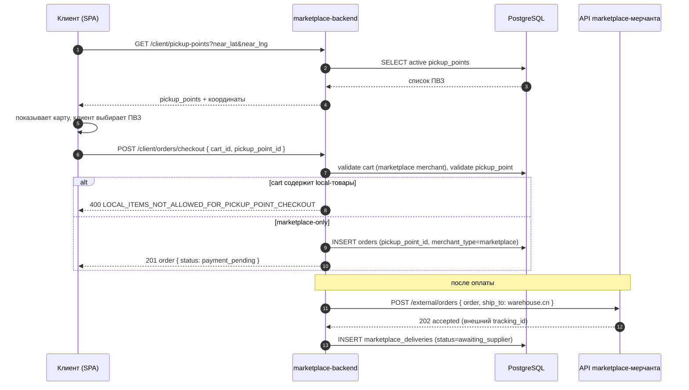
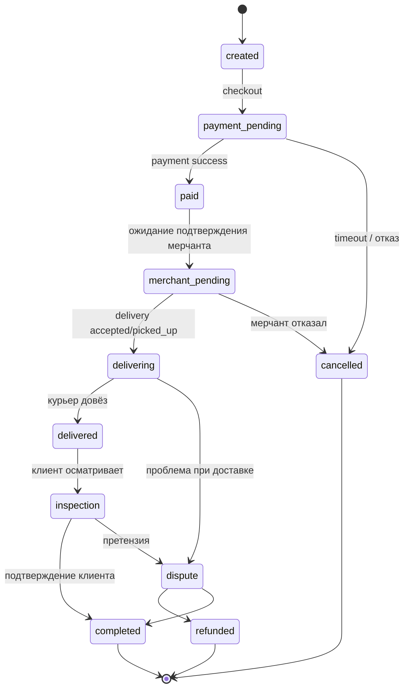
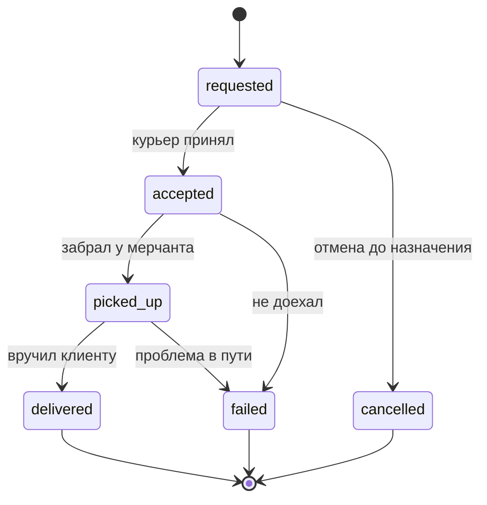
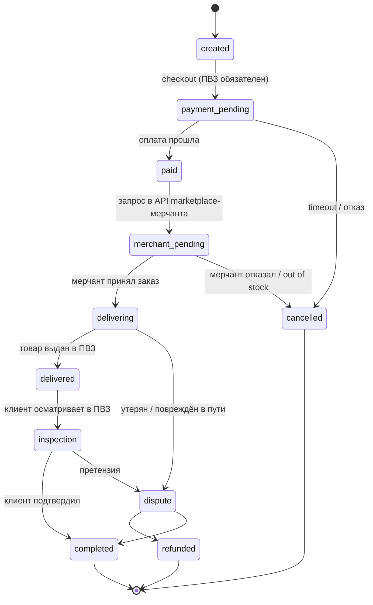
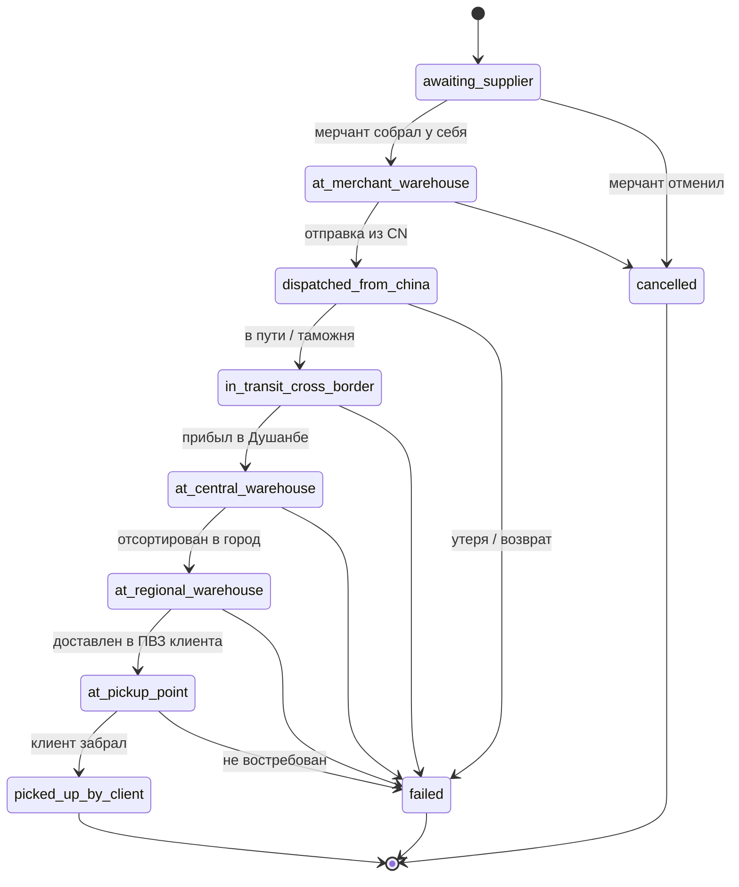

# Маркетплейс-мерчанты, складская сеть и доставка ПВЗ

## Контекст и проблема

Сейчас в системе мерчант — это локальный продавец в Таджикистане. Все товары хранятся у мерчанта на одном складе (`merchant_warehouses`), заказ создаётся в рамках одного мерчанта и доставляется такси (`order_deliveries` с провайдером `jurataxi`). Статусы заказа линейные и заточены под флоу «один склад → клиент».

Нужно ввести новый тип мерчанта — **marketplace** (китайские поставщики). Их товары приезжают сначала на склад в Китае, потом на наш центральный склад в Душанбе, оттуда сортируются по региональным складам в городах, и в финале попадают в пункты выдачи (ПВЗ), где клиент забирает товар. Это меняет домены складов, статусов доставки, сотрудников и UI всех панелей.

## Подтверждённые решения

- Появляется второй тип мерчанта `marketplace` в дополнение к существующему `local` (поле `merchants.type` уже добавлено миграцией `1779400000000-add-pickup-points-and-merchant-type`).
- Marketplace-мерчантов создаёт только администратор из admin-panel; саморегистрации для них нет.
- Импорт каталога marketplace-мерчанта делается отдельным cron-задачей на мерчанта; на этом этапе — вручную написанная задача на каждого мерчанта, без авто-обнаружения.
- Складская сеть расширяется новыми ролями склада: `merchant` (китайский, на стороне поставщика), `central` (Душанбе, главный сортировочный), `regional` (городские склады, в т.ч. отдельный в Душанбе), `pickup_point` (ПВЗ, уже введён таблицей `pickup_points`).
- Доставка для marketplace-заказов не использует такси; вместо `jurataxi` появляется новый «внутренний» канал доставки между нашими складами и ПВЗ.
- Статусы доставки расширяются и должны быть привязаны к типу мерчанта/каналу доставки: набор статусов для local остаётся прежним, для marketplace добавляется свой набор (склад Китая → отправка → центральный склад → региональный склад → ПВЗ → выдан клиенту).
- Текущая роль `operator` переименовывается в `employee` (сотрудник). Колонка роли остаётся текстовой, чтобы можно было хранить произвольные подроли (`warehouse_manager`, `pvz_operator`, …). Система пермишенов поверх employee сохраняется.
- Сотрудники складов/ПВЗ получают доступ к системе только через новое мобильное приложение; в admin-panel их персональных интерфейсов нет.
- Marketplace-мерчанты могут менять статусы своих доставок через внешний API (вебхуки от их стороны). Локальные мерчанты статусы не меняют — для них флоу прежний.
- Каталог клиентского API должен показывать, что товар из marketplace-мерчанта находится за рубежом (страна склада мерчанта), и предупреждать о сроке доставки (минимум ~30 дней).
- ПВЗ должны в админке и в API заказа различать происхождение заказа (`local` vs `marketplace`).
- Внутри одного заказа правило «один заказ — один мерчант» сохраняется.
- В чекауте marketplace-заказа клиент **не указывает свой адрес**: он выбирает ПВЗ из списка/карты. UX — карта с геолокацией клиента и пинами всех активных ПВЗ; выбранный `pickup_point_id` уходит в `POST /orders/checkout` вместо `delivery_address_id`. Для local-заказов адрес клиента остаётся как сейчас.

## Анализ исходных требований и покрытие в плане

Сводная карта пунктов из исходного описания и где они закрыты:

| # | Требование | Где в плане |
| - | ---------- | ----------- |
| 1 | Новый тип мерчанта (китайские поставщики), создаётся только админом | «Подтверждённые решения», «Marketplace-мерчанты в admin-panel + backend» |
| 2 | Отдельный cron на каждого marketplace-мерчанта, вручную, без автоматики | «Импорт каталога marketplace-мерчанта (cron)» |
| 3 | Склад в записи мерчанта — это склад в Китае; нужно фиксировать страну | «Складская сеть как первоклассная сущность» + `merchant_warehouses.country_code` |
| 4 | Центральный склад в Душанбе с геолокацией | `warehouses.kind=central` + поля координат/slug/города |
| 5 | Региональные склады в каждом городе, включая Душанбе | `warehouses.kind=regional`, привязка к городу |
| 6 | После сортировочного склада товары идут в ПВЗ | Маршрут заказа: `regional → pickup_point` |
| 7 | ПВЗ — отдельная таблица (уже создана) | `pickup_points` (миграции `1779400000000`, `1779500000000`); подключаем как `warehouses.kind=pickup_point` или через FK |
| 8 | Доставка marketplace-заказа без такси | Канал доставки `internal` вместо `jurataxi` |
| 9 | Один заказ — один мерчант, сохранить | «Подтверждённые решения» |
| 10 | Запрос в API мерчанта при подтверждении заказа | «Изменения статусов от marketplace-мерчантов», маппинг статусов |
| 11 | Расширенные статусы доставки по типу мерчанта | `DeliveryStatusService`, диаграммы и таблица маппинга |
| 12 | `operators → employees`, текстовое поле роли, привязка к складу | «Сотрудники и мобильное API», миграция схемы |
| 13 | Marketplace-мерчанты могут менять статус через API | Защищённый эндпоинт + вебхук в backend |
| 14 | Новое мобильное приложение для сотрудников ПВЗ/складов | «Новое мобильное приложение сотрудников» |
| 15 | В админке список заказов в ПВЗ помечает origin (`local - marketplace`) | «Admin-panel: классификация и ПВЗ» |
| 16 | Фильтр в списке мерчантов по типу + колонка типа | «Admin-panel: классификация и ПВЗ» |
| 17 | Внутрянка merchant-panel для marketplace — отдельный UX | «Merchant-panel для marketplace» |
| 18 | Каталог клиенту: товар из-за рубежа, страна, срок ≥30 дней | «Клиентский API/каталог», `is_international` + `origin_country` + `estimated_delivery_days_min` |
| 19 | **Клиент выбирает ПВЗ на карте с его геолокацией** | «Чекаут marketplace-заказа: выбор ПВЗ» (новый раздел ниже) |
| 20 | Local-флоу не должен сломаться | Все изменения адресные: либо через тип мерчанта, либо через канал доставки |

## Чекаут marketplace-заказа: выбор ПВЗ на карте

UX и контракт:

- В корзине, когда все товары — из marketplace-мерчанта, чекаут показывает экран «Куда привезти» с картой Yandex Maps (`marketplace-spa` уже использует `YMapsProvider`):
  - центр карты — текущая геолокация клиента (с фоллбэком на город из профиля/последнего адреса);
  - на карте — все активные ПВЗ (`pickup_points` где `deleted_at IS NULL`);
  - под картой — список ПВЗ, отсортированный по расстоянию от клиента;
  - клиент выбирает один ПВЗ, видит карточку (название, адрес, город, время работы, расстояние) и подтверждает.
- Backend-эндпоинт `GET /client/pickup-points` отдаёт список ПВЗ с координатами и slug; опциональные query: `city`, `near_lat`, `near_lng`, `limit`.
- `POST /client/orders/checkout` для marketplace-заказа принимает `pickup_point_id` (или `pickup_point_slug`) вместо `delivery_address_id`. Для local-заказа поле `delivery_address_id` остаётся обязательным.
- В `orders` фиксируем `pickup_point_id` (FK на `pickup_points`); для local-заказов это поле `NULL`, для marketplace — обязательное.
- Контракт ошибок: `PICKUP_POINT_NOT_FOUND`, `PICKUP_POINT_INACTIVE`, `PICKUP_POINT_REQUIRED_FOR_MARKETPLACE_ORDER`, `DELIVERY_ADDRESS_NOT_ALLOWED_FOR_MARKETPLACE_ORDER`.
- В админке/мерчант-панели карточка заказа показывает выбранный клиентом ПВЗ (адрес + slug); в `pickup_points` страница «Заказы в этом ПВЗ» уже подразумевается, теперь у каждого заказа дополнительно — тип мерчанта.

### Sequence: выбор ПВЗ и чекаут (marketplace)

## Наблюдения по текущему состоянию

- `merchants.type` со значениями `local|marketplace` и индекс по типу уже есть (`1779400000000`).
- `pickup_points` со slug и геокоординатами уже есть (`1779400000000`, `1779500000000`), но они существуют изолированно: к заказу и к складской сети не подключены.
- `merchant_warehouses` — это склады на стороне мерчанта; для marketplace там по сути будет адрес склада в Китае.
- Нашей собственной таблицы складов (центральный + региональные) нет.
- `order_deliveries` поддерживает только провайдера `jurataxi` (CHECK-констрейнт) и фиксированный набор статусов (`requested|accepted|picked_up|delivered|failed|cancelled`).
- В админке есть отдельные модули `operators`, `pickup-points`, `merchants`, `warehouses` (admin/warehouses/), но логики маршрутизации заказа по сети складов нет.
- В cron-worker нет задач, специфичных для отдельного marketplace-мерчанта; есть только общие задачи (heartbeat, expiry, payouts).
- Клиентский каталог в `marketplace-backend/src/modules/client` отдаёт товары без признака страны/срока международной доставки.

## Текущий флоу заказа (local-мерчант)

Источники статусов:
- `orders.status` (миграция `1779200000000`): `created → payment_pending → paid → merchant_pending → delivering → delivered → inspection → completed` плюс терминальные `dispute | refunded | cancelled`.
- `order_deliveries.status` (миграции `1760701500000`, `1777800000000`): `requested → accepted → picked_up → delivered`, плюс `failed | cancelled`. Провайдер фиксированный — `jurataxi`.

### Диаграмма физического движения товара (local)

### Диаграмма статусов заказа (local)

### Диаграмма статусов доставки (local, `order_deliveries`)

## Целевой флоу заказа (marketplace-мерчант)

Marketplace-заказ использует ту же шапку статусов `orders.status`, но между `paid` и `delivered` живёт не один курьер, а маршрут по нашим складам. Состояния маршрута фиксируются в отдельной сущности доставки (расширение `order_deliveries` или новая `marketplace_deliveries`) с собственным набором статусов и записываются в `order_status_history`.

### Диаграмма физического движения товара (marketplace)

```mermaid
flowchart LR
  Client[Клиент<br/>оформляет заказ]
  MarketplaceAPI[(API marketplace-мерчанта<br/>Китай)]
  CN["Склад мерчанта в Китае<br/>(merchant_warehouses, country=CN)"]
  Border[(Транзит / граница)]
  Central["Центральный склад<br/>Душанбе (warehouses.kind=central)"]
  Regional["Региональный склад<br/>город клиента (warehouses.kind=regional)"]
  PVZ["ПВЗ<br/>(pickup_points)"]
  Pickup[Клиент забирает товар]

  Client -->|checkout, ПВЗ| MarketplaceAPI
  MarketplaceAPI --> CN
  CN -->|международная отправка| Border
  Border --> Central
  Central -->|сортировка| Regional
  Regional --> PVZ
  PVZ --> Pickup
```

### Диаграмма статусов заказа (marketplace)

### Диаграмма статусов внутренней доставки (marketplace)

### Маппинг внутренних статусов на статусы заказа

| Внутренний статус доставки           | Статус `orders.status` | Кто двигает                                         |
| ------------------------------------ | ---------------------- | --------------------------------------------------- |
| `awaiting_supplier`                  | `merchant_pending`     | backend (после оплаты)                              |
| `at_merchant_warehouse`              | `merchant_pending`     | вебхук marketplace-мерчанта                         |
| `dispatched_from_china`              | `delivering`           | вебхук marketplace-мерчанта                         |
| `in_transit_cross_border`            | `delivering`           | вебхук marketplace-мерчанта                         |
| `at_central_warehouse`               | `delivering`           | сотрудник центрального склада (мобильное приложение) |
| `at_regional_warehouse`              | `delivering`           | сотрудник регионального склада                      |
| `at_pickup_point`                    | `delivering`           | сотрудник ПВЗ (приёмка)                             |
| `picked_up_by_client`                | `delivered`            | сотрудник ПВЗ (выдача)                              |
| `failed` / `cancelled`               | `cancelled` / `dispute`| backend, по правилам `DeliveryStatusService`        |

## Предлагаемый подход

1. **Складская сеть как первоклассная сущность**
   - Решение: делать **единую таблицу складов** `warehouses`, а не отдельные таблицы под каждый тип склада. Так проще строить маршруты, назначать сотрудников, фильтровать склады в админке и переиспользовать один CRUD/API.
   - В `warehouses` добавить `kind` для физической роли склада: `merchant_origin`, `manager_stock`, `central`, `regional`, `pickup_point`.
   - В `warehouses` добавить одно разделяющее поле `scope` (или `ownership_type`): `merchant`, `manager`, `platform`. Оно отделяет склады мерчантов/менеджеров от нашей внутренней логистической сети.
   - Для строк `scope='merchant'` хранить `merchant_id`; для `scope='manager'` хранить `manager_id` или будущий `employee_id`; для `scope='platform'` владелец не нужен.
   - `pickup_points` не удаляем: либо связываем ПВЗ с `warehouses.id` через `pickup_points.warehouse_id`, либо постепенно переносим ПВЗ в `warehouses.kind='pickup_point'` и оставляем `pickup_points` как публичный профиль ПВЗ (slug, описание, часы работы, отображение на карте).
   - Для marketplace-мерчанта склад в Китае становится строкой `warehouses` с `kind='merchant_origin'`, `scope='merchant'`, `country_code='CN'` и `merchant_id=<marketplace merchant>`.

2. **Маршрут доставки marketplace-заказа**
   - Спроектировать маршрут заказа: для marketplace-заказа последовательность остановок `warehouse.kind='merchant_origin' (CN) → central (Душанбе) → regional (город клиента) → pickup_point`.
   - Для local-заказа маршрут вырождается в текущий (склад мерчанта → клиент через такси).
   - Решение: состояние посылки внутри маршрута оставить в `order_deliveries`, а не создавать отдельную `marketplace_deliveries`. Таблица уже является доменной точкой доставки заказа, поэтому её лучше аккуратно расширить, чем заводить параллельный источник правды.
   - Расширения `order_deliveries`:
     - `provider` расширить значениями `jurataxi`, `internal`, `marketplace_provider`.
     - `delivery_kind` или `merchant_type` добавить как явный признак `local|marketplace`, чтобы не вычислять тип через JOIN в каждом статусном переходе.
     - `pickup_warehouse_id`, `current_warehouse_id`, `destination_warehouse_id`, `pickup_point_id` добавить как nullable FK на `warehouses`/`pickup_points` для marketplace-маршрута.
     - `external_tracking_id` оставить/переиспользовать для трека marketplace-мерчанта; для `jurataxi` продолжить использовать внешний id такси.
     - `route_payload JSONB` использовать только для provider-specific данных, не как основной источник статуса.
     - CHECK-констрейнты по адресам/координатам нужно ослабить или разделить по `provider`: для `jurataxi` адреса обязательны, для `internal` обязательны warehouse/pickup_point FK.
   - Историю переходов продолжать писать в `order_status_history`; при необходимости добавить `order_delivery_events`, если одного статуса недостаточно для аудита сканов/переупаковок.

3. **Сервис статусов доставки**
   - Выделить `DeliveryStatusService`, который знает разрешённые статусы и переходы для каждого типа мерчанта/канала доставки.
   - Для local — текущая цепочка (на базе `order_deliveries.status` + статусы заказа).
   - Для marketplace — расширенная цепочка: `awaiting_supplier`, `at_merchant_warehouse`, `dispatched_from_china`, `in_transit_cross_border`, `at_central_warehouse_dushanbe`, `at_regional_warehouse`, `at_pickup_point`, `picked_up_by_client`, плюс терминальные ошибки/отмены.
   - Хранить переходы в журнале (расширить `order_status_history` или добавить delivery-специфичный журнал), чтобы события от внешних API marketplace-мерчантов и от сотрудников ПВЗ/складов оседали в одну ленту.

4. **Создание marketplace-мерчантов и их cron**
   - В admin-panel — отдельная форма «Создать marketplace-мерчанта» с обязательной страной склада, контактами и API-конфигом (URL/секрет для пуш-статусов и/или для пулла каталога).
   - На каждого marketplace-мерчанта в `marketplace-cron-worker` поднимается отдельная задача (на старте — ручная регистрация задачи в коде/конфиге), которая раз в N времени тянет каталог мерчанта и upserts товары в наш каталог.
   - Цены/остатки приходят из внешнего API; локально хранится привязка `product ↔ merchant`.

5. **Изменения статусов от marketplace-мерчантов**
   - Backend выставляет защищённый эндпоинт для marketplace-мерчантов (по API-ключу мерчанта), через который их система может присылать обновления статусов конкретной доставки/трека.
   - Маппинг внешнего статуса → наш статус делается через `DeliveryStatusService`.

6. **Сотрудники складов и ПВЗ**
   - Переименовать домен `operators` в `employees` (sql-схема и модули `admin/operators` → `admin/employees`, оставив текстовую колонку роли).
   - Подроли: `central_warehouse_employee`, `regional_warehouse_employee`, `pickup_point_employee` — задаются как строки в `employees.role`.
   - Привязать сотрудника к конкретному складу (`employee.warehouse_id`).
   - Дать через систему пермишенов доступ к нужным API мобильного приложения сотрудника.

7. **Мобильное приложение для сотрудников (новая поверхность)**
   - Отдельный API-модуль `src/modules/employee` (или `warehouse-staff`) с авторизацией по логину/паролю + JWT/сессии.
   - Эндпоинты по функционалу: принять груз на склад, отсканировать/перевести партию на следующий узел маршрута, выдать клиенту в ПВЗ.
   - В первом срезе — API контракт + минимальный набор экранов; UI приложения трекается отдельным репозиторием/проектом (новая папка по аналогии с `lavka-courier-frontend`).

8. **Admin-panel: классификация и ПВЗ**
   - В списке мерчантов — фильтр `type ∈ {local, marketplace}` и колонка типа.
   - Карточка marketplace-мерчанта — расширенный профиль (страна склада, API-конфиг, привязанный cron-id, лог последних синхронизаций).
   - Список заказов и карточка ПВЗ — отображать происхождение заказа (`local|marketplace`) и текущий узел маршрута.
   - В разделе «Склады» — управление центральным/региональными складами и ПВЗ как единой сетью.

9. **Merchant-panel для marketplace**
   - Marketplace-мерчанту в panel показывать только релевантные блоки: их каталог из нашей стороны, лог синхронизаций, статусы доставок, входящий вебхук-ключ.
   - Скрывать блоки, не применимые к marketplace (например, ручное управление товарами, если каталог тянется по cron).
   - Локальные мерчанты — без изменений.

10. **Клиентский API/каталог**
    - Возвращать на товаре признак происхождения (через мерчанта): `origin_country`, `is_international`, `estimated_delivery_days_min`.
    - Чекаут для marketplace-товара показывает предупреждение о сроке (>= 30 дней), не предлагает курьерскую доставку, фиксирует только ПВЗ как точку получения (с выбором города/ПВЗ).
    - Карточка заказа клиента — лента статусов из расширенного `DeliveryStatusService`.

11. **Выбор ПВЗ клиентом на карте (marketplace-чекаут)**
    - `GET /client/pickup-points` — список активных ПВЗ с координатами, slug, городом, временем работы. Поддержать `near_lat`/`near_lng`/`city` для сортировки и фильтрации.
    - В `marketplace-spa` экран чекаута для marketplace-корзины — карта Yandex Maps с пинами ПВЗ, авто-геолокация клиента, список под картой, сортировка по расстоянию.
    - `POST /client/orders/checkout` для marketplace — принимает `pickup_point_id` (или slug); `delivery_address_id` запрещён для marketplace-корзин, и наоборот.
    - Колонка `orders.pickup_point_id` (FK на `pickup_points`, nullable) — обязательная для marketplace-заказов, NULL для local.
    - Новые коды ошибок: `PICKUP_POINT_NOT_FOUND`, `PICKUP_POINT_INACTIVE`, `PICKUP_POINT_REQUIRED_FOR_MARKETPLACE_ORDER`, `DELIVERY_ADDRESS_NOT_ALLOWED_FOR_MARKETPLACE_ORDER`, `LOCAL_ITEMS_NOT_ALLOWED_FOR_PICKUP_POINT_CHECKOUT`.
    - В админке/merchant-panel карточка заказа отображает выбранный клиентом ПВЗ; на странице ПВЗ — счётчик и список заказов с фильтром по типу мерчанта.

12. **Локализация и UX-флаги marketplace в SPA**
    - В карточке товара и поиске — бейдж «Доставка из {country}» и срок «≥ {N} дней».
    - В корзине — предупреждение, что заказ оформляется в ПВЗ, и блок выбора ПВЗ при переходе к оплате.
    - В истории заказов клиента — расширенная лента статусов (с городами и узлами маршрута).

13. **Партии, контейнеры/коробки и QR-коды**
      - Нужна сущность партии, потому что через границу товары будут ехать не по одному заказу, а грузом: фура/контейнер/партия с товарами разных клиентов.
      - Минимальная модель:
         - `shipment_batches` — партия пересечения границы: номер, marketplace-мерчант, статус, дата отправки из Китая, дата прихода в центральный склад, вес/объём, документы, перевозчик.
         - `shipment_packages` — коробка/мешок/место внутри партии: `batch_id`, QR-код, статус, текущий склад, вес, объём.
         - `shipment_package_items` — связь коробки с `order_item_id` или `order_delivery_id`, чтобы понимать, какие клиентские товары лежат внутри.
      - В первом релизе можно начать с `shipment_batches` + `shipment_packages`, без сложной детализации по каждому товару. При сканировании QR сотрудник двигает коробку, а система двигает все связанные `order_deliveries`.
      - Если позже понадобится точнее: добавить уровень `package_items`, чтобы один заказ мог быть в нескольких коробках, а одна коробка могла содержать товары разных заказов.

14. **Ценообразование marketplace-доставки и cargo-расчёт**
      - Нужно отделить цену товара от стоимости международной логистики и нашей фиксированной наценки.
      - Cargo обычно считает по двум базам:
         - фактический вес: `actual_weight_kg * rate_per_kg`;
         - объёмный вес: `volume_m3 * rate_per_m3` или `(length_cm * width_cm * height_cm / divisor) * rate_per_kg`.
      - Практичное правило для первого релиза: считать cargo fee как максимум из весового и объёмного расчёта:
         - `weight_fee = actual_weight_kg * rate_per_kg`;
         - `volume_fee = volume_m3 * rate_per_m3`;
         - `cargo_fee = max(weight_fee, volume_fee)`.
      - Пример:
         - товар весит `2.4 кг`, ставка `35 TJS / кг` → `84 TJS`;
         - объём `0.018 м³`, ставка `5000 TJS / м³` → `90 TJS`;
         - cargo fee = `90 TJS`;
         - наша фиксированная наценка на заказ = `50 TJS`;
         - итоговая логистика для клиента = `140 TJS`.
      - Таблицы/поля:
         - `marketplace_cargo_tariffs`: `merchant_id`, `rate_per_kg`, `rate_per_m3`, `currency`, `min_fee`, `is_active`.
         - В `order_items` или отдельной `order_item_logistics` фиксировать snapshot: вес, объём, cargo fee, применённый тариф.
         - В `orders` фиксировать `marketplace_service_fee` (пока фикс `50 TJS` на заказ), чтобы будущие изменения тарифа не меняли старые заказы.
      - На будущее: разные marketplace-мерчанты могут иметь разные cargo-ставки, разные формулы, минимальные сборы и разные API, поэтому тарифы должны быть merchant-scoped, а не глобальными.

15. **Интеграции с разными marketplace-провайдерами**
      - Ожидание: у разных marketplace-мерчантов будут разные API. Поэтому нужен слой адаптеров, а не один жёстко прошитый клиент.
      - Модель:
         - `marketplace_integrations`: `merchant_id`, `provider_code`, `base_url`, `auth_type`, `credentials_ref`, `is_active`, `settings JSONB`.
         - Интерфейс адаптера: `fetchCatalog`, `createRemoteOrder`, `mapExternalStatus`, `verifyWebhook`, `normalizeCargoFields`.
         - Для каждого провайдера свой адаптер: `taobaoLikeProvider`, `customChinaProviderA`, `manualProvider`.
      - Для первого релиза можно сделать `manualProvider`/`genericHttpProvider`, чтобы не блокироваться на полноценной автоматизации: каталог тянем по простому endpoint, статусы принимаем вебхуком, специфичные поля кладём в `provider_payload`.

## Этапы реализации

1. **Доменная модель и миграции БД**
   - Спроектировать единую таблицу `warehouses` с `kind` (`merchant_origin|manager_stock|central|regional|pickup_point`) и `scope` (`merchant|manager|platform`).
   - Связать `pickup_points` с `warehouses` через `pickup_points.warehouse_id` или подготовить миграцию в сторону `warehouses.kind='pickup_point'`.
   - Расширить `order_deliveries` под marketplace-маршрут: `provider='internal'`, warehouse/pickup_point FK, `delivery_kind`, `route_payload`, ослабленные CHECK-констрейнты по адресам.
   - Добавить `warehouses.country_code` для `kind='merchant_origin'` и атрибуты marketplace-конфига на `merchants` (URL, секрет, активность синхронизации).
   - Добавить `orders.pickup_point_id` (FK на `pickup_points`, nullable) и валидацию «pickup_point_id обязателен для marketplace-заказа, delivery_address_id запрещён».
   - Переименовать схему `operators` → `employees`, ввести `employees.warehouse_id` и текстовое поле `role`.

2. **Сервис статусов доставки**
   - Реализовать `DeliveryStatusService` (или модуль `modules/delivery-status`) с матрицей разрешённых переходов на тип мерчанта.
   - Подключить его к существующим переходам local-заказа без изменения внешних статусов.
   - Реализовать переходы для marketplace-заказа.

3. **Marketplace-мерчанты в admin-panel + backend**
   - Endpoint админа на создание marketplace-мерчанта с обязательным `type='marketplace'` и API-конфигом.
   - UI создания/редактирования и фильтрация списка по типу.
   - Регистрация cron-таска на мерчанта (вначале — конфиг + код задачи в `marketplace-cron-worker`).

4. **Импорт каталога marketplace-мерчанта (cron)**
   - Задача в `marketplace-cron-worker`, забирающая каталог по API мерчанта, upsert товаров, маркировка `merchant_id` и страны мерчанта.
   - Идемпотентность, журнал последней синхронизации (на мерчанте), бэкоффы и явные ошибки.

5. **Внешние статусы от marketplace-мерчантов**
   - Защищённый эндпоинт приёма апдейтов статусов от внешней системы мерчанта.
   - Маппинг внешний → внутренний через `DeliveryStatusService`, запись в журнал статусов.

6. **Сеть наших складов и маршрутизация заказа**
   - CRUD складов (`merchant_origin|manager_stock|central|regional|pickup_point`) в admin-panel с фильтрами по `scope` и `kind`.
   - При создании marketplace-заказа фиксируем маршрут: исходный склад мерчанта → центральный → региональный (по городу клиента) → ПВЗ (выбранный клиентом).
   - Список заказов в ПВЗ помечает источник (`local|marketplace`).

7. **Сотрудники и мобильное API**
   - Миграция `operators` → `employees` без потери данных.
   - Backend-модуль `employee` с авторизацией и API под мобильное приложение (приём на склад, перевод на следующий узел, выдача в ПВЗ).
   - Минимальный пермишенный набор под подроли.

8. **Клиентский каталог и чекаут**
   - Расширить product/list/detail API признаком международной доставки и страной склада мерчанта.
   - В UI клиента (`marketplace-spa`) показать предупреждение о сроке и страну происхождения; в чекауте marketplace-заказа выбирать только ПВЗ.
   - Реализовать `GET /client/pickup-points` (с фильтрами `near_lat`/`near_lng`/`city`).
   - В `marketplace-spa` добавить экран выбора ПВЗ на карте Yandex Maps (геолокация клиента + пины ПВЗ + список с расстоянием).
   - В контракте `POST /client/orders/checkout` для marketplace-корзин принимать `pickup_point_id` вместо `delivery_address_id`; обновить DTO/валидации/тесты.

9. **Лента статусов клиенту**
   - В клиентском API заказа отдавать расширенный список статусов с временными метками (`at_central_warehouse_dushanbe`, `at_regional_warehouse`, …).
   - В клиентском UI отрисовать соответствующий таймлайн.

10. **Merchant-panel для marketplace**
    - В `marketplace-merchant-panel` отдельные блоки для типа `marketplace`: лог синхронизации каталога, API-ключи/секреты, статусы доставок.
    - Скрыть блоки, неприменимые к marketplace.

11. **Новое мобильное приложение сотрудников**
    - Отдельный фронтовый проект (по аналогии с `lavka-courier-frontend`) на React/Vite, под мобильный viewport.
    - Экраны: логин, входящие на склад, отправка на следующий узел, выдача в ПВЗ, история.
    - Использует `employee`-API и набор пермишенов.

12. **Партии и QR-движение груза**
   - Добавить `shipment_batches`, `shipment_packages`, `shipment_package_items`.
   - На центральном/региональном складе и в ПВЗ сотрудники сканируют QR коробки/партии, а backend массово двигает связанные `order_deliveries`.
   - В первом релизе достаточно связи `package → order_delivery`; детализацию до `order_item` добавить при необходимости.

13. **Cargo pricing и фиксированная наценка**
   - Добавить merchant-scoped тарифы `marketplace_cargo_tariffs`.
   - На момент checkout фиксировать snapshot cargo-расчёта и `marketplace_service_fee=50 TJS` на заказ.
   - Вынести расчёт в отдельный сервис, чтобы разные marketplace-провайдеры могли иметь разные формулы.

14. **Адаптеры marketplace-провайдеров**
   - Добавить таблицу `marketplace_integrations` и интерфейс provider-adapter.
   - Первый адаптер — `genericHttpProvider`/`manualProvider`, дальше добавлять конкретных поставщиков без переписывания checkout и статусов.

## Открытые вопросы

- Точное имя разделяющего поля в `warehouses`: `scope`, `ownership_type` или `warehouse_owner_type`. По смыслу нужно одно поле, которое отделяет `merchant|manager|platform`.
- Какой уровень детализации QR нужен в первом релизе: достаточно `package → order_delivery` или сразу нужен `package → order_item`.
- Какие cargo-ставки использовать как стартовые (`rate_per_kg`, `rate_per_m3`, `min_fee`) и будут ли они одинаковыми для всех marketplace-мерчантов на MVP.
- Наша фиксированная наценка `50 TJS` на заказ подтверждается как MVP-правило или должна быть настройкой в админке с первого релиза.
- Какие первые marketplace-провайдеры интегрируем: generic/manual или конкретный китайский поставщик с реальным API.
- В каком объёме нужна локализация статусов для клиента (RU/TJ) и для сотрудников ПВЗ?
- Нужна ли отдельная роль/панель для сотрудника центрального склада в admin-panel (read-only мониторинг), или достаточно мобильного приложения?
- Как именно мигрировать существующих `operators` в `employees` без даунтайма и потери пермишенов.
