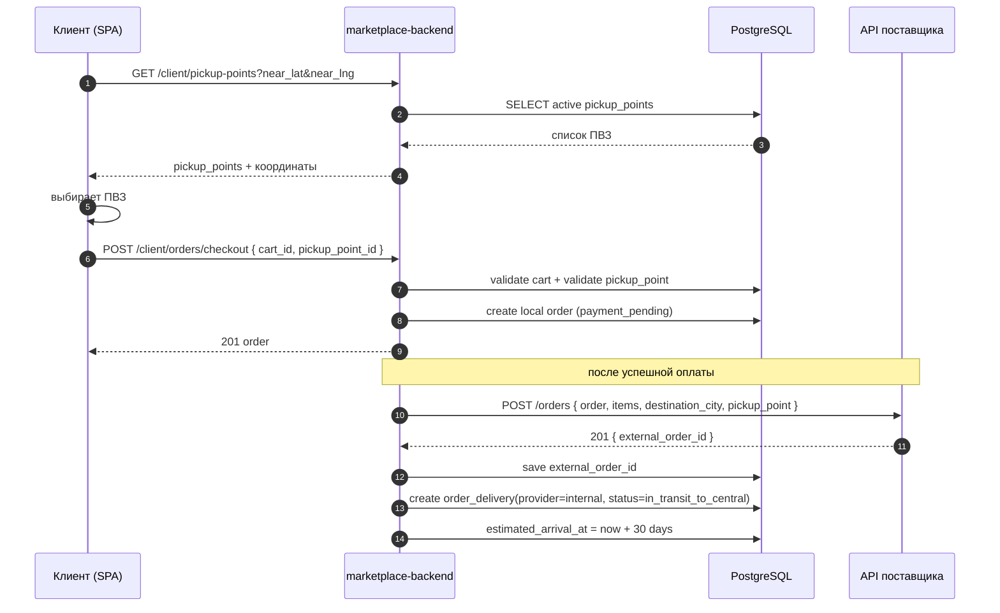
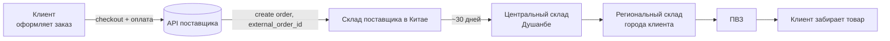
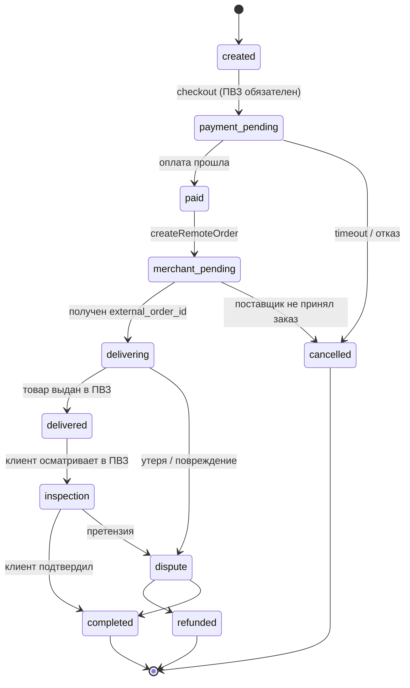
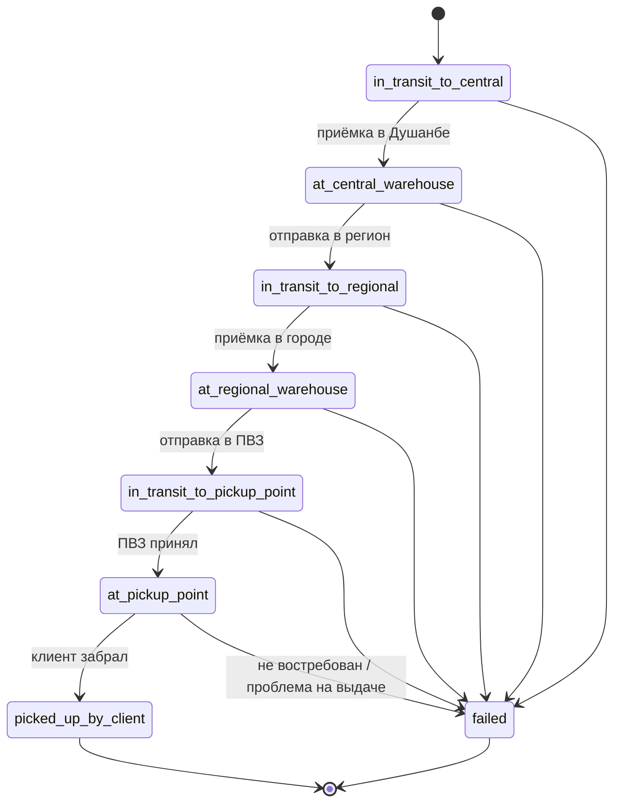

# Маркетплейс-мерчанты, складская сеть и доставка в ПВЗ

## Контекст и проблема

Сейчас в системе мерчант — это локальный продавец в Таджикистане. Все товары хранятся у мерчанта на одном складе (`merchant_warehouses`), заказ создаётся в рамках одного мерчанта и доставляется такси (`order_deliveries` с провайдером `jurataxi`). Статусы заказа линейные и заточены под флоу «один склад -> клиент».

Нужно ввести новый тип мерчанта — **marketplace**. Это внешний поставщик, который отдаёт нам каталог по API и принимает создание заказа через своё API. После успешного создания внешнего заказа мы получаем `external_order_id` — это основной идентификатор поставщика для конкретного заказа. Дальше заказ не требует постоянного участия мерчанта: товар считается уже отправленным в нашу сторону, ориентир по доставке до центрального склада — около 30 дней, а дальнейшее движение полностью ведётся нашей системой и нашими сотрудниками.

Маршрут marketplace-заказа: склад поставщика в Китае -> центральный склад в Душанбе -> региональный склад города клиента -> ПВЗ -> клиент. Это меняет домены складов, статусов доставки, сотрудников, мобильного приложения и клиентского чекаута.

## Подтверждённые решения

- Появляется второй тип мерчанта `marketplace` в дополнение к существующему `local`.
- Marketplace-мерчантов создаёт только администратор из admin-panel; саморегистрации для них нет.
- Для MVP у нас один marketplace-провайдер. Архитектуру делаем так, чтобы позже можно было добавить новых, но отдельного набора сценариев под несколько провайдеров сейчас не закладываем.
- Импорт каталога marketplace-мерчанта делается отдельной cron-задачей на мерчанта; регистрация этой задачи пока ручная.
- Backend работает только в исходящем направлении: запрашивает каталог и создаёт заказ во внешнем API.
- Merchant-panel для marketplace-мерчанта не нужен в MVP. Взаимодействие с поставщиком минимальное и происходит через backend/API, а не через UI.
- После оплаты backend вызывает API поставщика, создаёт у него заказ и получает `external_order_id`.
- Получение `external_order_id` означает, что товар принят поставщиком и считается находящимся в пути к нам. Начальный внутренний статус после этого — `in_transit_to_central`.
- Базовый срок доставки до центрального склада — около `30` дней. Это нужно показывать клиенту в каталоге и в чекауте.
- Складская сеть расширяется новыми типами: `merchant_origin`, `central`, `regional`, `pickup_point`.
- Доставка для marketplace-заказов не использует такси. Для них в `order_deliveries` появляется внутренний канал `internal`.
- `operator` полностью переименовывается в `employee`; старый домен операторов можно заменять целиком.
- Админ сохраняет полный доступ и может работать в мобильном приложении так же, как сотрудник склада/ПВЗ. Отдельная роль для админа не нужна.
- В первом релизе вместо QR используется `external_order_id`: сотрудники сканируют штрихкод/маркировку поставщика или вводят `external_order_id` вручную.
- Для cargo используем только весовую модель: `rate_per_kg`.
- Наша наценка на marketplace-заказ — `5%` от суммы заказа. Это не хардкод: значение хранится в Settings модуле и подставляется в расчёт как настраиваемый параметр.
- Локализуем только статичные подписи и статусы. Названия товаров не локализуются.
- Правило «один заказ — один мерчант» сохраняется.
- В чекауте marketplace-заказа клиент не указывает домашний адрес: он выбирает ПВЗ из списка/карты.

## Анализ требований и их покрытие

| # | Требование / решение | Где в плане |
| - | -------------------- | ----------- |
| 1 | Новый тип мерчанта `marketplace`, создаётся только админом | «Подтверждённые решения», «Admin-panel и backend-конфиг мерчанта» |
| 2 | Отдельный cron на каждого marketplace-мерчанта | «Импорт каталога marketplace-мерчанта (cron)» |
| 3 | Склад поставщика в Китае должен храниться в системе | «Складская сеть как первоклассная сущность» |
| 4 | Центральный склад в Душанбе | `warehouses.kind='central'` |
| 5 | Региональные склады по городам | `warehouses.kind='regional'` |
| 6 | После сортировки товары идут в ПВЗ | Маршрут `central -> regional -> pickup_point` |
| 7 | ПВЗ уже существуют и должны участвовать в маршруте | «Выбор ПВЗ клиентом», `orders.pickup_point_id` |
| 8 | Marketplace-заказы идут без такси | `order_deliveries.provider='internal'` |
| 9 | Один заказ — один мерчант | «Подтверждённые решения» |
| 10 | При создании заказа backend обращается в API поставщика и получает order ID | «Создание внешнего заказа через API поставщика» |
| 11 | Нужны отдельные статусы под marketplace-флоу | «Сервис статусов доставки», диаграммы marketplace-флоу |
| 12 | `operators -> employees`, привязка к складу | «Сотрудники и мобильное API», миграция схемы |
| 13 | Входящие обновления от поставщика не используем | Зафиксировано в «Подтверждённых решениях», архитектура строится только на исходящих API-вызовах |
| 14 | Нужно новое мобильное приложение для сотрудников складов/ПВЗ | «Мобильное приложение сотрудников» |
| 15 | В админке и ПВЗ нужно видеть источник заказа | «Admin-panel: классификация и маршруты» |
| 16 | Фильтр мерчантов по типу | «Admin-panel: классификация и маршруты» |
| 17 | Merchant-panel для marketplace не нужен в MVP | Зафиксировано в «Подтверждённых решениях» |
| 18 | В каталоге нужно показывать, что товар зарубежный и ждать около 30 дней | «Клиентский API/каталог» |
| 19 | Клиент выбирает ПВЗ на карте | «Чекаут marketplace-заказа: выбор ПВЗ на карте» |
| 20 | Local-флоу не должен ломаться | Все изменения ветвятся по `merchant.type` / `order_deliveries.provider` |
| 21 | Вместо QR в первом релизе используем `external_order_id` | «Приёмка и движение по `external_order_id`» |
| 22 | Cargo только по `rate_per_kg` | «Cargo pricing и наценка» |
| 23 | Наценка `5%` от суммы заказа, настраивается в Settings | «Cargo pricing и наценка» |
| 24 | Один marketplace сейчас, но возможность расширения оставить | «Один провайдер в MVP и точка расширения» |
| 25 | Админ тоже может пользоваться мобильным приложением | «Сотрудники и мобильное API» |

## Чекаут marketplace-заказа: выбор ПВЗ на карте

UX и контракт:

- В корзине, когда все товары относятся к `marketplace`-мерчанту, чекаут показывает экран «Куда привезти» с картой Yandex Maps:
  - центр карты — текущая геолокация клиента, с фоллбэком на город профиля;
  - на карте — все активные ПВЗ;
  - под картой — список ПВЗ, отсортированный по расстоянию;
  - клиент выбирает ПВЗ, видит его адрес, город, график и расстояние.
- Backend-эндпоинт `GET /client/pickup-points` отдаёт список ПВЗ с координатами и slug; опциональные query: `city`, `near_lat`, `near_lng`, `limit`.
- `POST /client/orders/checkout` для marketplace-заказа принимает `pickup_point_id` вместо `delivery_address_id`.
- В `orders` сохраняем `pickup_point_id`; для local-заказов поле `NULL`, для marketplace — обязательное.
- Контракт ошибок: `PICKUP_POINT_NOT_FOUND`, `PICKUP_POINT_INACTIVE`, `PICKUP_POINT_REQUIRED_FOR_MARKETPLACE_ORDER`, `DELIVERY_ADDRESS_NOT_ALLOWED_FOR_MARKETPLACE_ORDER`.
- В админке карточка заказа показывает выбранный ПВЗ и текущее положение по маршруту.

### Sequence: чекаут и создание внешнего заказа

## Наблюдения по текущему состоянию

- `merchants.type` со значениями `local|marketplace` уже есть.
- `pickup_points` со slug и геокоординатами уже есть, но с заказом и складским маршрутом пока не связаны.
- `merchant_warehouses` сейчас описывают склады на стороне мерчанта; для marketplace там по сути хранится адрес склада в Китае.
- Нашей собственной единой таблицы складов для центрального/региональных узлов пока нет.
- `order_deliveries` поддерживает только `jurataxi` и набор локальных статусов.
- В админке есть модули мерчантов, ПВЗ и складов, но логики транзита через несколько узлов нет.
- В cron-worker нет адресных задач под marketplace-провайдера.
- Клиентский каталог не показывает зарубежное происхождение товара и ориентир по сроку доставки.

## Текущий флоу заказа (local-мерчант)

Источники статусов:

- `orders.status`: `created -> payment_pending -> paid -> merchant_pending -> delivering -> delivered -> inspection -> completed` плюс терминальные `dispute | refunded | cancelled`.
- `order_deliveries.status`: `requested -> accepted -> picked_up -> delivered`, плюс `failed | cancelled`.

### Диаграмма физического движения товара (local)

## Целевой флоу заказа (marketplace)

Marketplace-заказ использует общую шапку `orders.status`, но логистика после оплаты идёт по нашей внутренней маршрутной цепочке. Поставщик нужен только в момент создания внешнего заказа и возврата `external_order_id`.

### Диаграмма физического движения товара (marketplace)

### Диаграмма статусов заказа (marketplace)

### Диаграмма внутренних статусов доставки (marketplace)

### Маппинг внутренних статусов на `orders.status`

| Внутренний статус доставки | Статус `orders.status` | Кто двигает |
| -------------------------- | ---------------------- | ----------- |
| `in_transit_to_central` | `delivering` | backend после `createRemoteOrder` |
| `at_central_warehouse` | `delivering` | сотрудник центрального склада / админ в mobile app |
| `in_transit_to_regional` | `delivering` | сотрудник центрального склада / админ |
| `at_regional_warehouse` | `delivering` | сотрудник регионального склада / админ |
| `in_transit_to_pickup_point` | `delivering` | сотрудник регионального склада / админ |
| `at_pickup_point` | `delivering` | сотрудник ПВЗ / админ |
| `picked_up_by_client` | `delivered` | сотрудник ПВЗ / админ |
| `failed` | `cancelled` / `dispute` | backend по правилам `DeliveryStatusService` |

## Предлагаемый подход

1. **Складская сеть как первоклассная сущность**
   - Вводим единую таблицу `warehouses`.
   - Для физической роли склада используем `kind`: `merchant_origin`, `central`, `regional`, `pickup_point`.
   - Для разделения владельца используем поле `scope`: `merchant | platform`.
   - Для `scope='merchant'` храним `merchant_id`; для `scope='platform'` отдельный владелец не нужен.
   - `pickup_points` не удаляем: связываем их с `warehouses` через `pickup_points.warehouse_id`.

2. **Маршрут доставки marketplace-заказа**
   - Для marketplace-заказа последовательность узлов: `merchant_origin -> central -> regional -> pickup_point`.
   - Для local-заказа маршрут остаётся текущим и не смешивается с marketplace-моделью.
   - `order_deliveries` расширяем, а не создаём отдельную таблицу доставки:
     - `provider`: `jurataxi | internal`;
     - `delivery_kind`: `local | marketplace`;
     - `origin_warehouse_id`, `current_warehouse_id`, `destination_warehouse_id`, `pickup_point_id`;
     - `external_order_id` — идентификатор заказа у поставщика;
     - `estimated_arrival_at` — расчётная дата прибытия в центральный склад.

3. **Сервис статусов доставки**
   - Выделяем `DeliveryStatusService` с двумя наборами правил: `local` и `marketplace`.
   - Для marketplace сервис знает внутренние статусы маршрута и маппинг на `orders.status`.
   - Историю переходов продолжаем писать в `order_status_history`; при необходимости расширяем payload событиями склада.

4. **Admin-panel и backend-конфиг marketplace-мерчанта**
   - В admin-panel добавляем форму создания/редактирования marketplace-мерчанта.
   - Для MVP достаточно полей на `merchants`: `provider_code`, `api_base_url`, `api_key_ref`, `catalog_sync_enabled`, `last_catalog_sync_at`, `origin_country_code`.
   - Отдельный merchant-panel для marketplace не делаем.

5. **Создание внешнего заказа через API поставщика**
   - После успешной оплаты backend вызывает `createRemoteOrder`.
   - В ответ получает `external_order_id`.
   - `external_order_id` сохраняется в `order_deliveries` как основной внешний идентификатор.
   - Если внешний заказ не создался, заказ не переводится в рабочий logistics-флоу.
   - Входящих обновлений статусов и отдельных ключей для них в архитектуре нет.

6. **Сотрудники и мобильное API**
   - Полностью переименовываем `operators` в `employees`.
   - `employees.role` остаётся текстовым полем.
   - `employees.warehouse_id` привязывает сотрудника к конкретному узлу.
   - Админ может работать в тех же мобильных сценариях; для него даём полный доступ и, при необходимости, выбор склада вручную.

7. **Мобильное приложение сотрудников**
   - Отдельный API-модуль `employee` / `warehouse-staff`.
   - Сценарии MVP:
     - принять товар на центральный склад;
     - отправить на региональный склад;
     - принять на региональный склад;
     - отправить в ПВЗ;
     - принять в ПВЗ;
     - выдать клиенту.
   - Во всех этих сценариях первичным идентификатором выступает `external_order_id`.

8. **Admin-panel: классификация и маршруты**
   - В списке мерчантов — фильтр `type = local | marketplace`.
   - В карточке marketplace-мерчанта — страна происхождения, провайдер, API-конфиг, лог последних синхронизаций каталога.
   - В заказах, ПВЗ и складах — отображаем происхождение заказа (`local | marketplace`) и текущий узел маршрута.
   - В разделе складов — управление центральным и региональными узлами.

9. **Клиентский API/каталог**
   - На товаре возвращаем `origin_country`, `is_international`, `estimated_delivery_days_min`.
   - В чекауте marketplace-заказа не даём выбрать домашний адрес, только ПВЗ.
   - В карточке заказа клиента отдаём ленту статусов из `DeliveryStatusService`.

10. **Выбор ПВЗ клиентом**
   - `GET /client/pickup-points` — список активных ПВЗ с координатами, slug, городом и графиком работы.
   - `POST /client/orders/checkout` для marketplace принимает `pickup_point_id`; `delivery_address_id` запрещён.
   - В `orders.pickup_point_id` храним выбранный клиентом ПВЗ.

11. **Локализация**
   - Локализуем статичные подписи и статусы для клиента и сотрудников.
   - Названия товаров и исходные supplier-названия остаются без локализации.

12. **Приёмка и движение по `external_order_id`**
   - В первом релизе QR-кодов нет.
   - На коробке/накладной поставщика должен быть `external_order_id` или штрихкод, который его кодирует.
   - Сотрудник центрального склада сканирует или вручную вводит `external_order_id`.
   - Backend по `external_order_id` находит заказ, показывает город назначения, региональный склад и ПВЗ.
   - После подтверждения приёмки система переводит заказ в `at_central_warehouse`, а затем позволяет сформировать отправку на нужный регион.
   - На региональном складе и в ПВЗ этот же `external_order_id` используется дальше как ключ при приёмке и выдаче.
   - Если позже понадобится физическая локальная маркировка, можно добавить печать локальной стикер-этикетки поверх этой модели, но это не требуется для MVP.

13. **Cargo pricing и наценка**
   - Для MVP считаем cargo только по весу:
     - `cargo_fee = actual_weight_kg * rate_per_kg`.
   - Тарифы храним в `marketplace_cargo_tariffs`:
     - `merchant_id`, `rate_per_kg`, `currency`, `min_fee`, `is_active`.
   - Наша сервисная наценка считается отдельно:
     - `marketplace_service_fee = order_subtotal * settings.MARKETPLACE_ORDER_MARKUP_PERCENT / 100`.
   - Для MVP значение `settings.MARKETPLACE_ORDER_MARKUP_PERCENT = 5`.
   - В заказе фиксируем snapshot:
     - `cargo_fee`,
     - `marketplace_markup_percent`,
     - `marketplace_service_fee`.

14. **Один провайдер в MVP и точка расширения**
   - На первом этапе реализуем один адаптер `MarketplaceProviderAdapter`.
   - Достаточно интерфейса:
     - `fetchCatalog`,
     - `createRemoteOrder`,
     - `normalizeProduct`.
   - Когда появится второй provider, конфиг можно вынести из `merchants` в отдельную таблицу `marketplace_integrations`, но для MVP это не нужно.

## Этапы реализации

1. **Доменная модель и миграции БД**
   - Добавить `warehouses` с `kind` и `scope`.
   - Связать `pickup_points` с `warehouses`.
   - Расширить `order_deliveries` под `internal`-маршрут и `external_order_id`.
   - Добавить `orders.pickup_point_id`.
   - Полностью переименовать `operators` в `employees`.

2. **Сервис статусов доставки**
   - Реализовать `DeliveryStatusService` с двумя ветками: `local` и `marketplace`.
   - Подключить внутренние статусы `in_transit_to_central -> ... -> picked_up_by_client`.

3. **Admin-panel и backend-конфиг мерчанта**
   - Создание marketplace-мерчанта.
   - Поля API-конфига и страны происхождения.
   - Фильтрация списка мерчантов по типу.

4. **Импорт каталога marketplace-мерчанта (cron)**
   - Отдельная задача в `marketplace-cron-worker`.
   - Upsert товаров, журнал последней синхронизации, обработка ошибок.

5. **Создание заказа у поставщика**
   - После оплаты вызвать `createRemoteOrder`.
   - Сохранить `external_order_id`.
   - Инициализировать `order_delivery` со статусом `in_transit_to_central`.

6. **Сеть складов и маршрутизация**
   - CRUD складов в админке.
   - Определение регионального склада по городу клиента.
   - Маршрут `central -> regional -> pickup_point`.

7. **Сотрудники и мобильное API**
   - Миграция `employees`.
   - Авторизация сотрудников и админов в mobile flow.
   - API приёмки, перевода и выдачи.

8. **Клиентский каталог и чекаут**
   - Признак международной доставки и срок `~30 дней`.
   - `GET /client/pickup-points`.
   - Выбор ПВЗ на карте.
   - Checkout через `pickup_point_id`.

9. **Лента статусов клиенту**
   - Таймлайн внутренних статусов в клиентском API и SPA.

10. **Мобильное приложение сотрудников**
   - Новый фронтовый проект под mobile viewport.
   - Экраны логина, приёмки, отправки, выдачи и истории операций.

11. **Приёмка по `external_order_id`**
   - Сценарий сканирования/ввода `external_order_id`.
   - Автоопределение заказа, города, склада и ПВЗ.
   - Подтверждение переходов по маршруту.

12. **Cargo pricing и Settings**
   - `marketplace_cargo_tariffs.rate_per_kg`.
   - `settings.MARKETPLACE_ORDER_MARKUP_PERCENT`.
   - Snapshot расчёта в заказе.

13. **Точка расширения под новых провайдеров**
   - Один адаптер в MVP.
   - Выделенный интерфейс, чтобы позже без переписывания checkout и cron добавить второго провайдера.

## Открытые вопросы

- Какое стартовое значение `rate_per_kg` используем для первого marketplace-мерчанта в MVP.
- Нужен ли для клиента отдельный видимый статус «в пути в Душанбе ~30 дней», или достаточно текста в карточке заказа и общего `delivering`.
- Должен ли `estimated_arrival_at` быть фиксированным правилом `+30 days`, или это тоже нужно выносить в Settings как настраиваемый SLA.
