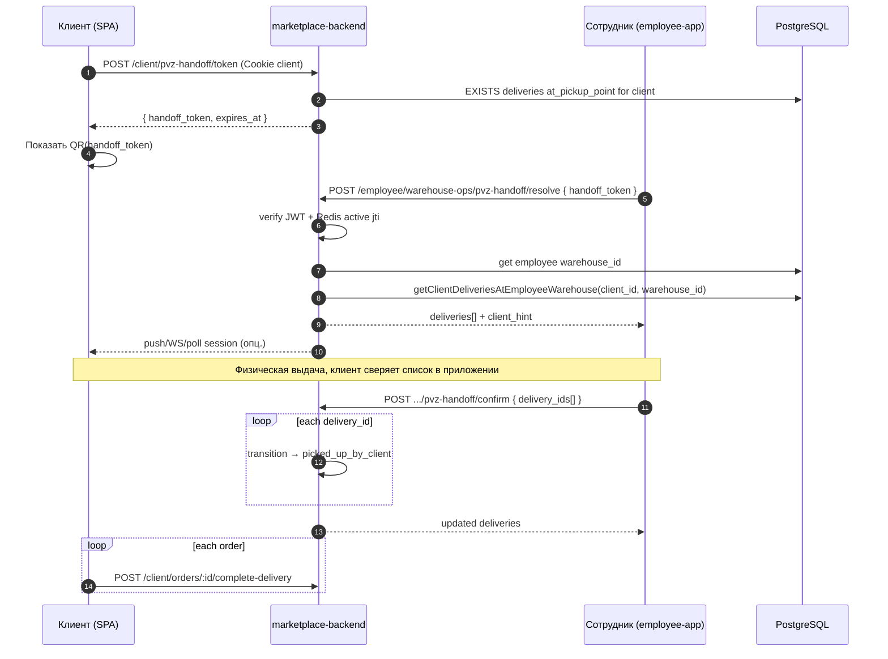

# QR-выдача на ПВЗ: идентификация клиента и batch-приёмка

## Контекст и проблема

Сейчас сотрудник ПВЗ работает **по посылке**: сканирует или вводит `external_order_id` одной доставки (`GET /employee/warehouse-ops/orders/lookup`), затем переводит её в `picked_up_by_client` (`POST /employee/warehouse-ops/deliveries/:id/transition`). Клиент после этого подтверждает приём через `POST /client/orders/:id/complete-delivery`.

Это удобно, когда у клиента одна коробка или нет мобильного приложения. Неудобно, когда клиент пришёл за **несколькими заказами** на одном ПВЗ: сотруднику приходится сканировать каждую посылку отдельно, а клиент не видит единый список «что сейчас выдают» до подтверждения в приложении.

Нужен параллельный флоу: клиент показывает **QR с короткоживущим handoff-токеном**, сотрудник сканирует его, backend возвращает **все доставки клиента в статусе `at_pickup_point` на складе этого сотрудника**, после физической выдачи сотрудник batch-переводит их в `picked_up_by_client`, клиент завершает осмотр через существующий `complete-delivery`.

Связь с общим планом склада: в [marketplace-merchants-and-warehouse-network.md](./marketplace-merchants-and-warehouse-network.md) зафиксировано, что в первом релизе MVP использовался только `external_order_id`. Этот документ описывает **следующий этап (phase 4+)** — QR по клиенту, без отмены lookup по штрихкоду.

## Подтверждённые решения

- Продукт: только **marketplace** (`app/marketplace-*`), не `lavka-*`.
- Handoff-токен — **отдельный JWT** с `typ: 'pvz_handoff'`, **не** access_token клиента и не его шифрование.
- Срок действия токена: **30 минут** (`exp` в JWT).
- Таблица в PostgreSQL для токенов **не нужна**; **Redis обязателен** для хранения «текущего» `jti` клиента (см. инвалидацию ниже).
- **Каждый** `POST /client/pvz-handoff/token` выпускает новый JWT и **инвалидирует предыдущий** QR того же клиента.
- Backend **не отдаёт URL картинки QR** — в ответе только `handoff_token`; QR рисует клиентское приложение локально из этой строки.
- Проверка личности на скане: `verify(token)` → `client_id` из payload; при генерации QR клиент уже авторизован, `userId` берётся из сессии.
- Сотрудник видит только посылки, где `order_deliveries.current_warehouse_id` = `employees.warehouse_id` сотрудника и `status = 'at_pickup_point'`.
- Флоу lookup по `external_order_id` **остаётся** (fallback без смартфона, одна посылка).
- Переход статусов — тот же registry: `at_pickup_point` → `picked_up_by_client` → у клиента `complete-delivery` → `completed`.
- Частичная выдача в MVP: `confirm` принимает массив `delivery_ids[]`, не обязательно все сразу.

## Что уже есть в коде (опора)

| Компонент | Путь / поведение |
| --------- | ---------------- |
| Очередь ПВЗ | `WarehouseOpsService.listQueue` — deliveries на `warehouse_id` сотрудника |
| Lookup посылки | `lookupByExternalOrderId` + `assertEmployeeWarehouseAccess` |
| Transition | `WarehouseOpsService.transition` + `DeliveryStatusService` |
| Статусы | `MarketplaceDeliveryStatus.AT_PICKUP_POINT`, `PICKED_UP_BY_CLIENT` |
| Клиент после выдачи | `POST /client/orders/:id/complete-delivery` |
| JWT | `JwtService` (`src/libs/validation/auth/jwt.service.ts`) |
| Redis (опц.) | `src/core/redis.ts`, паттерн revoke в `user-jwt.guard` |
| E2E флоу ПВЗ | `marketplace-order-lifecycle.integration.spec.ts` |

## Архитектура токена

### Payload (пример)

```json
{
  "sub": "<client_uuid>",
  "typ": "pvz_handoff",
  "jti": "<uuid>",
  "iat": 1710000000,
  "exp": 1710001800
}
```

- Подпись: `Envs.JWT_SECRET` или отдельный `PVZ_HANDOFF_SECRET` (предпочтительно отдельный секрет, чтобы access-guard не принимал handoff-токен).
- В QR кодируется **строка `handoff_token` из ответа API** (см. контракт ниже). Вариант с deep link `app://pickup?token=...` — только на фронте; employee `resolve` всегда принимает raw token в JSON body.

### Инвалидация при перевыпуске (обязательно в MVP)

При выдаче токена backend:

1. Генерирует новый `jti` (UUID).
2. Подписывает JWT с `sub = client_id`, `exp = now + 30m`.
3. В Redis: `SET pvz:handoff:active:{client_id} {jti} EX 1800` — перезаписывает ключ, старый `jti` перестаёт быть «активным».

При `resolve` сотрудником:

1. `verify` JWT (подпись, `exp`, `typ`).
2. `GET pvz:handoff:active:{client_id}` — должен **совпадать** с `jti` из токена; иначе `PVZ_HANDOFF_TOKEN_INVALID` (старый QR после «Обновить» на телефоне).

Без Redis одного JWT с `exp` недостаточно: старый QR останется валидным до истечения 30 минут после перевыпуска.

### Чего не делать

| Антипаттерн | Почему |
| ----------- | ------ |
| Класть `access_token` в QR | Утечка полной сессии при фото QR |
| Сравнивать QR с cookie сотрудника | Разные субъекты; сотрудник не «логинится» клиентом |
| Хранить список заказов в токене | Раздувает QR, устаревает при новой посылке |
| Таблица `pvz_handoff_tokens` | Достаточно JWT + Redis active `jti` |
| Отдавать `qr_image_url` / PNG с бэка | QR генерируется на клиенте; бэк не хранит картинки |

### Опционально Redis (phase 4.1)

- При `resolve`: `SET pvz:handoff:used:{jti} 1 EX 1800 NX` — one-time scan (защита от replay фото; отдельно от инвалидации при перевыпуске).

## API

### Почему `POST /client/pvz-handoff/token`, а не `GET`

| Критерий | `POST` | `GET` |
| -------- | ------ | ----- |
| Побочный эффект (новый токен, инвалидация старого в Redis) | Допустим по семантике HTTP | **Нежелателен** (GET должен быть safe/idempotent без side effects) |
| Кэширование прокси/CDN | Не кэшируется по умолчанию | Риск закэшировать «токен» |
| Повторный тап «Обновить QR» | Явное действие «выпустить новый» | Выглядит как «просто прочитать», но меняет состояние |

Итого: выпуск токена — **создание ресурса** (новая сессия handoff), поэтому `POST`. Тело запроса пустое `{}` или без body.

### Клиент: как появляется QR (нет пути к файлу на бэке)


**Контракт ответа** `POST /client/pvz-handoff/token` (201 или 200):

```typescript
{
  handoff_token: string;   // JWT, payload для QR — encode целиком эту строку
  expires_at: string;      // ISO-8601, дублирует exp для UI таймера
  jti: string;             // опционально, для отладки; в QR не обязателен отдельно
  pending_pickups_count: number; // сколько at_pickup_point у клиента (все ПВЗ)
}
```

**Клиентское приложение (marketplace-spa):**

```typescript
const { handoff_token, expires_at } = await api.post('/client/pvz-handoff/token');
// Пример: react-qr-code — value={handoff_token}, не URL на CDN
<QRCode value={handoff_token} size={256} level="M" />
```

Сотрудник после скана получает ту же строку, что была закодирована в QR, и шлёт её в `resolve` — **без** повторного запроса к `/token`.

Ошибки до показа QR: `PVZ_HANDOFF_NO_PICKUPS` (409 или 404) — нет посылок `at_pickup_point`, экран «нечего забирать».

### Клиент — эндпоинты

| Method | Path | Auth | Описание |
| ------ | ---- | ---- | -------- |
| `POST` | `/client/pvz-handoff/token` | client | Выпустить handoff JWT (30m), **инвалидировать предыдущий** через Redis; ответ — `handoff_token` для локального QR |
| `GET` | `/client/pvz-handoff/session` | client | (Опц., phase 4.1) Активная сессия выдачи после скана сотрудником |

Модуль: `src/modules/client/pvz-handoff/` (новый), не смешивать с `pickup-points` (это каталог ПВЗ для чекаута).

### Сотрудник

| Method | Path | Auth | Описание |
| ------ | ---- | ---- | -------- |
| `POST` | `/employee/warehouse-ops/pvz-handoff/resolve` | employee | `{ handoff_token }` → список deliveries + метаданные для UI |
| `POST` | `/employee/warehouse-ops/pvz-handoff/confirm` | employee | `{ delivery_ids: string[] }` → batch transition → `picked_up_by_client` |

Расширение существующего `warehouse-ops`, те же `assertEmployeeWarehouseAccess` и `transition` внутри сервиса.

### Response resolve (черновик)

```typescript
{
  client_id: string;
  client_hint: string;        // маска: «***1234» телефона или имя — только на экране сотрудника
  pickup_point_name: string;
  deliveries: Array<{
    delivery_id: string;
    order_id: string;
    public_order_id: string;
    external_order_id: string | null;
    merchant_store_name: string;
    status: 'at_pickup_point';
    allowed_transitions: ['picked_up_by_client'];
  }>;
}
```

## SQL (новые запросы)

Файл: `src/modules/employee/warehouse-ops/sql/warehouse-ops.sql` (или отдельный `pvz-handoff.sql` в том же модуле).

```sql
/* @name getClientDeliveriesAtEmployeeWarehouseSql */
SELECT
  od.id AS delivery_id,
  od.order_id,
  od.status,
  od.external_order_id,
  o.order_id AS public_order_id,
  o.client_id,
  m.store_name AS merchant_store_name,
  pp.name AS pickup_point_name
FROM order_deliveries od
  INNER JOIN orders o ON o.id = od.order_id
  INNER JOIN merchants m ON m.id = o.merchant_id
  LEFT JOIN warehouses pp ON pp.id = od.pickup_point_id
    AND pp.kind = 'pickup_point'
    AND pp.scope = 'platform'
WHERE od.delivery_kind = 'marketplace'
  AND o.client_id = :client_id!
  AND od.current_warehouse_id = :warehouse_id!
  AND od.status = 'at_pickup_point'
ORDER BY od.updated_at ASC;
```

После `sql:generate` — вызов из `PvzHandoffService` / расширения `WarehouseOpsService`.

## Sequence: полный флоу



## Безопасность

| Риск | Митигация |
| ---- | --------- |
| Фото QR, replay | TTL 30m; active `jti` в Redis; опционально one-time scan на resolve (4.1) |
| Старый QR после «Обновить» | Redis `pvz:handoff:active:{client_id}` — только последний `jti` валиден |
| Утечка сессии клиента | Отдельный `typ`, не access JWT |
| Сотрудник другого ПВЗ | Фильтр `current_warehouse_id = employee.warehouse_id` |
| Перебор токенов | Rate limit на `resolve` (по IP + employee_id) |
| Выдача чужих заказов | Resolve только по verified `client_id`; confirm проверяет принадлежность client + warehouse + status |
| PII в QR | Только opaque token; hint только в response resolve для экрана сотрудника |

Коды ошибок (добавить в error-codes): `PVZ_HANDOFF_TOKEN_INVALID`, `PVZ_HANDOFF_TOKEN_EXPIRED`, `PVZ_HANDOFF_NO_PICKUPS`, `PVZ_HANDOFF_DELIVERY_NOT_ELIGIBLE`.

## UX

### Клиент (marketplace-spa)

- Экран «Забрать заказы» / кнопка в заказах со статусом «Готов к выдаче».
- Кнопка «Обновить QR» → повторный `POST /token` → новый `handoff_token` → перерисовать `<QRCode value={...} />`; старый QR на экране/в скриншоте перестаёт проходить `resolve`.
- После resolve — список «Сотрудник открыл выдачу: N посылок» (polling `GET session` или notification).

### Сотрудник (marketplace-employee-app)

- Режим «Сканировать QR клиента» рядом с существующим сканом `external_order_id`.
- Экран списка посылок с чекбоксами (по умолчанию все `at_pickup_point`).
- Кнопка «Выдано» → `confirm`.
- Показ `client_hint` для сверки личности на стойке.

## Интеграция с уведомлениями (опционально)

После успешного `resolve`:

- `NotificationEventPublisher` — клиенту: `order.ready_for_pickup_at_pvz` или агрегированное «N заказов готовы к выдаче».
- Канал: push / in-app; SMS не обязателен (клиент уже на ПВЗ).

## Тестирование

| Уровень | Сценарии |
| ------- | -------- |
| Unit | verify token, expired, wrong typ, empty deliveries |
| Integration | полный цикл: token → resolve → confirm → complete-delivery (расширить `marketplace-order-lifecycle.integration.spec.ts`) |
| Security | employee другого warehouse → 403/empty; confirm чужой delivery_id → 404 |
| Employee-app / SPA | ручной чеклист в todo |

## Этапы внедрения

### MVP (phase 4.0)

1. `PvzHandoffTokenService` + env secret + Redis active `jti`.
2. Client `POST /client/pvz-handoff/token` → response `handoff_token` (SPA рисует QR).
3. Employee `resolve` + `confirm` (batch через существующий `transition`).
4. SQL `getClientDeliveriesAtEmployeeWarehouseSql`.
5. Integration test.
6. Минимальный UI в employee-app + SPA (QR display).

### Улучшения (phase 4.1)

- Redis: one-time resolve (replay фото).
- `GET /client/pvz-handoff/session`.
- Push при resolve.
- Локализация статических строк (ru/tj).

## Связанные файлы для реализации

- `marketplace-backend/src/modules/employee/warehouse-ops/`
- `marketplace-backend/src/modules/client/` — новый `pvz-handoff`
- `marketplace-backend/src/core/delivery/delivery-status.registry.ts`
- `marketplace-employee-app` — экран QR
- `marketplace-spa` — экран «Показать QR»

## Открытые вопросы

- [ ] Отдельный `PVZ_HANDOFF_SECRET` vs общий `JWT_SECRET`?
- [x] Инвалидация предыдущего токена при каждом `POST /token` — Redis active `jti` (MVP).
- [ ] One-time scan на `resolve` (отдельно от перевыпуска QR)?
- [ ] Что показывать в `client_hint`: последние 4 цифры телефона, имя из профиля, или оба?
- [ ] Нужен ли агрегированный `complete-delivery` batch для клиента (сейчас по одному `order_id`)?

---

См. чеклист реализации: [pvz-client-qr-handoff.todo.md](./pvz-client-qr-handoff.todo.md).
