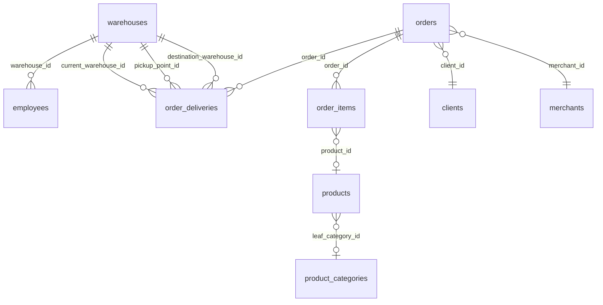

# Hub складов и ПВЗ в админке: сотрудники, товары, заказы, аудит

## Контекст и проблема

В админ-панели marketplace уже есть:

- **Пункты выдачи (ПВЗ)** — список `/pickup-points`, создание, деталь `/pickup-points/[slug]` (только форма редактирования: имя, город, координаты).
- **Платформенные склады** — список `/platform-warehouses`, создание; **нет** страницы детали по `id`.
- **Сотрудники** — CRUD `/employees`, привязка к складу через `employees.warehouse_id`.

Операционная работа на складе и в ПВЗ идёт через **employee API** (`/employee/warehouse-ops`): очередь доставок, переходы статусов, QR handoff. Контракт эндпоинтов: [employee-warehouse-ops.md](../../specs/employee-warehouse-ops.md). Админ не видит «внутрянку» узла сети: кто работает на точке, какие товары (позиции заказов) уже пришли или в пути, какие заказы привязаны к складу.

Нужно:

1. **Внутренняя страница (hub)** для платформенного склада и для ПВЗ с вкладками: сотрудники, товары, заказы (+ настройки для ПВЗ).
2. **Фильтры товаров**: телефон клиента, магазин мерчанта (`store_name`), категория (рекурсивно по дереву), признак «пришёл / не пришёл».
3. **Аудит** всех действий сотрудников в рамках складов/ПВЗ в `audit_log` + лента на карточке сотрудника.
4. **PostgreSQL view** для удобных выборок.
5. **Обновление seeder** (`app/seeder`) под демо-данные hub.

Связанные документы:

- [marketplace-merchants-and-warehouse-network.md](./marketplace-merchants-and-warehouse-network.md) — модель складов, статусы marketplace-доставки.
- [pvz-client-qr-handoff.md](./pvz-client-qr-handoff.md) — QR-выдача на ПВЗ (employee API).

Продукт: только **marketplace** (`app/marketplace-*`), не `lavka-*`.

---

## Подтверждённые решения

| Тема | Решение |
|------|---------|
| Единая таблица складов | После миграции `1780200000000-unify-warehouses.psql` все узлы в `warehouses`: `scope` = `platform` \| `merchant`, `kind` = `central` \| `regional` \| `pickup_point` \| `merchant_origin`. |
| ПВЗ в админке | Маршрут `/pickup-points`, API `/admin/pickup-points`; строка в `warehouses` с `kind = pickup_point`. |
| «Товары» на hub | Не остатки каталога `products.quantity`, а **строки заказов** `order_items` в marketplace-доставках `order_deliveries.delivery_kind = 'marketplace'`, связанных со складом. |
| Фильтр мерчанта | Параметр API `merchant_name`, в БД — `merchants.store_name` (в UI подпись «Магазин»). |
| «Пришёл» | Доставка физически на этом складе: `current_warehouse_id = warehouse_id` **и** статус по типу склада (см. ниже). |
| «Не пришёл» | Доставка относится к узлу (транзит, `pickup_point_id`, `destination_warehouse_id`), но ещё не в «at_*» на этом складе. |
| Аудит | Таблица `audit_log`; новый `actor_type = 'employee'`; записи из `WarehouseOpsService`. |
| API hub | Префикс **`/admin/warehouse-hub/:warehouseId`** — не пересекается с `/admin/warehouses/:id` (мерчантские склады). |
| Права | Переиспользовать `pickup-points:list`, `platform-warehouses:list` (через существующие permission keys), `operators:list` для сотрудников и audit. |
| Seeder | Исправить `merchant_warehouses` → `warehouses`; добавить ПВЗ, platform warehouses, employees, marketplace order_deliveries, audit_log. |

---

## Что уже есть в коде

### Backend

| Компонент | Путь | Статус |
|-----------|------|--------|
| CRUD платформенных складов | `src/modules/admin/platform-warehouses/` | `GET/POST /admin/platform-warehouses`, `GET/PUT/DELETE :id` |
| CRUD ПВЗ | `src/modules/admin/pickup-points/` | `GET/POST /admin/pickup-points`, `GET/PATCH/DELETE :slug` |
| Сотрудники | `src/modules/admin/employees/` | CRUD, `warehouse_id` на create/update; **нет** фильтра list по `warehouse_id` |
| Мерчантские склады (read) | `src/modules/admin/warehouses/` | `GET /admin/warehouses`, `GET :id` |
| Employee warehouse ops | `src/modules/employee/warehouse-ops/` | transition, handoff, очередь; **без** audit |
| Audit write | `src/core/audit.service.ts` | INSERT; сейчас только disputes |
| Audit read | — | **Нет** admin API |
| View в migrations | — | **Нет** `v_warehouse_fulfillment_lines` |

### Admin panel

| Маршрут | Содержимое |
|---------|------------|
| `/pickup-points` | Таблица, ссылка на edit |
| `/pickup-points/[slug]` | Только форма (нет hub) |
| `/platform-warehouses` | Карточки без ссылки на деталь |
| `/platform-warehouses/create` | Создание |
| `/employees`, `/employees/[id]` | CRUD, permissions; **нет** журнала действий |

### Seeder (`app/seeder`)

| Сущность | Статус |
|----------|--------|
| `merchant_warehouses` INSERT | **Устарело** — таблица удалена unify-миграцией |
| Platform warehouses / ПВЗ | Только 4 строки из SQL-миграции `1779900000000` |
| `employees` | **Не сидится** |
| `order_deliveries` marketplace | Сидится только jurataxi/local, без `pickup_point_id` / warehouse routing |
| `audit_log` | **Не сидится** |
| `disputes.operator_id` | Ссылается на `admins`, после split должен быть `employees` |

---

## Модель данных

### Склады (`warehouses`)

```
scope = 'platform'  →  central | regional | pickup_point
scope = 'merchant'  →  merchant_origin (не в scope этого hub)
```

Hub работает только с **`scope = 'platform'`** (центральные, региональные, ПВЗ).

### Связь заказов со складом



**Заказ «относится к складу»**, если выполняется хотя бы одно:

- `order_deliveries.current_warehouse_id = :warehouse_id`
- `order_deliveries.pickup_point_id = :warehouse_id`
- `order_deliveries.destination_warehouse_id = :warehouse_id`
- `orders.pickup_point_id = :warehouse_id`

### Статусы marketplace и «пришёл»

Из `MarketplaceDeliveryStatus` (`src/core/delivery/delivery-status.type.ts`):

| `warehouses.kind` | Статус «товар пришёл на этот узел» |
|-------------------|-------------------------------------|
| `central` | `at_central_warehouse` |
| `regional` | `at_regional_warehouse` |
| `pickup_point` | `at_pickup_point` |

**`has_arrived`** (для строки `order_item` + delivery):

```sql
od.current_warehouse_id = :warehouse_id
AND od.status = CASE w.kind
  WHEN 'central' THEN 'at_central_warehouse'
  WHEN 'regional' THEN 'at_regional_warehouse'
  WHEN 'pickup_point' THEN 'at_pickup_point'
END
```

**В пути к узлу** (для фильтра `arrived=false`): доставка связана со складом (см. JOIN ниже), но `has_arrived = false` — например `in_transit_to_pickup_point` при `pickup_point_id = warehouse_id`.

Employee API уже фильтрует выданные позиции на ПВЗ: `getClientPickupProductsAtEmployeeWarehouseSql` — только `at_pickup_point` + `current_warehouse_id`. Hub расширяет это для админки: все связанные позиции + фильтр arrived + категория/клиент/мерчант.

### `audit_log`

Текущая схема (`1760700400000-disputes-payouts-audit.psql`):

| Колонка | Тип |
|---------|-----|
| `id` | BIGSERIAL |
| `entity_type` | VARCHAR(50) |
| `entity_id` | UUID |
| `action` | VARCHAR(50) |
| `actor_type` | CHECK: `system`, `buyer`, `merchant`, `operator` |
| `actor_id` | VARCHAR(100) |
| `old_value`, `new_value` | JSONB |
| `created_at` | TIMESTAMPTZ |

**Изменение:** добавить `employee` в CHECK `actor_type`.

**Рекомендуемые записи** из warehouse-ops:

| Метод | `action` | `entity_type` | `new_value` (минимум) |
|-------|----------|---------------|------------------------|
| `transition` | `delivery.status_changed` | `order_delivery` | `warehouse_id`, `from_status`, `to_status`, `delivery_id` |
| `resolvePvzHandoff` | `pvz.handoff_resolved` | `warehouse` | `warehouse_id`, `client_id`, `delivery_count` |
| `confirmPvzHandoff` | `pvz.handoff_confirmed` | `order_delivery` | `warehouse_id`, `delivery_id`, `order_id` (на каждую доставку или batch в одной записи — зафиксировать при реализации) |

`actor_type: 'employee'`, `actor_id: employeeId` (UUID строкой).

Dispute-записи с `actor_type: 'operator'` не трогаем (исторические данные).

---

## PostgreSQL: миграция и view

**Файл:** `marketplace-backend/migrations/1780400000000-warehouse-hub-audit.psql`

### 1. Расширение `audit_log`

```sql
ALTER TABLE audit_log DROP CONSTRAINT IF EXISTS audit_log_actor_type_check;
ALTER TABLE audit_log ADD CONSTRAINT audit_log_actor_type_check
  CHECK (actor_type IN ('system', 'buyer', 'merchant', 'operator', 'employee'));
```

### 2. View `v_warehouse_fulfillment_lines`

Одна строка = позиция заказа + marketplace-доставка + клиент + мерчант + категория + флаг прибытия.

```sql
CREATE OR REPLACE VIEW v_warehouse_fulfillment_lines AS
SELECT
  w.id AS warehouse_id,
  w.kind AS warehouse_kind,
  w.name AS warehouse_name,
  oi.id AS order_item_id,
  oi.product_id,
  oi.product_title,
  oi.product_price,
  oi.quantity,
  oi.order_id,
  o.order_id AS public_order_id,
  od.id AS delivery_id,
  od.status AS delivery_status,
  od.external_order_id,
  od.current_warehouse_id,
  od.pickup_point_id,
  o.client_id,
  c.phone AS client_phone,
  c.name AS client_name,
  m.id AS merchant_id,
  m.store_name AS merchant_store_name,
  p.leaf_category_id,
  pc.slug AS category_slug,
  (
    od.current_warehouse_id = w.id
    AND od.status = CASE w.kind
      WHEN 'central' THEN 'at_central_warehouse'
      WHEN 'regional' THEN 'at_regional_warehouse'
      WHEN 'pickup_point' THEN 'at_pickup_point'
      ELSE NULL
    END
  ) AS has_arrived
FROM warehouses w
INNER JOIN order_deliveries od ON od.delivery_kind = 'marketplace'
  AND (
    od.current_warehouse_id = w.id
    OR od.pickup_point_id = w.id
    OR od.destination_warehouse_id = w.id
  )
INNER JOIN orders o ON o.id = od.order_id
INNER JOIN order_items oi ON oi.order_id = o.id
INNER JOIN clients c ON c.id = o.client_id
INNER JOIN merchants m ON m.id = o.merchant_id
LEFT JOIN products p ON p.id = oi.product_id
LEFT JOIN product_categories pc ON pc.id = p.leaf_category_id
WHERE w.deleted_at IS NULL
  AND w.scope = 'platform';
```

**down:** `DROP VIEW IF EXISTS v_warehouse_fulfillment_lines;` + откат CHECK (без `employee`).

Запросы hub в pgtyped могут читать view или дублировать JOIN в `.sql` для явных фильтров (категория recursive CTE — как в `admin.sql` `getAllProductsPaginatedSql`).

---

## Backend: модуль `warehouse-hub`

**Папка:** `marketplace-backend/src/modules/admin/warehouse-hub/`

### API (контракт)

| Method | Path | Описание |
|--------|------|----------|
| GET | `/admin/warehouse-hub/:warehouseId` | Обзор: данные `warehouses` + счётчики `employees_count`, `products_count`, `orders_count` |
| GET | `/admin/warehouse-hub/:warehouseId/employees` | `page`, `limit`, `search` → `employees.warehouse_id = :id` |
| GET | `/admin/warehouse-hub/:warehouseId/products` | Пагинация; query: `client_phone`, `merchant_name`, `category` (slug), `arrived` (`true` \| `false` \| omit = all) |
| GET | `/admin/warehouse-hub/:warehouseId/orders` | Пагинация; заказы, связанные со складом (см. модель выше) |
| GET | `/admin/employees/:id/audit-logs` | `page`, `limit`; `actor_type = 'employee'`, `actor_id = :id` |

**Валидация `warehouseId`:** строка существует, `scope = 'platform'`, `deleted_at IS NULL`. Иначе `404`.

**ПВЗ в UI:** страница знает `slug` → `GET /admin/pickup-points/:slug` → `id` (UUID) → все hub-запросы по `warehouseId`.

### DTO / Response (примеры полей)

**WarehouseHubOverviewResponse**

- Поля склада: `id`, `slug`, `name`, `kind`, `city`, `location`, `is_active`, …
- `employees_count`, `products_lines_count`, `orders_count` (или отдельные arrived / in_transit — опционально)

**WarehouseHubProductLineResponse**

- `order_item_id`, `product_id`, `product_title`, `quantity`, `product_image` (первое из `images`)
- `public_order_id`, `delivery_id`, `delivery_status`, `external_order_id`
- `client_phone`, `merchant_store_name`, `category_slug`, `category_title` (locale)
- `has_arrived: boolean`

**WarehouseHubOrderResponse**

- `id`, `public_order_id`, `status`, `client_phone`, `merchant_store_name`, `total_amount`, `created_at`
- `delivery_status`, `current_warehouse_name` (опционально)

**EmployeeAuditLogResponse**

- `id`, `action`, `entity_type`, `entity_id`, `old_value`, `new_value`, `created_at`

### SQL (`warehouse-hub/sql/warehouse-hub.sql`)

Именованные запросы pgtyped, например:

- `getPlatformWarehouseHubOverviewSql` — warehouse row + subselect counts
- `getWarehouseHubEmployeesSql` — пагинация с `warehouse_id`
- `getWarehouseHubProductLinesSql` — FROM view + фильтры + recursive category
- `countWarehouseHubProductLinesSql`
- `getWarehouseHubOrdersSql` / `countWarehouseHubOrdersSql`
- `getEmployeeAuditLogsSql` / `countEmployeeAuditLogsSql`

После правок: `npm run sql:generate` в `marketplace-backend`.

### Расширение employees list

В [`employees.sql`](marketplace-backend/src/modules/admin/employees/sql/employees.sql):

- `GetManyEmployeesDto`: поле `warehouse_id?: uuid`
- `AND (:warehouse_id::uuid IS NULL OR e.warehouse_id = :warehouse_id)` в `getEmployeesPaginatedSql` и `getEmployeesCountSql`

### Регистрация

- `WarehouseHubModule` в [`admin.module.ts`](marketplace-backend/src/modules/admin/admin.module.ts)
- Декораторы по [backend-api-decorators.mdc](.cursor/rules/backend-api-decorators.mdc)
- `RequirePermission('pickup-points:list')` на hub endpoints (или разделить: products/orders — тот же list)

### Аудит в `WarehouseOpsService`

- Inject `AuditService` в [`warehouse-ops.service.ts`](marketplace-backend/src/modules/employee/warehouse-ops/services/warehouse-ops.service.ts)
- Provider `AuditService` в [`employee.module.ts`](marketplace-backend/src/modules/employee/employee.module.ts)
- Обновить [`audit.type.ts`](marketplace-backend/src/core/audit.type.ts): `actor_type` включает `'employee'`
- После успешного `transition` / handoff — `audit.log(...)` (ошибки audit не роняют основной флоу — как в disputes)

### Тесты (минимум)

- Integration: employee transition → строка в `audit_log` с `actor_type = employee`
- `GET /admin/warehouse-hub/:id/products?arrived=true` на seeded PVZ с `at_pickup_point`
- Unit service: фильтр category recursive (mock DB или fixture)

---

## Admin panel: UI hub

### Маршруты

| Сущность | Маршрут | Вкладки |
|----------|---------|---------|
| Платформенный склад | `/platform-warehouses/[id]` | Обзор · Сотрудники · Товары · Заказы |
| ПВЗ | `/pickup-points/[slug]` | Обзор · Сотрудники · Товары · Заказы · **Настройки** (текущая форма) |
| Сотрудник | `/employees/[id]` | Существующая форма + секция **«Журнал действий»** |

### API-клиент

Файл [`admin-warehouse-hub-api.ts`](marketplace-admin-panel/src/lib/admin-warehouse-hub-api.ts) по образцу [`admin-employees-api.ts`](marketplace-admin-panel/src/lib/admin-employees-api.ts) (`apiClient.request`, без обязательной регенерации всего `Api.ts` на первом этапе).

Хуки: `use-warehouse-hub.hook.ts` или расширение `use-marketplace-admin.hook.ts`.

### Компоненты

| Компонент | Назначение |
|-----------|------------|
| `warehouse-hub-shell.component.tsx` | Шапка (name, kind, city, active), TabList |
| `warehouse-hub-overview-tab` | Счётчики, краткие метаданные |
| `warehouse-hub-employees-tab` | Таблица → Link `/employees/[id]` |
| `warehouse-hub-products-tab` | Фильтры + таблица/карточки, badge «Пришёл» / «В пути» |
| `warehouse-hub-orders-tab` | Таблица → Link `/orders/[id]` если есть маршрут |

### Связь списков

- [`platform-warehouses/page-client.tsx`](marketplace-admin-panel/src/app/platform-warehouses/page-client.tsx) — клик по карточке → `/platform-warehouses/{id}`
- [`pickup-points/page-client.tsx`](marketplace-admin-panel/src/app/pickup-points/page-client.tsx) — основная ссылка на hub (не только edit)

### Локализация

`src/locales/ru.json`, `tj.json`:

- `warehouseHub.title`, `warehouseHub.tabs.*`, `warehouseHub.products.filters.*`, `warehouseHub.products.arrived` / `inTransit`
- `employeeDetailPage.auditLog.*`

### OpenAPI (опционально)

После поднятия backend: `npm run generate:api:local` в admin-panel для синхронизации `Api.ts`.

---

## Seeder (`app/seeder`)

### Порядок в `secure-deal-bulk-seeder.ts`

```
product-categories
→ admins
→ platform-warehouses      [NEW]
→ pickup-points            [NEW]
→ employees                [NEW]
→ merchants (+ warehouses merchant_origin)  [FIX]
→ active-sessions
→ clients
→ client-delivery-addresses
→ products
→ orders (+ marketplace deliveries)  [EXTEND]
→ audit-log                [NEW]
→ disputes                 [FIX operator_id]
→ reviews
→ notifications
→ client-activity
```

### Изменения по файлам

| Файл | Действие |
|------|----------|
| `merchants.seeder.ts` | INSERT в `warehouses` (`kind=merchant_origin`, `scope=merchant`, slug, name, …); убрать `merchant_warehouses` |
| `platform-warehouses.seeder.ts` | **NEW** — несколько `central` / `regional` (города из `warehouse-locations.ts`) |
| `pickup-points.seeder.ts` | **NEW** — `pickup_point`, уникальные slugs |
| `employees.seeder.ts` | **NEW** — логины, `warehouse_id`, `employee_permissions` |
| `orders.seeder.ts` | Часть заказов marketplace: `delivery_kind=marketplace`, `pickup_point_id`, `current_warehouse_id`, статусы mix (`at_pickup_point`, `in_transit_*`, …) |
| `audit-log.seeder.ts` | **NEW** — demo `delivery.status_changed`, `pvz.handoff_*` |
| `disputes.seeder.ts` | `operator_id` → id из `employees` |
| `types.ts` / `runtime.ts` | `SeedEmployee`, счётчики: `platform_warehouses_created`, `pickup_points_created`, `employees_created`, `audit_logs_created`; `runtime.employees`, `runtime.platformWarehouses`, `runtime.pickupPoints` |

### Пример INSERT platform warehouse

```sql
INSERT INTO warehouses (slug, name, kind, scope, city, location, latitude, longitude, country_code, is_active)
VALUES ('seed-central-dushanbe', 'Central Dushanbe', 'central', 'platform', 'Dushanbe', '...', 38.55, 68.78, 'TJ', true);
```

### Пример marketplace delivery для hub demo

```sql
INSERT INTO order_deliveries (
  order_id, delivery_kind, status, current_warehouse_id, pickup_point_id,
  destination_warehouse_id, provider, external_order_id, ...
) VALUES (
  :order_id, 'marketplace', 'at_pickup_point', :pvz_id, :pvz_id, ...
);
```

---

## Порядок реализации (чеклист)

### Фаза 1 — БД и backend core

- [ ] Миграция `1780400000000-warehouse-hub-audit.psql`
- [ ] `warehouse-hub.sql` + `npm run sql:generate`
- [ ] `WarehouseHubModule` (service, controller, DTOs, decorators)
- [ ] `GET /admin/employees/:id/audit-logs`
- [ ] `warehouse_id` в `GetManyEmployeesDto` + SQL
- [ ] `AuditService` в `WarehouseOpsService` + `employee` в `audit.type.ts`
- [ ] Минимальные тесты backend

### Фаза 2 — Admin panel

- [ ] `admin-warehouse-hub-api.ts` + hooks
- [ ] `/platform-warehouses/[id]` hub
- [ ] Рефактор `/pickup-points/[slug]` (вкладки)
- [ ] Секция audit на `/employees/[id]`
- [ ] Ссылки с list-страниц
- [ ] ru/tj locales

### Фаза 3 — Seeder

- [ ] Fix merchants → `warehouses`
- [ ] Новые seeders + порядок в bulk seeder
- [ ] Прогон `npm run seed:secure-deal` на чистой БД с миграциями
- [ ] Ручная проверка hub в UI

### Фаза 4 — Полировка

- [ ] OpenAPI regen admin-panel
- [ ] Документация cross-link в README docs / AGENTS.md (опционально)
- [ ] E2E smoke: открыть ПВЗ hub → видны сотрудники и товары с badge

---

## Риски и ограничения

| Риск | Митигация |
|------|-----------|
| Конфликт пути `/admin/warehouses/:id` | Использовать только `/admin/warehouse-hub/:warehouseId` |
| Старый процесс backend после рефакторинга employees | Перезапуск dev-сервера после деплоя |
| Пустой hub после bulk seed | Обновить seeder (фаза 3) |
| View без индексов на тяжёлых фильтрах | Пагинация + индексы на `order_deliveries (delivery_kind, status, current_warehouse_id)` уже есть; при медленных запросах — EXPLAIN на staging |
| `operator` vs `employee` в audit | Новые записи только `employee`; UI audit только для employees |
| Local/jurataxi заказы в общем списке orders hub | Фильтр `delivery_kind = 'marketplace'` для вкладки «Товары»; для «Заказов» — явно описать в UI, что показываются marketplace + привязка по pickup |

---

## Критерии приёмки

1. Админ открывает платформенный склад или ПВЗ и видит вкладки: сотрудники (с переходом в карточку), товары с фильтрами и badge «Пришёл», заказы склада.
2. Сотрудник выполняет transition / handoff на ПВЗ → в `audit_log` появляется запись с `actor_type = employee`.
3. На `/employees/[id]` отображается журнал этих действий (пагинация).
4. `npm run seed:secure-deal` на БД с актуальными миграциями не падает на `merchant_warehouses`; после seed hub-страницы не пустые.
5. Backend build и admin-panel build проходят без ошибок.

---

## Связанные пути в репозитории

| Область | Путь |
|---------|------|
| Backend hub (создать) | `app/marketplace-backend/src/modules/admin/warehouse-hub/` |
| Employee ops | `app/marketplace-backend/src/modules/employee/warehouse-ops/` |
| Admin employees | `app/marketplace-backend/src/modules/admin/employees/` |
| Admin panel hub (создать) | `app/marketplace-admin-panel/src/app/platform-warehouses/[id]/` |
| Admin panel ПВЗ | `app/marketplace-admin-panel/src/app/pickup-points/[slug]/` |
| Seeder | `app/seeder/src/secure-deal/` |
| Миграция (создать) | `app/marketplace-backend/migrations/1780400000000-warehouse-hub-audit.psql` |

---

*Документ: план реализации hub складов/ПВЗ, аудита и seeder. Версия для ревью перед разработкой.*
