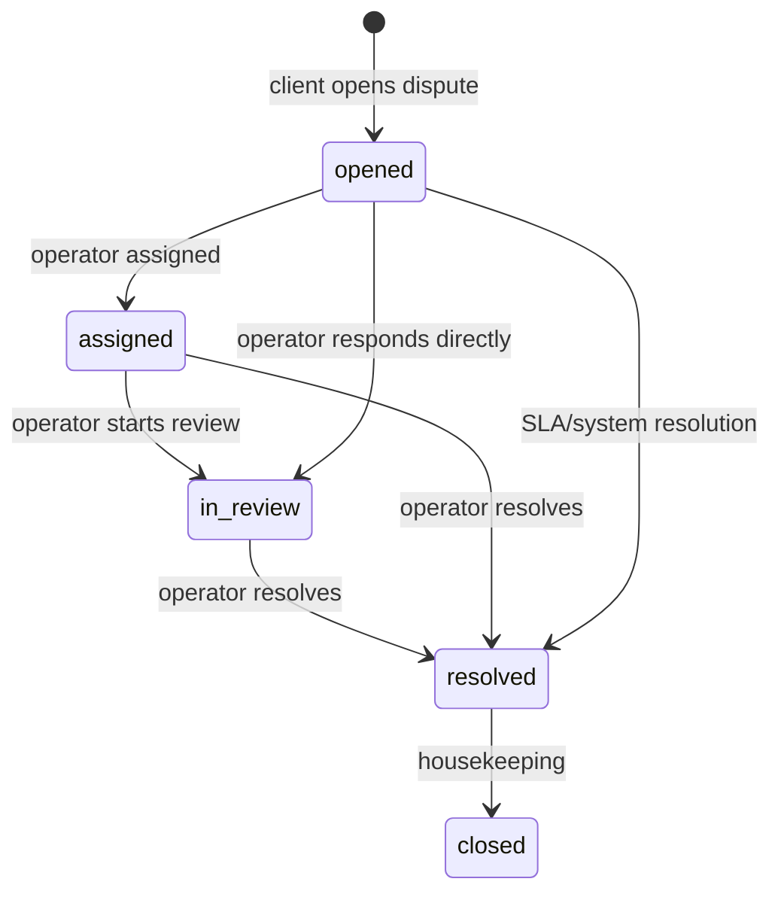

# Disputes specification

This document describes the current dispute model implemented in `app/backend/src/core/disputes` and surfaced through client, merchant, and admin modules.

## Purpose

A dispute freezes the order lifecycle, collects evidence and chat from the participants, and lets an operator resolve the case into:

- `completed` when the merchant wins;
- `refunded` when the client wins;
- partial merchant payout for partial-refund outcomes.

## Identifiers

The active dispute identifier is the dispute UUID:

| Field | Meaning |
| --- | --- |
| `disputes.id` | Primary UUID and active identifier used by REST/UI routes. |
| `dispute_chat_messages.dispute_pk` | The same dispute UUID used for chat room routing. |

## Dispute statuses

- `open` (legacy compatibility)
- `opened`
- `assigned`
- `in_review`
- `resolved`
- `closed`

`opened` is the canonical new-case state.

## Main routes

### Client

| Method | Route | Purpose |
| --- | --- | --- |
| `POST` | `/api/client/disputes` | Create dispute for current client order. |
| `GET` | `/api/client/disputes` | List current client disputes. |
| `GET` | `/api/client/disputes/:id` | Detail by dispute UUID. |
| `GET` | `/api/client/disputes/:id/chat/messages` | Initial chat history. |
| `POST` | `/api/client/disputes/:id/chat/messages` | Send chat message. |

### Merchant

| Method | Route | Purpose |
| --- | --- | --- |
| `GET` | `/api/merchant/disputes` | Merchant dispute list. |
| `GET` | `/api/merchant/disputes/:id` | Merchant detail by dispute UUID. |
| `GET` | `/api/merchant/disputes/:id/chat/messages` | Initial chat history. |
| `POST` | `/api/merchant/disputes/:id/chat/messages` | Send chat message. |

### Admin / operator

| Method | Route | Purpose |
| --- | --- | --- |
| `GET` | `/api/admin/disputes` | Admin dispute list. |
| `GET` | `/api/admin/disputes/:id` | Detail by dispute UUID. |
| `GET` | `/api/admin/disputes/:id/messages` | Initial chat history. |
| `POST` | `/api/admin/disputes/:id/messages` | Send chat message. |
| `PUT` | `/api/admin/disputes/:id/resolve` | Final resolution. |

## Chat and realtime

Storage: `dispute_chat_messages`.

Rules:

1. Initial history is loaded over REST.
2. After initial fetch, UI should append incoming WS messages instead of polling the REST endpoint.
3. Message payloads are deduplicated by message UUID.
4. Chat becomes read-only once the dispute is resolved.

WebSocket:

| Setting | Value |
| --- | --- |
| Namespace | `/disputes-chat` |
| Join event | `dispute:join` |
| Join payload | `{ "id": "<dispute-uuid>" }` or `{ "dispute_id": "<dispute-uuid>" }` |
| Main events | `dispute.chat.message.created`, `dispute.chat.message.system` |

Notes:

- The value passed to room join is still the dispute UUID, even if the payload key is `dispute_id`.
- Access is enforced server-side by dispute membership / role permissions.

## Causes

Canonical client-facing causes:

- `not_delivered`
- `not_as_described`
- `damaged`
- `incomplete_order`
- `other`

## State machine

## Resolution effects

| Outcome | Order effect | Payout effect |
| --- | --- | --- |
| buyer favor | `orders.status = refunded` | no merchant payout |
| merchant favor | `orders.status = completed` | payout created |
| partial refund | order closed with partial merchant payout logic | payout amount reduced |

## Detail response

Dispute detail should be treated as UUID-based and render:

- `id`
- `order_id`
- `client_name`, `client_phone`
- `merchant_title`
- `operator_name`
- `cause`, `description`
- `media`
- `operator_resolution_details`
- `status`
- `opened_at`, `resolved_at`, `created_at`, `updated_at`
- `order_price`

## SLA and notifications

- SLA automation can resolve long-running disputes and emit a system chat message.
- New dispute messages can also fan out into durable notification inbox rows.
- Chat WS messages are immediate room events; inbox notifications are durable and separate.
