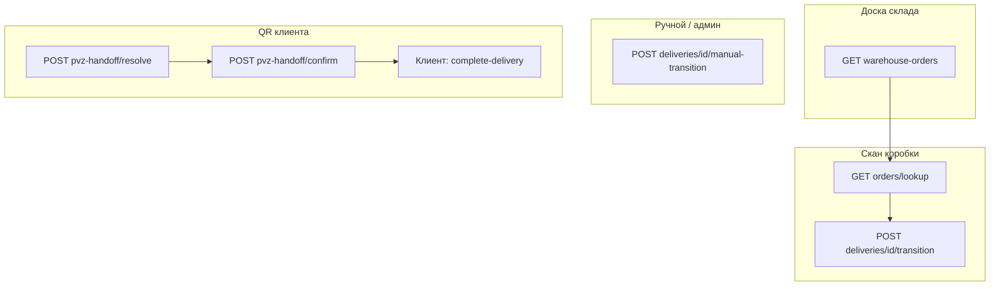

# Employee warehouse ops API

Операционный API для сотрудников склада и ПВЗ marketplace-заказов. Модуль: `app/marketplace-backend/src/modules/employee/warehouse-ops/`. Swagger-тег: **Employee / Warehouse Ops**.

Ручной переход с явным складом для админа: `app/marketplace-backend/src/modules/admin/warehouse-ops/` → **Admin / Warehouse Ops**.

## Scope

API покрывает:

- поиск доставки по внешнему номеру поставщика (`external_order_id`) с маршрутом складов и полным списком товаров;
- сводку заказов на складе сотрудника (входящие / на точке / убывшие);
- **автоматическую** смену статуса по маршруту заказа (следующий шаг выводится из JWT + склада сотрудника, без `next_status` в теле);
- **ручную** смену статуса с явным `warehouse_id` (нестандартный маршрут, исправление);
- выдачу клиенту по QR (batch handoff).

Не входит в scope: admin CRUD платформенных складов и сотрудников (см. `platform-warehouses`, `warehouse-hub`), клиентский `complete-delivery`, генерация handoff-токена (`POST /client/pvz-handoff/token`).

Удалённые маршруты (больше не используются):

- `GET /employee/warehouse-ops/deliveries` — заменён на `GET /employee/warehouse-ops/warehouse-orders`;
- `POST /employee/warehouse-ops/pvz-handoff/client-products` — товары отдаются в `orders/lookup` без пагинации.

## Authentication

| Actor | JWT | Привязка к складу |
| --- | --- | --- |
| Сотрудник | employee | `employees.warehouse_id`; доступ к доставке — текущий, входящий (`destination_warehouse_id`) или убывший (`in_transit_*` с `current_warehouse_id`) склад |
| Админ (только manual) | admin | `isAdmin: true` в сервисе — без проверки actor warehouse |

## Platform warehouses and route

Склады платформы (`warehouses.scope = 'platform'`, виды `central` | `regional` | `pickup_point`) задают сеть fulfillment.

Для **стандартного** `transition` маршрут доставки резолвится SQL `getMarketplaceRouteWarehousesForDeliverySql`:

- **ПВЗ назначения** — `order_deliveries.pickup_point_id` → активный `pickup_point` warehouse;
- **Региональный** — единственный активный `regional` в том же `city`, что и ПВЗ;
- **Центральный** — единственный активный `central` в том же `city`.

Если ПВЗ, региональный или центральный для города не найден → `400073` `DELIVERY_ROUTE_WAREHOUSE_NOT_CONFIGURED`; в `lookup` поле `allowed_transitions` будет пустым.

## Marketplace delivery statuses

| Status | Meaning |
| --- | --- |
| `in_transit_to_central` | В пути на центральный склад |
| `at_central_warehouse` | Принят на центральном складе |
| `in_transit_to_regional` | В пути на региональный склад |
| `at_regional_warehouse` | На региональном складе |
| `in_transit_to_pickup_point` | В пути в ПВЗ |
| `at_pickup_point` | Готов к выдаче клиенту на ПВЗ |
| `picked_up_by_client` | Выдан сотрудником; клиент завершает осмотр в приложении |
| `failed` | Терминальная ошибка / отмена логистики |

Глобально допустимые переходы — `DeliveryStatusService` (`MARKETPLACE_DELIVERY_TRANSITIONS` в `src/core/delivery/delivery-status.registry.ts`).

### Статусы, которые может выставить сотрудник (авто-transition)

Следующий шаг **не передаётся в теле**. Сервер выбирает единственный допустимый переход из `allowed_transitions` для склада сотрудника. Если переходов нет (шаг уже выполнен или не предусмотрен на этой точке) → `400068` `ORDER_INVALID_STATUS_TRANSITION`.

Целевые статусы сотрудника (как и раньше): `at_central_warehouse`, `in_transit_to_regional`, `at_regional_warehouse`, `in_transit_to_pickup_point`, `at_pickup_point`, `picked_up_by_client`.

**Запрещённые целевые статусы:** `in_transit_to_central`, `failed` → `400070` `DELIVERY_TRANSITION_STATUS_FORBIDDEN`.

### `allowed_transitions` в lookup

Для сотрудника список фильтруется (`filterEmployeeAllowedTransitions`): сотрудник на ожидаемом actor-складе для текущего статуса. Пустой список означает, что на этой точке действие недоступно (или маршрут не сконфигурирован).

## Routes

### Employee (`/employee/warehouse-ops`)

| Method | Route | Purpose |
| --- | --- | --- |
| `GET` | `/employee/warehouse-ops/orders/lookup` | Найти доставку по `external_order_id` + маршрут + все товары |
| `GET` | `/employee/warehouse-ops/warehouse-orders` | Заказы склада сотрудника: входящие / на точке / убывшие |
| `POST` | `/employee/warehouse-ops/deliveries/{id}/transition` | Авто-переход на следующий шаг (тело пустое) |
| `POST` | `/employee/warehouse-ops/deliveries/{id}/manual-transition` | Ручной переход с явным `warehouse_id` |
| `POST` | `/employee/warehouse-ops/pvz-handoff/resolve` | Разобрать QR клиента (handoff token) |
| `POST` | `/employee/warehouse-ops/pvz-handoff/confirm` | Пакетно подтвердить выдачу |

### Admin (`/admin/warehouse-ops`)

| Method | Route | Purpose |
| --- | --- | --- |
| `POST` | `/admin/warehouse-ops/deliveries/{id}/manual-transition` | Ручной переход без проверки actor warehouse |

---

### `GET /employee/warehouse-ops/orders/lookup`

**Назначение:** поиск одной marketplace-доставки по штрихкоду/номеру поставщика.

**Query:**

| Param | Required | Description |
| --- | --- | --- |
| `external_order_id` | yes | Внешний идентификатор заказа у поставщика |

**Response:** `DeliveryLookupResponse`

| Field | Description |
| --- | --- |
| `delivery_id` | UUID доставки |
| `order_id` | UUID заказа |
| `public_order_id` | Публичный номер заказа |
| `status` | Текущий статус |
| `external_order_id` | Внешний номер |
| `pickup_point_name`, `pickup_point_city` | ПВЗ назначения |
| `merchant_store_name` | Магазин marketplace-мерчанта |
| `allowed_transitions` | Следующие статусы, доступные **этому** сотруднику (для UI; transition их не требует) |
| `routing` | Маршрут складов (см. ниже) |
| `items` | **Все** позиции заказа (без пагинации) |

**`routing` (объект):**

| Field | Description |
| --- | --- |
| `from_warehouse` | Склад отправления для текущего этапа (`id`, `name`, `kind`, `city`) или `null` |
| `to_warehouse` | Склад назначения текущего этапа (`in_transit_*`) |
| `expected_warehouse` | Склад, на котором посылка **должна** оказаться на этом шаге |
| `has_arrived_at_expected_warehouse` | `true`, если посылка уже принята на `expected_warehouse` (`at_*` на этой точке) |

**`items[]`:** `product_id`, `product_title`, `product_price`, `quantity`, `product_image`, `product_slug` (опционально).

**Доступ:** доставка видна, если она на складе сотрудника, **в пути на** него (`destination_warehouse_id`) или **убыла** с него (`in_transit_*` и `current_warehouse_id` = склад сотрудника).

**Ошибки:** `RESOURCE_NOT_FOUND`, `INSUFFICIENT_PERMISSIONS`.

---

### `GET /employee/warehouse-ops/warehouse-orders`

**Назначение:** сводка marketplace-доставок, связанных со складом текущего сотрудника.

**Response:** `WarehouseOrdersResponse`

| Section | Условие |
| --- | --- |
| `incoming` | `status IN (in_transit_to_central, in_transit_to_regional, in_transit_to_pickup_point)` и `destination_warehouse_id` = склад сотрудника |
| `at_warehouse` | `current_warehouse_id` = склад сотрудника и `status IN (at_central_warehouse, at_regional_warehouse, at_pickup_point)` |
| `departed` | `current_warehouse_id` = склад сотрудника и `status IN (in_transit_to_regional, in_transit_to_pickup_point)` — ушли на следующий этап (не включает `picked_up_by_client`) |

Каждая запись — `WarehouseOrderSummaryResponse` (идентификаторы, статус, маршрут `routing`, краткие поля заказа; без списка товаров — товары в `lookup`).

---

### `POST /employee/warehouse-ops/deliveries/{id}/transition`

**Назначение:** выполнить **единственный** допустимый следующий шаг для склада сотрудника. **Тело запроса пустое** (или `{}`).

**Path:** `id` — UUID доставки.

Сервер:

1. Определяет `employees.warehouse_id` из JWT.
2. Строит `allowed_transitions` как в lookup.
3. Если ровно один переход — применяет его; если ноль — `ORDER_INVALID_STATUS_TRANSITION`; если больше одного — `ORDER_INVALID_STATUS_TRANSITION` (неоднозначность).

Склады для перехода — `resolveStandardTransitionWarehouses` (как раньше, без `warehouse_id` в теле).

**Response:** `DeliveryLookupResponse` (обновлённый lookup).

**Ошибки:** `ORDER_INVALID_STATUS_TRANSITION`, `DELIVERY_TRANSITION_ACTOR_WAREHOUSE_MISMATCH`, `DELIVERY_ROUTE_WAREHOUSE_NOT_CONFIGURED`, `RESOURCE_NOT_FOUND`, `INSUFFICIENT_PERMISSIONS`.

---

### `POST /employee/warehouse-ops/deliveries/{id}/manual-transition`

Без изменений: переход с **явным** `warehouse_id` и `next_status`.

**Admin:** `POST /admin/warehouse-ops/deliveries/{id}/manual-transition`.

---

### `POST /employee/warehouse-ops/pvz-handoff/resolve` / `confirm`

Без изменений. `confirm` внутри вызывает transition → `picked_up_by_client`.

---

## Error codes (warehouse ops)

| statusKey | When |
| --- | --- |
| `400068` | Нет допустимого следующего шага (transition без тела) |
| `400070` | Целевой статус `in_transit_to_central` или `failed` |
| `400071` | Сотрудник не на actor-складе стандартного перехода |
| `400072` | `warehouse_id` не того `kind` для `next_status` (manual) |
| `400073` | Не сконфигурирован маршрут (central/regional/ПВЗ для города) |
| `403002` | `INSUFFICIENT_PERMISSIONS` — чужой склад / нет `warehouse_id` у сотрудника |

## Operational flows

| Сценарий | Маршрут |
| --- | --- |
| Скан → следующий шаг | `lookup` → `transition` (без тела) |
| Доска склада | `warehouse-orders` |
| Нестандартный склад | `manual-transition` |
| Клиент с QR | `pvz-handoff/resolve` → `confirm` |

## Related docs

| Document | Topic |
| --- | --- |
| [marketplace-merchants-and-warehouse-network.md](../plans/marketplace/marketplace-merchants-and-warehouse-network.md) | Складская сеть, статусы |
| [warehouse-pvz-admin-hub.md](../plans/marketplace/warehouse-pvz-admin-hub.md) | Админка `/platform-warehouses`, hub, audit |
| [pvz-client-qr-handoff.md](../plans/marketplace/pvz-client-qr-handoff.md) | Handoff-токен, Redis |
| [orders.md](./orders.md) | Контракт заказов и buyer lifecycle |

## Code references

| Component | Path |
| --- | --- |
| Employee controller | `marketplace-backend/src/modules/employee/warehouse-ops/controllers/warehouse-ops.controller.ts` |
| Admin manual controller | `marketplace-backend/src/modules/admin/warehouse-ops/controllers/admin-warehouse-ops.controller.ts` |
| Service | `marketplace-backend/src/modules/employee/warehouse-ops/services/warehouse-ops.service.ts` |
| Transition helper | `marketplace-backend/src/modules/employee/warehouse-ops/services/warehouse-ops-transition.helper.ts` |
| SQL | `marketplace-backend/src/modules/employee/warehouse-ops/sql/warehouse-ops.sql` |
| Employee app | `marketplace-employee-app/src/app/page.tsx` |
