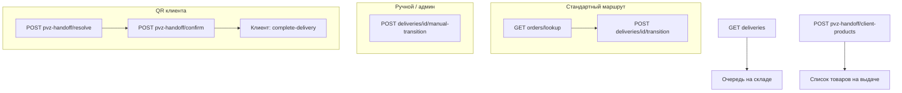

# Employee warehouse ops API

Операционный API для сотрудников склада и ПВЗ marketplace-заказов. Модуль: `app/marketplace-backend/src/modules/employee/warehouse-ops/`. Swagger-тег: **Employee / Warehouse Ops**.

Ручной переход с явным складом для админа: `app/marketplace-backend/src/modules/admin/warehouse-ops/` → **Admin / Warehouse Ops**.

## Scope

API покрывает:

- поиск доставки по внешнему номеру поставщика (`external_order_id`);
- очередь доставок на складе сотрудника;
- **стандартную** смену статуса по маршруту заказа (central → regional → ПВЗ из `order_deliveries.pickup_point_id`);
- **ручную** смену статуса с явным `warehouse_id` (нестандартный маршрут, исправление, админ);
- выдачу клиенту по QR (batch handoff);
- список товаров, готовых к выдаче на ПВЗ сотрудника.

Не входит в scope: admin CRUD платформенных складов и сотрудников (см. `platform-warehouses`, `warehouse-hub`), клиентский `complete-delivery`, генерация handoff-токена (`POST /client/pvz-handoff/token`).

## Authentication

| Actor | JWT | Привязка к складу |
| --- | --- | --- |
| Сотрудник | employee | `employees.warehouse_id`; доступ к доставке — `order_deliveries.current_warehouse_id` |
| Админ (только manual) | admin | `isAdmin: true` в сервисе — без проверки actor warehouse |

## Platform warehouses and route

Склады платформы (`warehouses.scope = 'platform'`, виды `central` | `regional` | `pickup_point`) задают сеть fulfillment.

Для **стандартного** `transition` маршрут доставки резолвится SQL `getMarketplaceRouteWarehousesForDeliverySql`:

- **ПВЗ назначения** — `order_deliveries.pickup_point_id` → активный `pickup_point` warehouse;
- **Региональный** — единственный активный `regional` в том же `city`, что и ПВЗ;
- **Центральный** — единственный активный `central` в том же `city`.

Если ПВЗ, региональный или центральный для города не найден → `400073` `DELIVERY_ROUTE_WAREHOUSE_NOT_CONFIGURED`; в `lookup` поле `allowed_transitions` будет пустым.

## Marketplace delivery statuses

| Status | Meaning |
| --- | --- |
| `in_transit_to_central` | В пути на центральный склад |
| `at_central_warehouse` | Принят на центральном складе |
| `in_transit_to_regional` | В пути на региональный склад |
| `at_regional_warehouse` | На региональном складе |
| `in_transit_to_pickup_point` | В пути в ПВЗ |
| `at_pickup_point` | Готов к выдаче клиенту на ПВЗ |
| `picked_up_by_client` | Выдан сотрудником; клиент завершает осмотр в приложении |
| `failed` | Терминальная ошибка / отмена логистики |

Глобально допустимые переходы — `DeliveryStatusService` (`MARKETPLACE_DELIVERY_TRANSITIONS` в `src/core/delivery/delivery-status.registry.ts`).

### Статусы, которые может выставить сотрудник

Enum `EmployeeMarketplaceTransitionStatus` (тело `transition` / `manual-transition`):

| Value | Обычный actor warehouse (стандартный transition) |
| --- | --- |
| `at_central_warehouse` | central |
| `in_transit_to_regional` | central |
| `at_regional_warehouse` | regional |
| `in_transit_to_pickup_point` | regional |
| `at_pickup_point` | pickup_point (ПВЗ маршрута) |
| `picked_up_by_client` | pickup_point |

**Запрещённые целевые статусы** для employee/admin ops: `in_transit_to_central`, `failed` → `400070` `DELIVERY_TRANSITION_STATUS_FORBIDDEN`.

### `allowed_transitions` в lookup

Для сотрудника список фильтруется (`filterEmployeeAllowedTransitions`):

1. исключаются запрещённые целевые статусы;
2. `employees.warehouse_id` должен совпадать с **ожидаемым** складом для текущего статуса доставки на маршруте;
3. для каждого кандидата проверяется, что `actorWarehouseId` стандартного перехода = складу сотрудника.

Для админа в lookup возвращаются все registry-переходы, кроме `in_transit_to_central` и `failed`.

## Routes

### Employee (`/employee/warehouse-ops`)

| Method | Route | Purpose |
| --- | --- | --- |
| `GET` | `/employee/warehouse-ops/orders/lookup` | Найти доставку по `external_order_id` |
| `GET` | `/employee/warehouse-ops/deliveries` | Очередь доставок на складе сотрудника |
| `POST` | `/employee/warehouse-ops/deliveries/{id}/transition` | Стандартный переход по маршруту заказа |
| `POST` | `/employee/warehouse-ops/deliveries/{id}/manual-transition` | Ручной переход с явным `warehouse_id` |
| `POST` | `/employee/warehouse-ops/pvz-handoff/resolve` | Разобрать QR клиента (handoff token) |
| `POST` | `/employee/warehouse-ops/pvz-handoff/confirm` | Пакетно подтвердить выдачу |
| `POST` | `/employee/warehouse-ops/pvz-handoff/client-products` | Товары на выдаче на ПВЗ (пагинация) |

### Admin (`/admin/warehouse-ops`)

| Method | Route | Purpose |
| --- | --- | --- |
| `POST` | `/admin/warehouse-ops/deliveries/{id}/manual-transition` | Ручной переход без проверки actor warehouse |

---

### `GET /employee/warehouse-ops/orders/lookup`

**Назначение:** поиск одной marketplace-доставки по штрихкоду/номеру поставщика.

**Query:**

| Param | Required | Description |
| --- | --- | --- |
| `external_order_id` | yes | Внешний идентификатор заказа у поставщика |

**Response:** `DeliveryLookupResponse`

| Field | Description |
| --- | --- |
| `delivery_id` | UUID доставки |
| `order_id` | UUID заказа |
| `public_order_id` | Публичный номер заказа |
| `status` | Текущий статус |
| `external_order_id` | Внешний номер |
| `pickup_point_name`, `pickup_point_city` | ПВЗ назначения |
| `merchant_store_name` | Магазин marketplace-мерчанта |
| `allowed_transitions` | Следующие статусы, доступные **этому** сотруднику на маршруте |

**Ошибки:** `RESOURCE_NOT_FOUND`, `INSUFFICIENT_PERMISSIONS` (доставка не на складе сотрудника).

---

### `GET /employee/warehouse-ops/deliveries`

**Назначение:** рабочая очередь доставок на складе текущего сотрудника (до 50 записей).

**Фильтр статусов в очереди:**

- `in_transit_to_central`
- `at_central_warehouse`
- `in_transit_to_regional`
- `at_regional_warehouse`
- `in_transit_to_pickup_point`
- `at_pickup_point`

**Response:** массив записей из `getDeliveriesAtWarehouseSql`.

---

### `POST /employee/warehouse-ops/deliveries/{id}/transition`

**Назначение:** стандартный переход — склады берутся из маршрута заказа, **`warehouse_id` в теле не передаётся**.

**Path:** `id` — UUID доставки.

**Body:**

```json
{
  "next_status": "at_central_warehouse"
}
```

| Field | Required | Description |
| --- | --- | --- |
| `next_status` | yes | `EmployeeMarketplaceTransitionStatus` |

**Логика складов** (`resolveStandardTransitionWarehouses`):

| `next_status` | `current_warehouse_id` | `destination_warehouse_id` | Actor (проверка сотрудника) |
| --- | --- | --- | --- |
| `at_central_warehouse` | central | — | central |
| `in_transit_to_regional` | текущий или central | regional | central |
| `at_regional_warehouse` | regional | — | regional |
| `in_transit_to_pickup_point` | текущий или regional | pickup_point | regional |
| `at_pickup_point` | pickup_point | — | pickup_point |
| `picked_up_by_client` | pickup_point | — | pickup_point |

Сотрудник должен работать на **actor** складе → иначе `400071` `DELIVERY_TRANSITION_ACTOR_WAREHOUSE_MISMATCH`.

**Побочные эффекты:**

- `order_deliveries.status`, `current_warehouse_id`, `destination_warehouse_id`;
- `order_delivery_status_events`;
- при необходимости — `orders.status`;
- `at_pickup_point` → push/SMS клиенту;
- audit: `delivery.status_changed` (`actor_type`: `employee` | `operator` для admin).

**Response:** `DeliveryLookupResponse` (повторный lookup по `external_order_id`, если есть).

---

### `POST /employee/warehouse-ops/deliveries/{id}/manual-transition`

**Назначение:** переход с **явным** платформенным складом (нестандартный маршрут, другой regional/ПВЗ в городе, восстановление).

**Body:**

```json
{
  "next_status": "at_regional_warehouse",
  "warehouse_id": "550e8400-e29b-41d4-a716-446655440000"
}
```

| Field | Required | Description |
| --- | --- | --- |
| `next_status` | yes | `EmployeeMarketplaceTransitionStatus` |
| `warehouse_id` | yes | UUID активного `warehouses` (`scope = platform`) |

**Правила:**

- Сотрудник: `delivery.current_warehouse_id` = `employees.warehouse_id` (доставка уже на его точке).
- `warehouse_id.kind` должен соответствовать `next_status` (например `at_regional_warehouse` → `regional`) → иначе `400072` `DELIVERY_WAREHOUSE_KIND_MISMATCH`.
- Для `in_transit_*`: `current_warehouse_id = null`, `destination_warehouse_id = warehouse_id`.
- Для `at_*` / `picked_up_by_client`: `current_warehouse_id = warehouse_id`.

**Audit:** `delivery.manual_status_changed`.

**Admin:** `POST /admin/warehouse-ops/deliveries/{id}/manual-transition` — тот же body, без проверки actor warehouse (`isAdmin: true`).

---

### `POST /employee/warehouse-ops/pvz-handoff/resolve`

**Назначение:** после скана QR клиента — посылки клиента в `at_pickup_point` на **складе сотрудника**.

**Body:** `{ "handoff_token": "<JWT>" }` (см. [pvz-client-qr-handoff.md](../plans/marketplace/pvz-client-qr-handoff.md)).

**Фильтр:** `status = at_pickup_point` и `current_warehouse_id = employees.warehouse_id`.

**Audit:** `pvz.handoff_resolved`.

---

### `POST /employee/warehouse-ops/pvz-handoff/confirm`

**Назначение:** пакетно `at_pickup_point` → `picked_up_by_client` (1–100 UUID).

Внутри — стандартный `transition` на каждый id. Клиент: `POST /client/orders/:id/complete-delivery`.

**Audit:** `pvz.handoff_confirmed` на каждую доставку.

---

### `POST /employee/warehouse-ops/pvz-handoff/client-products`

**Назначение:** постраничный список позиций заказов на выдаче на ПВЗ сотрудника.

**Body:** `page`, `limit` (`GetManyPaginatedBaseDto`). `client_id` не передаётся — выборка по складу сотрудника и `at_pickup_point`.

---

## Error codes (warehouse ops)

| statusKey | When |
| --- | --- |
| `400070` | Целевой статус `in_transit_to_central` или `failed` |
| `400071` | Сотрудник не на actor-складе стандартного перехода |
| `400072` | `warehouse_id` не того `kind` для `next_status` (manual) |
| `400073` | Не сконфигурирован маршрут (central/regional/ПВЗ для города) |
| `403002` | `INSUFFICIENT_PERMISSIONS` — чужой склад / нет `warehouse_id` у сотрудника |

## Operational flows



| Сценарий | Маршрут |
| --- | --- |
| Коробка по штатному маршруту | `lookup` → `transition` |
| Другой склад в городе / исправление | `manual-transition` (employee или admin) |
| Очередь на точке | `deliveries` |
| Клиент с QR | `pvz-handoff/resolve` → `confirm` |
| Сводка товаров на выдаче | `pvz-handoff/client-products` |

## Related docs

| Document | Topic |
| --- | --- |
| [marketplace-merchants-and-warehouse-network.md](../plans/marketplace/marketplace-merchants-and-warehouse-network.md) | Складская сеть, статусы |
| [warehouse-pvz-admin-hub.md](../plans/marketplace/warehouse-pvz-admin-hub.md) | Админка `/platform-warehouses`, hub, audit |
| [pvz-client-qr-handoff.md](../plans/marketplace/pvz-client-qr-handoff.md) | Handoff-токен, Redis |
| [orders.md](./orders.md) | Контракт заказов и buyer lifecycle |

## Code references

| Component | Path |
| --- | --- |
| Employee controller | `marketplace-backend/src/modules/employee/warehouse-ops/controllers/warehouse-ops.controller.ts` |
| Admin manual controller | `marketplace-backend/src/modules/admin/warehouse-ops/controllers/admin-warehouse-ops.controller.ts` |
| Service | `marketplace-backend/src/modules/employee/warehouse-ops/services/warehouse-ops.service.ts` |
| Transition helper | `marketplace-backend/src/modules/employee/warehouse-ops/services/warehouse-ops-transition.helper.ts` |
| Employee transition enum | `marketplace-backend/src/modules/employee/warehouse-ops/dto/employee-marketplace-transition-status.enum.ts` |
| SQL | `marketplace-backend/src/modules/employee/warehouse-ops/sql/warehouse-ops.sql` |
| Employee app | `marketplace-employee-app/src/app/page.tsx` |
