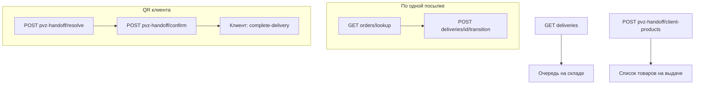

# Employee warehouse ops API

Операционный API для сотрудников склада и ПВЗ marketplace-заказов. Модуль: `app/marketplace-backend/src/modules/employee/warehouse-ops/`. Swagger-тег: **Employee / Warehouse Ops**.

## Scope

API покрывает:

- поиск доставки по внешнему номеру поставщика (`external_order_id`);
- очередь доставок на складе сотрудника;
- смену статуса доставки по цепочке marketplace-логистики;
- выдачу клиенту по QR (batch handoff);
- список товаров, готовых к выдаче на ПВЗ сотрудника.

Не входит в scope: admin CRUD складов/сотрудников, клиентский `complete-delivery`, генерация handoff-токена (это `POST /client/pvz-handoff/token`).

## Authentication

Все эндпоинты требуют **employee JWT** (`@Authorized` в декораторах API). Сотрудник привязан к складу через `employees.warehouse_id`; доступ к доставке проверяется по `order_deliveries.current_warehouse_id`.

Админ может использовать те же сценарии (в сервисе есть флаг `isAdmin`, в employee-контроллере передаётся `false`).

## Marketplace delivery statuses

| Status | Meaning |
| --- | --- |
| `in_transit_to_central` | В пути на центральный склад |
| `at_central_warehouse` | Принят на центральном складе |
| `in_transit_to_regional` | В пути на региональный склад |
| `at_regional_warehouse` | На региональном складе |
| `in_transit_to_pickup_point` | В пути в ПВЗ |
| `at_pickup_point` | Готов к выдаче клиенту на ПВЗ |
| `picked_up_by_client` | Выдан сотрудником; клиент завершает осмотр в приложении |
| `failed` | Терминальная ошибка / отмена логистики |

Допустимые переходы задаёт `DeliveryStatusService` (`MARKETPLACE_DELIVERY_TRANSITIONS` в `src/core/delivery/delivery-status.registry.ts`). При `transition` в `at_pickup_point` клиенту уходит уведомление «заказ готов к выдаче».

## Routes

| Method | Route | Purpose |
| --- | --- | --- |
| `GET` | `/employee/warehouse-ops/orders/lookup` | Найти доставку по `external_order_id` |
| `GET` | `/employee/warehouse-ops/deliveries` | Очередь доставок на складе сотрудника |
| `POST` | `/employee/warehouse-ops/deliveries/{id}/transition` | Сменить статус доставки |
| `POST` | `/employee/warehouse-ops/pvz-handoff/resolve` | Разобрать QR клиента (handoff token) |
| `POST` | `/employee/warehouse-ops/pvz-handoff/confirm` | Пакетно подтвердить выдачу |
| `POST` | `/employee/warehouse-ops/pvz-handoff/client-products` | Товары на выдаче на ПВЗ (пагинация) |

---

### `GET /employee/warehouse-ops/orders/lookup`

**Назначение:** поиск одной marketplace-доставки по штрихкоду/номеру поставщика.

**Query:**

| Param | Required | Description |
| --- | --- | --- |
| `external_order_id` | yes | Внешний идентификатор заказа у поставщика |

**Response:** `DeliveryLookupResponse`

| Field | Description |
| --- | --- |
| `delivery_id` | UUID доставки |
| `order_id` | UUID заказа |
| `public_order_id` | Публичный номер заказа |
| `status` | Текущий статус |
| `external_order_id` | Внешний номер |
| `pickup_point_name`, `pickup_point_city` | ПВЗ назначения |
| `merchant_store_name` | Магазин marketplace-мерчанта |
| `allowed_transitions` | Разрешённые следующие статусы |

**Ошибки:** `RESOURCE_NOT_FOUND`, `INSUFFICIENT_PERMISSIONS` (доставка не на складе сотрудника).

**Сценарий:** сотрудник сканирует или вводит номер с коробки → UI показывает карточку и кнопки перехода.

---

### `GET /employee/warehouse-ops/deliveries`

**Назначение:** рабочая очередь доставок на складе текущего сотрудника (до 50 записей).

**Фильтр статусов в очереди:**

- `in_transit_to_central`
- `at_central_warehouse`
- `in_transit_to_regional`
- `at_regional_warehouse`
- `in_transit_to_pickup_point`
- `at_pickup_point`

**Response:** массив записей из `getDeliveriesAtWarehouseSql` (поля доставки, заказа, ПВЗ — как в SQL-модуле).

**Сценарий:** экран «что сейчас на нашей точке» в employee app.

---

### `POST /employee/warehouse-ops/deliveries/{id}/transition`

**Назначение:** перевести доставку в следующий статус по registry.

**Path:** `id` — UUID доставки.

**Body:**

```json
{
  "next_status": "at_central_warehouse",
  "warehouse_id": "550e8400-e29b-41d4-a716-446655440000"
}
```

| Field | Required | Description |
| --- | --- | --- |
| `next_status` | yes | Целевой `MarketplaceDeliveryStatus` |
| `warehouse_id` | no | Склад для warehouse-scoped перехода; по умолчанию `current_warehouse_id` доставки |

**Побочные эффекты:**

- обновление `order_deliveries.status` и `current_warehouse_id`;
- запись в `order_delivery_status_events`;
- при необходимости — обновление `orders.status` (маппинг через `DeliveryStatusService`);
- при переходе в `at_pickup_point` — push/SMS клиенту;
- audit: `delivery.status_changed`.

**Response:** обновлённый `DeliveryLookupResponse` (через повторный lookup по `external_order_id`, если он есть).

**Сценарии:** приёмка на центральном/региональном складе, отправка в ПВЗ, выдача одной посылки (`at_pickup_point` → `picked_up_by_client`).

---

### `POST /employee/warehouse-ops/pvz-handoff/resolve`

**Назначение:** после скана QR клиента — получить все посылки клиента, готовые к выдаче на **этом** ПВЗ.

**Body:**

```json
{
  "handoff_token": "<JWT from client app>"
}
```

Токен выпускается клиентом: `POST /client/pvz-handoff/token` (`typ: pvz_handoff`, TTL ~30 мин, см. [pvz-client-qr-handoff.md](../plans/marketplace/pvz-client-qr-handoff.md)).

**Response:** `PvzHandoffResolveResponse`

| Field | Description |
| --- | --- |
| `client_id` | UUID клиента из токена |
| `client_hint` | Маскированный телефон (последние 4 цифры) для сверки личности |
| `pickup_point_name` | Название ПВЗ |
| `deliveries` | Массив доставок в `at_pickup_point` на складе сотрудника |

**Фильтр:** только `status = at_pickup_point` и `current_warehouse_id = employees.warehouse_id`.

**Audit:** `pvz.handoff_resolved`.

---

### `POST /employee/warehouse-ops/pvz-handoff/confirm`

**Назначение:** пакетно отметить выдачу после QR-флоу (частичная выдача допустима).

**Body:**

```json
{
  "delivery_ids": [
    "550e8400-e29b-41d4-a716-446655440030",
    "550e8400-e29b-41d4-a716-446655440031"
  ]
}
```

| Constraint | Value |
| --- | --- |
| `delivery_ids` | 1–100 UUID v4 |
| Eligible status | только `at_pickup_point` |

Для каждого id вызывается тот же `transition` → `picked_up_by_client`. Клиент затем подтверждает приём: `POST /client/orders/:id/complete-delivery`.

**Response:** `PvzHandoffConfirmResponse` — массив `DeliveryLookupResponse` по обработанным доставкам.

**Audit:** `pvz.handoff_confirmed` на каждую доставку.

---

### `POST /employee/warehouse-ops/pvz-handoff/client-products`

**Назначение:** постраничный список **позиций заказов** (товаров), готовых к выдаче на ПВЗ сотрудника.

**Body:** пагинация (`page`, `limit` из `GetManyPaginatedBaseDto`). Отдельный `client_id` в теле **не** передаётся — выборка по складу сотрудника и статусу `at_pickup_point`.

**Response:** `FindManyResponseBase<PvzClientProductResponse>`

| Field | Description |
| --- | --- |
| `product_id` | UUID товара |
| `product_title` | Название на момент заказа |
| `product_price` | Цена позиции |
| `order_id` | UUID заказа |
| `quantity` | Количество |
| `product_image` | Первое изображение из каталога |

**Сценарий:** экран «что лежит на выдаче» без привязки к конкретному клиенту.

---

## Operational flows



| Сценарий | Маршрут |
| --- | --- |
| Одна коробка, без смартфона у клиента | `lookup` → `transition` |
| Очередь работы на точке | `deliveries` |
| Клиент с QR, несколько заказов | `pvz-handoff/resolve` → `pvz-handoff/confirm` |
| Сводка товаров на выдаче | `pvz-handoff/client-products` |

## Related docs

| Document | Topic |
| --- | --- |
| [marketplace-merchants-and-warehouse-network.md](../plans/marketplace/marketplace-merchants-and-warehouse-network.md) | Складская сеть, статусы, MVP по `external_order_id` |
| [pvz-client-qr-handoff.md](../plans/marketplace/pvz-client-qr-handoff.md) | Handoff-токен, Redis, клиентский QR |
| [warehouse-pvz-admin-hub.md](../plans/marketplace/warehouse-pvz-admin-hub.md) | Админка складов/ПВЗ и audit |
| [orders.md](./orders.md) | Контракт заказов и buyer lifecycle |

## Code references

| Component | Path |
| --- | --- |
| Controller | `marketplace-backend/src/modules/employee/warehouse-ops/controllers/warehouse-ops.controller.ts` |
| Service | `marketplace-backend/src/modules/employee/warehouse-ops/services/warehouse-ops.service.ts` |
| SQL | `marketplace-backend/src/modules/employee/warehouse-ops/sql/warehouse-ops.sql` |
| Employee app usage | `marketplace-employee-app/src/app/page.tsx` |
