# Спецификация Notification

Документ описывает фактическую notification-систему Secure Deal на момент текущей реализации в `app/backend` и `app/cron-worker`: как создается событие, как оно превращается в inbox-строки для получателей, как доставляется через WebSocket/SMS, какие поля сохраняются в Postgres, какие поля возвращаются через REST и какие payload'ы проходят через Redis.

Главный принцип: **Postgres является source of truth**, а Redis, WebSocket и SMS являются транспортом. Если транспорт не сработал, inbox-уведомление не удаляется и остается доступным через REST.

## 1. Назначение системы

Notification-система решает пять задач:

1. **Durable inbox**: создать постоянную запись уведомления для конкретного получателя (`client`, `merchant`, `operator`, `admin`), чтобы пользователь увидел ее в списке даже после перезагрузки приложения.
2. **Realtime-доставка**: отправить новые уведомления в активные клиентские приложения через Socket.IO namespace `/notifications`.
3. **Delivery audit**: хранить попытки доставки durable inbox-уведомлений по каналам (`in_app`, `ws`, `sms`, `push`, `email`) и их статусы в `notification_deliveries`.
4. **Dispute chat realtime**: отправлять сообщения чата спора в Socket.IO namespace `/disputes-chat` событиями `dispute.chat.message.created` и `dispute.chat.message.system`. Это не `notification_deliveries.channel`, а отдельный rooms-only broadcast flow через `rooms`.
5. **Операционные алерты**: доставлять критические системные уведомления администраторам/операторам, например сбои Jurataxi или auto-confirm.

## 2. Компоненты

| Компонент | Путь | Ответственность |
| --- | --- | --- |
| Backend notification core | `app/backend/src/core/notifications` | REST inbox, publish pipeline, fanout, WS gateway, Redis bridge, fallback delivery. |
| Role controllers | `app/backend/src/modules/*/notifications` | REST API для client/merchant/admin/operator. |
| Backend producers | `app/backend/src/modules/**`, `app/backend/src/core/disputes` | Публикуют бизнес/системные события через `NotificationEventPublisher`. |
| Cron-worker publisher | `app/cron-worker/src/core/notifications` | Публикует события из фоновых job'ов через тот же Postgres/Redis pipeline. |
| Delivery worker | `app/cron-worker/src/jobs/notification-delivery.worker.ts` | Читает Redis queue, atomically claims delivery row, отправляет WS/SMS, обновляет delivery status. |
| Disputes chat gateway | `app/backend/src/core/disputes/ws/disputes-chat.gateway.ts` | Realtime-шлюз для сообщений внутри комнаты конкретного спора. |
| Disputes chat bridge | `app/backend/src/core/disputes/ws/disputes-chat-realtime-bridge.service.ts` | Слушает Redis Pub/Sub `notifications:chat-room:ws:emit:v1` и пробрасывает worker/backend broadcasts в `/disputes-chat`. |
| Disputes chat dispatcher | `app/backend/src/core/disputes/ws/disputes-chat-room.dispatcher.ts` | Подключает unified notification pipeline к `DisputesChatGateway` без прямой зависимости notifications → disputes. |
| Heartbeat jobs | `app/cron-worker/src/jobs/*notification-heartbeat.job.ts` | Опциональные synthetic events для smoke-тестов фронтенда. Отключены по умолчанию. |
| Database schema | `app/backend/migrations/1760710100000-notifications-v1.psql` и последующие migrations | Таблицы `notification_events`, `notification_recipients`, `notification_deliveries`. |

## 3. High-level flow

Система имеет **два параллельных потока** уведомлений. Первый — durable inbox: событие сохраняется в Postgres и доставляется по каналам. Второй — dispute chat realtime: сообщение отправляется напрямую в комнату `/disputes-chat`, без записи в `notification_events/recipients/deliveries`.

```mermaid
flowchart TD
  subgraph FLOW_A["── FLOW A: Durable inbox (все бизнес-события) ──"]
    Producer["Backend service / Cron job"] --> Publish["publish(input)\nrecipients=[...], rooms?=[...]"]
    Publish --> Tx["Postgres transaction"]
    Tx --> Event["notification_events\nimmutable event"]
    Event --> Fanout["Fanout per recipient"]
    Fanout --> Recipient["notification_recipients\ndurable inbox row"]
    Recipient --> DeliveryInApp["notification_deliveries\nchannel=in_app → sent immediately"]
    Recipient --> DeliveryWs["notification_deliveries\nchannel=ws → pending"]
    Recipient --> DeliverySms["notification_deliveries\nchannel=sms → pending"]
    Recipient --> DeliveryPush["notification_deliveries\nchannel=push → pending\n(reserved, not implemented)"]
    Recipient --> DeliveryEmail["notification_deliveries\nchannel=email → pending\n(reserved, not implemented)"]
    DeliveryWs --> Queue["Redis LIST\nnotifications:delivery:v1"]
    DeliverySms --> Queue
    DeliveryPush --> Queue
    DeliveryEmail --> Queue
    Queue --> Worker["cron-worker\nNotificationDeliveryWorker"]
    Worker --> Claim["Postgres claim\nworker_id + claimed_at + attempts++"]
    Claim --> WsPub["Redis Pub/Sub\nnotifications:ws:emit:v1"]
    Claim --> SmsProvider["HTTP SMS provider"]
    Claim --> Unsupported["push/email\nCHANNEL_NOT_SUPPORTED → skipped"]
    WsPub --> Bridge["Backend\nNotificationsRealtimeBridge"]
    Bridge --> GatewayNotif["Socket.IO /notifications\nevent: notification.created"]
    GatewayNotif --> Browser["Recipient browser/mobile app"]
    Recipient --> Rest["REST inbox API\nGET /api/{role}/notifications"]
    Rest --> Browser
  end

  subgraph FLOW_B["── FLOW B: Dispute chat realtime (сообщения чата спора) ──"]
    DisputeService["DisputesService\nsendMessage / assignDispute / closeDispute"]
    DisputeService --> SaveMsg["INSERT dispute chat message\n(createDisputeChatMessageSql)"]
    SaveMsg --> MsgResp["DisputeChatMessageResponse"]
    MsgResp --> BroadcastCall["broadcastChatRoom(disputePk, event, payload)\npublish(recipients=[], rooms=[{namespace:'disputes-chat',...}])"]
    BroadcastCall --> FastPath{"rooms-only path\n(recipients=[])"}
    FastPath -->|"backend-originated"| Dispatcher["DisputesChatRoomDispatcher\nChatRoomDispatcherRegistry"]
    FastPath -->|"worker-originated"| ChatPubSub["Redis Pub/Sub\nnotifications:chat-room:ws:emit:v1"]
    Dispatcher --> ChatGateway["DisputesChatGateway\nSocket.IO /disputes-chat"]
    ChatPubSub --> ChatBridge["DisputesChatRealtimeBridge\n(backend listener)"]
    ChatBridge --> ChatGateway
    ChatGateway --> ChatRoom["Socket.IO room\ndispute:<disputePk>"]
    ChatRoom --> Viewers["Все участники с открытым чатом"]
    DisputeService -->|"дополнительно"| InboxNotif["publishDisputeMessage\n→ FLOW A для остальных участников\ndomain=disputes, channel=in_app+ws"]
  end
```

Почему два потока:

- **FLOW A** — единственный способ для пользователя получить уведомление без открытого чата: создает durable inbox-строку, которая видна через REST даже после перезагрузки.
- **FLOW B** — единственный способ мгновенно показать само сообщение всем, кто прямо сейчас смотрит чат спора; не записывает ничего в notification tables, поэтому не перегружает inbox.
- Когда пользователь отправляет сообщение в чат, запускаются **оба потока одновременно**: FLOW B доставляет объект сообщения в открытый чат, FLOW A уведомляет остальных участников через inbox.
- **Redis payload минимальный** (только `deliveryId`): worker перечитывает состояние из Postgres, поэтому Redis не является source of truth.
- **Worker claim в Postgres**: несколько worker'ов могут читать одну очередь, но conditional `UPDATE` гарантирует, что только один обработает конкретный delivery.

## 4. Сущности и связи в Postgres

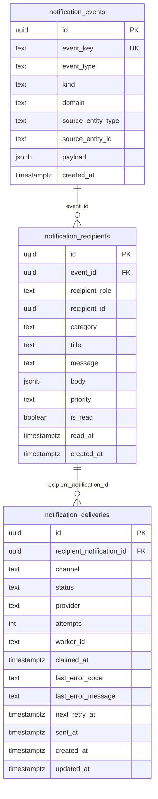

### 4.1 `notification_events`

Одна строка на одно доменное событие. Событие не хранит read-state и не привязано к одному пользователю.

| Поле | Тип | Значения / пример | Зачем нужно |
| --- | --- | --- | --- |
| `id` | `uuid` | `gen_random_uuid()` | Primary key события. |
| `event_key` | `text`, unique | `order.created:<orderId>` | Идемпотентность публикации. Повтор с тем же key не создаст дубль события. |
| `event_type` | `text` | `order.created`, `payment.confirmed`, `system.jurataxi_delivery_failed` | Машинный тип события, по нему фронт и аналитика понимают смысл уведомления. |
| `kind` | `text` | `business`, `operational`, `critical_alert` | Класс события. Используется для critical alerts. По умолчанию `business`. |
| `domain` | `text` | `orders`, `payments`, `disputes`, `reviews`, `promotions`, `security`, `verification`, `system` | Верхнеуровневая категория события. |
| `source_entity_type` | `text` | `order`, `dispute`, `merchant`, `operator`, `merchant_review`, `product_review` | Тип доменной сущности-источника. |
| `source_entity_id` | `text` | UUID заказа/спора/оператора | ID доменной сущности-источника. Хранится как text, потому что не все внешние/source IDs обязаны быть UUID. |
| `payload` | `jsonb` | `{ "orderId": "...", "status": "completed" }` | Исходный доменный payload события, общий для всех получателей. |
| `created_at` | `timestamptz` | `now()` | Время создания события. |

Ограничения:

- `event_key` уникален.
- `domain` ограничен фиксированным списком.
- `kind` ограничен `business | operational | critical_alert`.

Важный нюанс: backend pipeline передает `kind` в SQL и может создавать `critical_alert`; cron-worker pipeline сейчас не передает `kind`, поэтому события, созданные cron-worker'ом, получают DB default `business`.

### 4.2 `notification_recipients`

Одна строка на одного получателя одного события. Это и есть durable inbox item.

| Поле | Тип | Значения / пример | Зачем нужно |
| --- | --- | --- | --- |
| `id` | `uuid` | `gen_random_uuid()` | ID уведомления, который видит REST/WS consumer. |
| `event_id` | `uuid` FK | ссылка на `notification_events.id` | Связь с immutable event. |
| `recipient_role` | `text` | `client`, `merchant`, `operator`, `admin` | Роль inbox-владельца. |
| `recipient_id` | `uuid` | ID клиента/мерчанта/админа/оператора | Конкретный владелец inbox-строки. |
| `category` | `text` | обычно совпадает с `domain`: `orders`, `payments`, `disputes`, ... | Фильтр inbox'а и UI-раздел. |
| `title` | `text` | `Order delivered` | Короткий заголовок для списка. |
| `message` | `text` | `Your order ... has been marked as delivered.` | Читаемый текст уведомления; используется также для SMS. |
| `body` | `jsonb` | `{ "orderId": "...", "actions": [...] }` | Детали для notification detail-screen: факты, секции, действия, IDs. |
| `priority` | `text` | `low`, `normal`, `high`, `critical` | Важность уведомления для UI/сортировки/акцентов. |
| `is_read` | `boolean` | `false` by default | Read-state конкретного получателя. |
| `read_at` | `timestamptz`, nullable | `null` или timestamp | Когда пользователь прочитал уведомление. |
| `created_at` | `timestamptz` | `now()` | Время появления inbox-строки. |

Ограничения:

- `(event_id, recipient_role, recipient_id)` уникален. Одно событие не создаст две inbox-строки одному и тому же получателю.
- Read-state хранится **только здесь**, потому что один и тот же event может быть прочитан одним получателем и не прочитан другим.

### 4.3 `notification_deliveries`

Одна строка на канал доставки одной inbox-строки.

| Поле | Тип | Значения / пример | Зачем нужно |
| --- | --- | --- | --- |
| `id` | `uuid` | `gen_random_uuid()` | ID delivery job, который кладется в Redis queue. |
| `recipient_notification_id` | `uuid` FK | ссылка на `notification_recipients.id` | Какая inbox-строка доставляется. |
| `channel` | `text` | `in_app`, `ws`, `sms`, `push`, `email` | Канал доставки. Реально обрабатываются `in_app`, `ws`, `sms`; `push/email` присутствуют в schema/type contract, но сейчас будут skipped/not supported при dispatch. |
| `status` | `text` | `pending`, `sent`, `failed`, `retrying`, `skipped` | Текущее состояние доставки по каналу. |
| `provider` | `text`, nullable | `internal_in_app`, `internal_ws`, `http_sms`, `noop_sms` | Кто/что отвечает за доставку. |
| `attempts` | `integer` | `0`, `1`, `2`, `3` | Количество попыток. |
| `worker_id` | `text`, nullable | `<hostname>:<pid>:<random>` | Worker, который claim'нул delivery. |
| `claimed_at` | `timestamptz`, nullable | timestamp | Когда worker взял delivery в работу. |
| `last_error_code` | `text`, nullable | `WS_DELIVERY_FAILED`, `SMS_NOT_CONFIGURED` | Машинный код последней ошибки. |
| `last_error_message` | `text`, nullable | текст ошибки provider'а | Читаемое описание последней ошибки. |
| `next_retry_at` | `timestamptz`, nullable | timestamp | Когда можно повторить попытку. |
| `sent_at` | `timestamptz`, nullable | timestamp | Когда канал успешно доставлен. |
| `created_at` | `timestamptz` | `now()` | Когда delivery row создан. |
| `updated_at` | `timestamptz` | `now()` | Последнее изменение delivery row. |

Ограничения:

- `(recipient_notification_id, channel)` уникален.
- `attempts >= 0`.
- `channel` и `status` ограничены фиксированными списками.

## 5. Справочники значений

### 5.1 Роли получателей

| Значение | Кто это | Как получает auth |
| --- | --- | --- |
| `client` | Покупатель/клиент marketplace | REST: `CurrentClient`; WS: auth cookies/JWT session через `BaseWsGateway`. |
| `merchant` | Продавец/магазин | REST: `CurrentMerchant`; WS: auth cookies/JWT session. |
| `operator` | Оператор админки | REST: `CurrentAdmin` с role `operator` или `admin` на operator routes; WS: auth cookies/JWT session. |
| `admin` | Администратор | REST: `CurrentAdmin`; WS: auth cookies/JWT session. |

### 5.2 Domains / categories

| Значение | Используется для |
| --- | --- |
| `orders` | Создание, доставка, inspection, completion заказа. |
| `payments` | Платежи и выплаты. |
| `disputes` | Споры, сообщения, SLA, assignment, resolution. |
| `reviews` | Product reviews и merchant reviews. |
| `promotions` | Зарезервировано схемой; в текущих producers не найдено. |
| `security` | Operator lifecycle: создание, обновление, permissions. |
| `verification` | Статус merchant account: active/blocked. |
| `system` | Операционные/критические алерты. |

`domain` хранится на event, `category` хранится на recipient row. В текущей реализации они обычно совпадают, но разделение позволяет в будущем показать одно событие разным ролям в разных UI-категориях.

### 5.3 Kinds

| Значение | Смысл | Где используется |
| --- | --- | --- |
| `business` | Обычные бизнес-уведомления. | Default для всех событий, если producer не передал `kind`. |
| `operational` | Операционные уведомления без критичности. | Поддерживается схемой, текущие producers почти не используют. |
| `critical_alert` | Критический системный алерт. | Critical alerts endpoint для admin/operator; Jurataxi failures явно передают этот kind. |

Critical alerts REST-фильтр выбирает только `ne.kind = 'critical_alert'` и `nr.priority = 'critical'`.

### 5.4 Channels

| Значение | Что делает сейчас | Начальный delivery status |
| --- | --- | --- |
| `in_app` | Только создает durable inbox row. Отдельной внешней доставки нет. | `sent`, `provider=internal_in_app`, `attempts=1`, `sent_at=now()`. |
| `ws` | Доставляет `notification.created` через Socket.IO `/notifications`. | `pending`, `provider=internal_ws`, `attempts=0`. |
| `sms` | Отправляет `message` на телефон клиента/мерчанта через HTTP SMS provider. | `pending`, `provider=http_sms` в worker pipeline или `noop_sms` в backend fanout до фактической отправки. |
| `push` | Зарезервировано в БД и TypeScript contracts, но V1 не имеет push provider. Если producer явно укажет этот канал, delivery row создастся и попадет в очередь как любой non-`in_app` канал. | `pending`, `provider=null`, `attempts=0`; при dispatch станет `skipped` с `CHANNEL_NOT_SUPPORTED`. |
| `email` | Зарезервировано в БД и TypeScript contracts, но V1 не имеет email provider. Если producer явно укажет этот канал, delivery row создастся и попадет в очередь как любой non-`in_app` канал. | `pending`, `provider=null`, `attempts=0`; при dispatch станет `skipped` с `CHANNEL_NOT_SUPPORTED`. |

Активная поддержка каналов:

| Channel | Есть в DB enum/check | Есть в TS type | Создается fanout'ом | Enqueue в Redis | Обрабатывается worker/backend dispatch | Recovery scan из Postgres | Итог сейчас |
| --- | --- | --- | --- | --- | --- | --- | --- |
| `in_app` | да | да | да | нет, потому что уже `sent` | не нужен | не нужен | Durable inbox создан. |
| `ws` | да | да | да | да | да | да, SQL выбирает `channel IN ('ws', 'sms')` | Realtime `notification.created` или retry/fail/skip. |
| `sms` | да | да | да | да | да | да, SQL выбирает `channel IN ('ws', 'sms')` | HTTP SMS или skip/retry/fail. |
| `push` | да | да | да, если producer явно передал `push` | да при первичном enqueue | да, но только как unsupported → `skipped` | нет, recovery scan не выбирает `push` | Зарезервирован, provider отсутствует. |
| `email` | да | да | да, если producer явно передал `email` | да при первичном enqueue | да, но только как unsupported → `skipped` | нет, recovery scan не выбирает `email` | Зарезервирован, provider отсутствует. |

В текущих production producers фактически используются `in_app`, `ws` и местами `sms` (`payment.confirmed`). `push` и `email` не найдены как production channel choices, но их нельзя считать отсутствующими из контракта: они разрешены schema/type layer и имеют определенное поведение `pending -> skipped`.

### 5.5 Delivery statuses

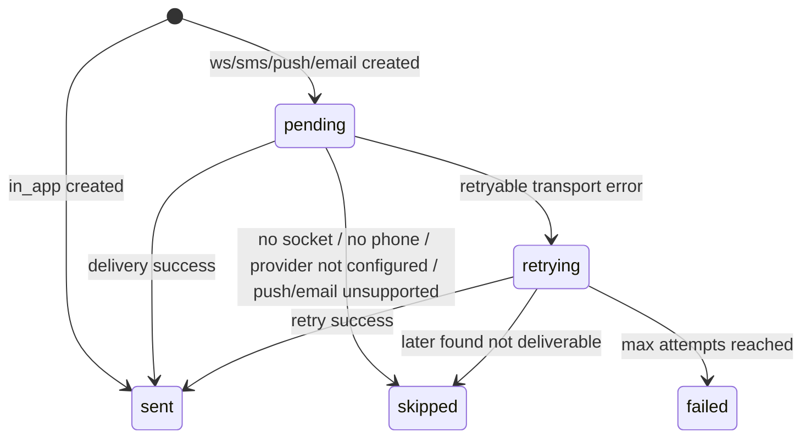

| Status | Значение |
| --- | --- |
| `pending` | Канал ожидает обработки worker'ом или fallback dispatcher'ом. |
| `sent` | Канал успешно доставлен или `in_app` row создан. |
| `failed` | Канал не доставлен после максимального числа retry. |
| `retrying` | Была retryable ошибка; `next_retry_at` указывает, когда повторять. |
| `skipped` | Доставку осознанно пропустили: нет WS room, нет телефона, SMS не настроен, канал не поддержан. |

## 6. Publish input contract

Backend producer вызывает `NotificationEventPublisher.publish(input)`, cron-worker producer вызывает `NotificationsPublisherService.publish(input)`. Контракт логически одинаковый.

```ts
{
  eventKey: string;
  eventType: string;
  kind?: 'business' | 'operational' | 'critical_alert'; // backend поддерживает, cron-worker SQL сейчас не пишет
  domain: 'orders' | 'payments' | 'disputes' | 'reviews' | 'promotions' | 'security' | 'verification' | 'system';
  sourceEntityType: string;
  sourceEntityId: string;
  payload?: object;
  recipients: Array<{
    role: 'client' | 'merchant' | 'operator' | 'admin';
    recipientId: string;
    category: string;
    title: string;
    message: string;
    body?: object;
    priority?: 'low' | 'normal' | 'high' | 'critical';
    channels?: Array<'in_app' | 'ws' | 'sms' | 'push' | 'email'>;
  }>;
  rooms?: Array<{
    namespace: 'disputes-chat';
    roomKey: string;
    eventType: string;
    payload: object;
  }>;
}
```

Поле `rooms` используется для ephemeral chat-room broadcasts. Если `recipients=[]`, но `rooms` не пустой, pipeline не создает rows в notification tables и только отправляет room broadcast.

### 6.1 Почему есть `payload` и `body`

| Поле | Где хранится | Для кого | Смысл |
| --- | --- | --- | --- |
| `payload` | `notification_events.payload` | Система, аудит, debugging, будущая аналитика | Общий доменный payload события, одинаковый для всех получателей. |
| `body` | `notification_recipients.body` | UI конкретного получателя | Presentation/detail payload. Может различаться для client и merchant, потому что ссылки, тексты и actions разные. |

Пример: одно событие `order.created` имеет общий `payload.orderId`, но `body.actions[0].target` у клиента будет `/orders/<id>`, а у merchant — `/merchant/orders/<id>`.

## 7. Producer-side sequence

### 7.1 FLOW A — durable inbox (все бизнес-события)

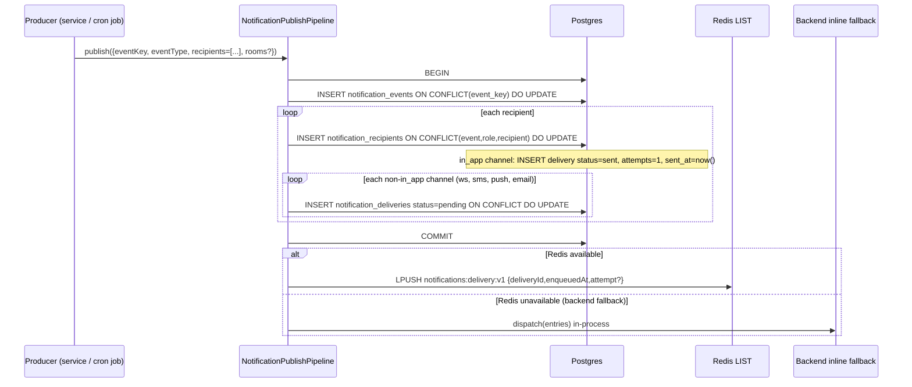

Backend fallback behavior:

- Если Redis доступен, backend producer кладет queued deliveries в Redis.
- Если Redis недоступен, backend `NotificationDeliveryQueueService` вызывает in-process `NotificationDeliveryService.dispatch(entries)`, чтобы delivery не потерялся.

Cron-worker publisher behavior:

- Если Redis доступен, кладет delivery IDs в Redis.
- Если Redis недоступен, оставляет rows `pending` в Postgres; recovery scan delivery worker'а сможет подобрать их позже.

### 7.2 FLOW B — dispute chat realtime (отправка сообщения в чат спора)

Этот поток запускается **параллельно** с FLOW A из `DisputesService` после каждого действия, создающего chat message.

```mermaid
sequenceDiagram
  participant UI as Browser/Mobile (client / merchant / operator)
  participant REST as Dispute REST controller
  participant Service as DisputesService
  participant PG as Postgres
  participant Pipeline as NotificationPublishPipeline
  participant Registry as ChatRoomDispatcherRegistry
  participant Dispatcher as DisputesChatRoomDispatcher
  participant ChatGW as DisputesChatGateway\n(/disputes-chat)
  participant ChatPubSub as Redis Pub/Sub\n(notifications:chat-room:ws:emit:v1)
  participant ChatBridge as DisputesChatRealtimeBridge
  participant Viewers as Все участники\nв комнате dispute:<pk>
  participant InboxPipeline as FLOW A (Inbox)\nnotification_events + recipients

  UI->>REST: POST /api/{role}/disputes/{id}/messages\n{message, media?}
  REST->>Service: sendClient/Merchant/OperatorDisputeMessage(...)
  Service->>Service: validateAccess + ensureWritable + ensureContent
  Service->>PG: INSERT dispute_chat_messages\n(sender_role, sender_id, message, media, is_system=false)
  PG-->>Service: DisputeChatMessageResponse
  Service->>Pipeline: publish(recipients=[], rooms=[{namespace:"disputes-chat", roomKey: dispute.id, eventType:"dispute.chat.message.created", payload: response}])
  note over Pipeline: recipients=[] → rooms-only fast path\nNO notification_events/recipients/deliveries created
  alt backend-originated
    Pipeline->>Registry: dispatch(broadcast)
    Registry->>Dispatcher: dispatch({namespace, roomKey, eventType, payload})
    Dispatcher->>ChatGW: emitToRoom(disputePk, "dispute.chat.message.created", response)
  else worker-originated (cron SLA, auto-close)
    Pipeline->>ChatPubSub: PUBLISH notifications:chat-room:ws:emit:v1\n{namespace, roomKey, event, payload}
    ChatPubSub->>ChatBridge: message (subscription)
    ChatBridge->>ChatGW: emitToRoom(roomKey, event, payload)
  end
  ChatGW->>Viewers: emit "dispute.chat.message.created"\n DisputeChatMessageResponse\n(to room dispute:<disputePk>)
  Service->>InboxPipeline: publishDisputeMessage(dispute, row, senderRole)\nFlow A → durable inbox для остальных участников\n(channel=in_app+ws, domain=disputes)
```

Детали разветвления по сценариям:

| Сценарий | Chat room event | Durable inbox notification |
| --- | --- | --- |
| Клиент отправил сообщение | `dispute.chat.message.created` → комната | merchant + assigned operator |
| Мерчант отправил сообщение | `dispute.chat.message.created` → комната | client + assigned operator |
| Оператор отправил сообщение | `dispute.chat.message.created` → комната | client + merchant |
| Спор создан | `dispute.chat.message.system` → комната | все active operators (FLOW A `dispute.opened`) |
| Оператор назначен | `dispute.chat.message.system` → комната | assigned operator (FLOW A `dispute.assigned`) |
| Спор закрыт (operator/admin) | `dispute.chat.message.system` → комната | client + merchant (FLOW A `dispute.status.changed`) |
| Cron SLA auto-close | `dispute.chat.message.system` → комната через Redis Pub/Sub | client + merchant (FLOW A `dispute.sla.closed`) |

Ключевые отличия двух потоков в этом флоу:

- FLOW B (chat) создает сообщение в `dispute_chat_messages` и отправляет его **живым зрителям** комнаты.
- FLOW A (inbox) создает уведомление в `notification_events/recipients/deliveries` для **всех остальных участников**, которые не смотрят чат прямо сейчас.
- Если никто не подключен к комнате — FLOW B тихо отбрасывается. FLOW A при этом не пострадал: inbox notification создан и будет виден через REST.

## 8. Redis contracts

### 8.1 Delivery queue

| Параметр | Значение |
| --- | --- |
| Redis data structure | `LIST` |
| Key | `notifications:delivery:v1` |
| Producer operation | `LPUSH` |
| Worker operation | `BRPOP` |
| Payload | JSON string |

Payload:

```json
{
  "deliveryId": "9ed0d9a4-70ec-48f7-b8da-222222222222",
  "enqueuedAt": "2026-05-07T06:41:23.429Z",
  "attempt": 0
}
```

| Поле | Обязательное | Значение | Почему так |
| --- | --- | --- | --- |
| `deliveryId` | да | UUID из `notification_deliveries.id` | Единственное authoritative поле. Worker по нему claim'ит row и перечитывает состояние из Postgres. |
| `enqueuedAt` | да | ISO timestamp | Наблюдаемость/debugging очереди. Не используется как source of truth. |
| `attempt` | нет | число | Информационное поле для retry/debug. Реальные attempts берутся из Postgres claim. |

В очередь могут попасть delivery rows с любым non-`in_app` каналом, если producer явно передал этот канал. Worker V1 реально доставляет только `ws` и `sms`; `push`/`email` после claim завершаются как `skipped` с `CHANNEL_NOT_SUPPORTED`.

### 8.2 WS emit Pub/Sub

| Параметр | Значение |
| --- | --- |
| Redis data structure | Pub/Sub |
| Channel | `notifications:ws:emit:v1` |
| Producer | `NotificationDeliveryWorker` в cron-worker |
| Consumer | `NotificationsRealtimeBridge` в backend |

Payload:

```json
{
  "recipientRole": "client",
  "recipientId": "44b0f0a0-0000-0000-0000-000000000001",
  "event": "notification.created",
  "payload": {
    "id": "9ed0d9a4-70ec-48f7-b8da-111111111111",
    "event_type": "order.status.changed",
    "category": "orders",
    "title": "Order delivered",
    "message": "Your order DC-00000001 has been marked as delivered.",
    "body": {
      "orderId": "0c4a...",
      "orderNumber": "DC-00000001",
      "status": "delivered"
    },
    "priority": "high",
    "is_read": false,
    "read_at": null,
    "created_at": "2026-05-07T06:41:23.429Z"
  }
}
```

Фактический нюанс текущей реализации: worker публикует WS payload в snake_case (`event_type`, `is_read`, `read_at`, `created_at`) и без `kind/actions`. Backend bridge не нормализует payload, а просто отправляет его в Socket.IO room. Если Redis недоступен и backend использует inline fallback, payload формируется через `NotificationResponse.from(...)` и приходит в camelCase. Поэтому frontend должен либо нормализовать оба варианта, либо backend/worker нужно унифицировать в отдельной задаче.

### 8.3 Chat-room Pub/Sub

| Параметр | Значение |
| --- | --- |
| Channel | `notifications:chat-room:ws:emit:v1` |
| Назначение | Ephemeral broadcasts для dispute chat rooms через gateway `/disputes-chat`. |
| Persistence | Не пишется в `notification_events`, если publish идет rooms-only. |

Payload:

```json
{
  "namespace": "disputes-chat",
  "roomKey": "<disputePk>",
  "event": "dispute.chat.message.created",
  "payload": {}
}
```

### 8.4 Обязательный поток сообщений в чаты диспутов через `/disputes-chat`

Это отдельный realtime-поток рядом с обычными inbox-уведомлениями. Он **обязателен**, потому что сообщение в споре должно появиться у всех открывших чат участников сразу, а не только как inbox notification. Важное отличие: inbox notification говорит "у вас новое сообщение", а `/disputes-chat` доставляет **сам объект сообщения** в комнату спора.

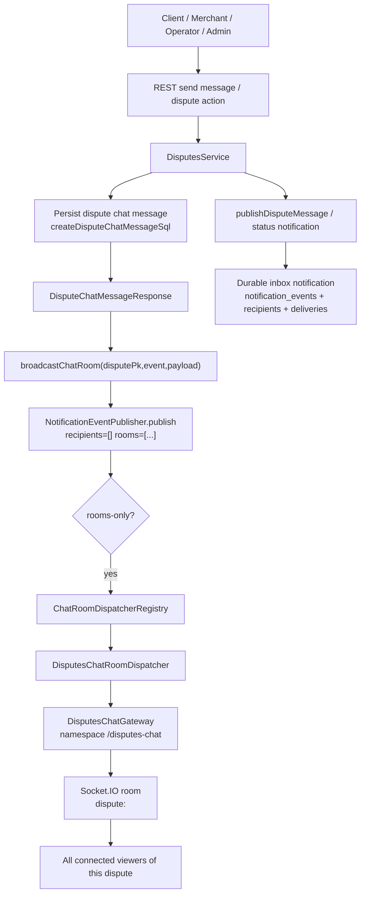

Почему это сделано через notification pipeline:

- `DisputesService` не импортирует gateway напрямую для каждого producer-case, а отправляет room broadcast через единый publish boundary.
- `NotificationPublishPipelineService` умеет fast-path: если `recipients.length === 0` и `rooms.length > 0`, он **не создает** `notification_events`, `notification_recipients`, `notification_deliveries`, а только dispatch'ит room broadcast.
- Для backend-originated events dispatcher вызывает `DisputesChatGateway.emitToRoom(...)` напрямую.
- Для worker-originated events cron-worker публикует в Redis Pub/Sub `notifications:chat-room:ws:emit:v1`, а backend `DisputesChatRealtimeBridge` пересылает в тот же gateway.
- Chat broadcast best-effort: если никто не подключен к комнате, событие просто не увидят live; историю сообщений фронт должен загрузить через REST при открытии спора.

#### 8.4.1 Socket.IO namespace и join contract

| Параметр | Значение |
| --- | --- |
| Namespace | `/disputes-chat` |
| Auth | Та же auth/session/JWT middleware логика через `BaseWsGateway`; cookies должны идти с credentials. |
| Join event from client | `dispute:join` |
| Join payload | `{ "id": "<disputePk>" }` или `{ "dispute_id": "<disputePk>" }` |
| Room access guard | `DisputeRoomAccessGuard` |
| Access service | `DisputeRoomAccessService.canAccessDisputeRoom(id, userId, role)` |
| Internal room name | `dispute:<disputePk>` |
| Join success response | `{ "ok": true, "room": "dispute:<disputePk>" }` |

Join пример:

```json
{
  "id": "1d41f2d8-2a8e-4f3a-9f0f-111111111111"
}
```

или:

```json
{
  "dispute_id": "1d41f2d8-2a8e-4f3a-9f0f-111111111111"
}
```

Правила доступа:

- socket должен быть авторизован;
- `id`/`dispute_id` должен быть UUID;
- guard проверяет, что текущий пользователь имеет доступ к комнате этого спора;
- если нет пользователя → `WsException('Unauthorized')`;
- если payload без dispute id → `WsException('Bad Request')`;
- если нет доступа → `WsException('Forbidden')`.

#### 8.4.2 Events, которые получает клиент в `/disputes-chat`

Registry gateway содержит два события:

| Event | Payload | Когда отправляется |
| --- | --- | --- |
| `dispute.chat.message.created` | `DisputeChatMessageResponse` | Пользовательское сообщение клиента/мерчанта/оператора. |
| `dispute.chat.message.system` | `DisputeChatMessageResponse` | Системное сообщение: спор создан, оператор назначен, спор закрыт и т.д. |

Фактический emit:

```ts
server.to(`dispute:${disputePk}`).emit(eventType, payload)
```

То есть gateway отправляет событие по имени `dispute.chat.message.created` или `dispute.chat.message.system` напрямую. В registry есть тип `DisputesChatEventEnvelope`, но текущий gateway **не оборачивает** payload в `{ type, value }`; он emits raw payload.

#### 8.4.3 Payload `DisputeChatMessageResponse`

```json
{
  "id": "8f26e96e-07b1-4e0a-8f6b-222222222222",
  "dispute_pk": "1d41f2d8-2a8e-4f3a-9f0f-111111111111",
  "sender_role": "client",
  "sender_id": "44b0f0a0-0000-0000-0000-000000000001",
  "message": "Здравствуйте, товар не соответствует описанию.",
  "media": [],
  "is_system": false,
  "created_at": "2026-05-07T06:41:23.429Z"
}
```

| Поле | Тип | Значения / пример | Почему получает frontend |
| --- | --- | --- | --- |
| `id` | `uuid` | ID chat message row | Для dedup/update/render key. |
| `dispute_pk` | `uuid` | UUID спора | Чтобы убедиться, что сообщение относится к открытой комнате. Это же значение используется как `roomKey`. |
| `sender_role` | enum | `client`, `merchant`, `operator`, `system` | UI определяет сторону сообщения, аватар, стиль bubble. |
| `sender_id` | `uuid \| null` | ID отправителя или `null` для system | Для отображения автора/своих сообщений; system message не имеет пользователя. |
| `message` | `string \| null` | текст до 4000 символов | Текст сообщения; может быть `null`, если отправлены только attachments. |
| `media` | array | media attachment objects | Вложения сообщения. |
| `is_system` | boolean | `true/false` | UI отличает автоматические события от пользовательских сообщений. |
| `created_at` | ISO string | timestamp | Сортировка и отображение времени. |

#### 8.4.4 Как создается пользовательское сообщение

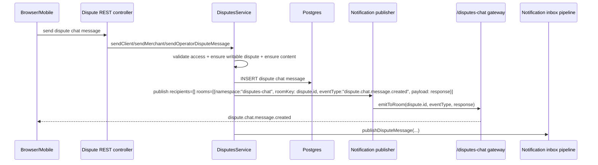

После chat broadcast сервис дополнительно вызывает `publishDisputeMessage(...)`, который создает **durable inbox notification** для участников, которые должны узнать о новом сообщении:

- если отправил `client`, notification получают merchant и assigned operator, если он есть;
- если отправил `merchant`, notification получают client и assigned operator, если он есть;
- если отправил `operator`, notification получают client и merchant;
- отправитель не получает inbox notification о собственном сообщении.

Таким образом есть два разных результата одного действия:

| Результат | Durable? | Канал | Для чего |
| --- | --- | --- | --- |
| Chat room broadcast | Нет | `/disputes-chat`, room `dispute:<id>` | Мгновенно добавить сообщение в открытый чат. |
| Inbox notification | Да | `notification_events` + `notification_recipients` + `in_app/ws` delivery | Сообщить участникам, которые не смотрят чат прямо сейчас. |

#### 8.4.5 Системные сообщения в чат спора

`DisputesService` отправляет `dispute.chat.message.system` после системных действий:

| Сценарий | Что сохраняется | Event в room |
| --- | --- | --- |
| Клиент создал спор | System message `Спор <id> создан клиентом...` | `dispute.chat.message.system` |
| Оператор взял спор | System message `Оператор <...> взял спор...` | `dispute.chat.message.system` |
| Оператор закрыл спор | System message `Спор <id> закрыт назначенным оператором...` | `dispute.chat.message.system` |
| Администратор закрыл спор | System message `Спор <id> закрыт администратором...` | `dispute.chat.message.system` |

Системное сообщение тоже сначала сохраняется в chat messages table, затем отправляется в room как `DisputeChatMessageResponse` с:

```json
{
  "sender_role": "system",
  "sender_id": null,
  "is_system": true
}
```

#### 8.4.6 Worker-originated chat broadcasts

Если сообщение/событие для chat room создается не backend HTTP flow, а worker'ом, worker не имеет Socket.IO server. Поэтому он публикует payload в Redis:

```json
{
  "namespace": "disputes-chat",
  "roomKey": "1d41f2d8-2a8e-4f3a-9f0f-111111111111",
  "event": "dispute.chat.message.system",
  "payload": {
    "id": "8f26e96e-07b1-4e0a-8f6b-222222222222",
    "dispute_pk": "1d41f2d8-2a8e-4f3a-9f0f-111111111111",
    "sender_role": "system",
    "sender_id": null,
    "message": "Спор автоматически закрыт по SLA...",
    "media": [],
    "is_system": true,
    "created_at": "2026-05-07T06:41:23.429Z"
  }
}
```

Backend `DisputesChatRealtimeBridge`:

1. подписывается на `notifications:chat-room:ws:emit:v1`;
2. парсит JSON;
3. проверяет `namespace === 'disputes-chat'`, `roomKey` string, `event` string;
4. вызывает `DisputesChatGateway.emitToRoom(roomKey, event, payload)`.

Если Redis не настроен, bridge выключен, и worker-originated chat broadcasts не попадут live в открытые комнаты. Это не ломает durable history, если само сообщение уже сохранено в БД: frontend восстановит историю через REST при следующей загрузке.

## 9. Delivery worker

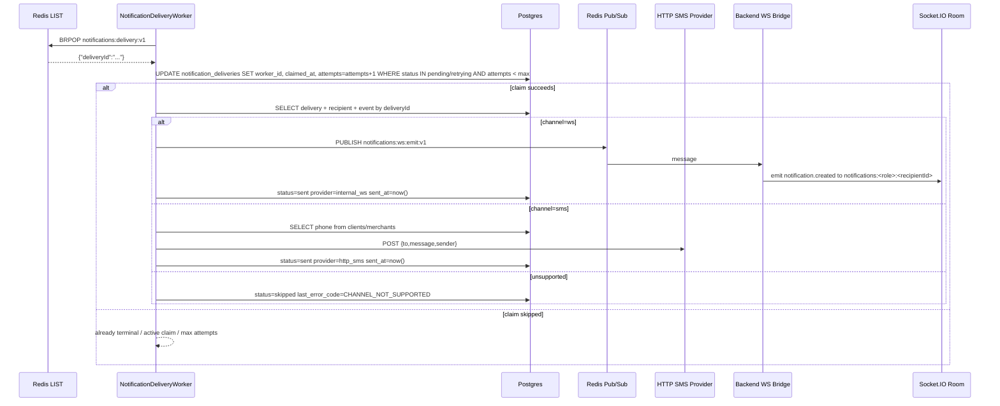

Worker reliability:

| Механизм | Значение |
| --- | --- |
| `worker_id` | Уникальный ID процесса: `<hostname>:<pid>:<random8>`. |
| Claim condition | Delivery должен быть `pending/retrying`, attempts меньше max, claim отсутствует или устарел. |
| Stuck claim TTL | `NOTIFICATIONS_CLAIM_STUCK_SECONDS`; backend default `60`, cron-worker default `300`. |
| Queue blocking timeout | `NOTIFICATIONS_QUEUE_BLOCK_TIMEOUT_SECONDS`; cron-worker default `5`. |
| Recovery scan | Каждую минуту ищет pending/retrying deliveries без активного claim и снова кладет их в Redis. |
| Max attempts | `NOTIFICATIONS_DELIVERY_MAX_ATTEMPTS`; default `3`. |
| Backoff | cron-worker `NOTIFICATIONS_RETRY_BACKOFF_MS`, default `1000,5000,30000`. Backend fallback использует `RETRY_BACKOFF_MS`, default `1000,2000,4000`. |

## 10. WebSocket contract

| Параметр | Значение |
| --- | --- |
| Namespace | `/notifications` |
| Auth | Та же HttpOnly/session/JWT auth логика, что в `BaseWsGateway`; cookies должны отправляться с credentials. |
| Room format | `notifications:<role>:<recipientId>` |
| Main event | `notification.created` |
| Connection ack | `connected` |
| CORS | `Envs.CORS_ORIGIN`, credentials enabled. |

При подключении gateway:

1. Проверяет auth.
2. Получает `role` и `userId`.
3. Join'ит socket в room `notifications:<role>:<userId>`.
4. Отправляет `connected`.

Рекомендуемый UI flow:

```mermaid
flowchart LR
  Open["App opens notification center"] --> REST["GET /api/<role>/notifications"]
  REST --> Cache["Render and cache inbox page"]
  Cache --> WS["Connect Socket.IO /notifications"]
  WS --> Event["Receive notification.created"]
  Event --> Normalize["Normalize payload shape"]
  Normalize --> Update["Prepend/update inbox list and unread counter"]
  Update --> Read["POST/PATCH read-state mutation"]
  Read --> Local["Update local cache/read counter"]
```

REST остается источником initial state и восстановления после offline. WS нужен для realtime append, а не для единственного способа получить уведомления.

## 11. REST API

Все routes находятся под глобальным API prefix приложения, поэтому в продуктовой документации они записаны как `/api/...`.

### 11.1 Client

| Method | Route | Auth | Что делает |
| --- | --- | --- | --- |
| `GET` | `/api/client/notifications` | `client` | Список inbox-уведомлений клиента. |
| `GET` | `/api/client/notifications/:id` | `client` | Детали одного уведомления клиента. |
| `POST` | `/api/client/notifications/:id/read` | `client` | Пометить одно уведомление прочитанным. |
| `POST` | `/api/client/notifications/read-all` | `client` | Пометить все unread уведомления прочитанными, опционально по category. |
| `PATCH` | `/api/client/notifications/read-state` | `client` | Bulk set read/unread для выбранных IDs. |

### 11.2 Merchant

| Method | Route | Auth | Что делает |
| --- | --- | --- | --- |
| `GET` | `/api/merchant/notifications` | `merchant` | Список inbox-уведомлений merchant. |
| `POST` | `/api/merchant/notifications/:id/read` | `merchant` | Пометить одно уведомление прочитанным. |
| `POST` | `/api/merchant/notifications/read-all` | `merchant` | Пометить все unread уведомления прочитанными, опционально по category. |

### 11.3 Admin

| Method | Route | Auth | Что делает |
| --- | --- | --- | --- |
| `GET` | `/api/admin/notifications` | `admin` | Список admin inbox. |
| `GET` | `/api/admin/notifications/critical-alerts` | `admin` | Только `kind=critical_alert` и `priority=critical`. |
| `POST` | `/api/admin/notifications/:id/read` | `admin` | Пометить одно уведомление прочитанным. |
| `POST` | `/api/admin/notifications/read-all` | `admin` | Пометить все unread уведомления прочитанными, опционально по category. |

### 11.4 Operator

| Method | Route | Auth | Что делает |
| --- | --- | --- | --- |
| `GET` | `/api/operator/notifications` | `admin` или `operator` | Список operator inbox. |
| `POST` | `/api/operator/notifications/:id/read` | `admin` или `operator` | Пометить одно уведомление прочитанным. |
| `POST` | `/api/operator/notifications/read-all` | `admin` или `operator` | Пометить все unread уведомления прочитанными, опционально по category. |

### 11.5 Query params для list/read-all

| Param | Тип | Default | Где используется | Описание |
| --- | --- | --- | --- | --- |
| `page` | integer >= 1 | `1` | list | Номер страницы. |
| `limit` | integer >= 1 | `10` | list | Размер страницы. |
| `category` | enum `NotificationDomain` или absent | `null` | list, read-all | Фильтр по `notification_recipients.category`. |
| `is_read` | boolean или absent | `null` | list | `true` только read, `false` только unread, absent все. |

List response:

```json
{
  "metadata": {
    "page": 1,
    "pageCount": 3,
    "count": 25,
    "total": 25
  },
  "items": []
}
```

`count` сейчас равен `total`, а не количеству элементов на странице.

### 11.6 REST `NotificationResponse`

REST всегда возвращает camelCase:

```json
{
  "id": "9ed0d9a4-70ec-48f7-b8da-111111111111",
  "category": "orders",
  "eventType": "order.status.changed",
  "kind": "business",
  "title": "Order delivered",
  "message": "Your order DC-00000001 has been marked as delivered.",
  "body": {
    "orderId": "0c4a...",
    "orderNumber": "DC-00000001",
    "status": "delivered",
    "actions": [
      {
        "type": "open_order",
        "label": "Open order",
        "target": "/orders/0c4a..."
      }
    ]
  },
  "priority": "high",
  "isRead": false,
  "readAt": null,
  "createdAt": "2026-05-07T06:41:23.429Z",
  "actions": [
    {
      "type": "open_order",
      "label": "Open order",
      "target": "/orders/0c4a..."
    }
  ]
}
```

| Поле | Откуда берется | Зачем |
| --- | --- | --- |
| `id` | `notification_recipients.id` | ID для detail/read mutations. |
| `category` | `notification_recipients.category` | UI-фильтр/иконка/группа. |
| `eventType` | `notification_events.event_type` | Машинный тип события. |
| `kind` | `notification_events.kind`, fallback `business` | Отличает business от critical alert. |
| `title` | `notification_recipients.title` | Заголовок карточки. |
| `message` | `notification_recipients.message` | Основной текст и SMS text. |
| `body` | `notification_recipients.body` | Детали, IDs, секции, actions. Если DB value не object, нормализуется в `{}`. |
| `priority` | `notification_recipients.priority` | Важность. |
| `isRead` | `notification_recipients.is_read` | Read-state. |
| `readAt` | `notification_recipients.read_at` | Timestamp прочтения или `null`. |
| `createdAt` | `notification_recipients.created_at` | Сортировка/отображение даты. |
| `actions` | `body.actions` | Нормализованный массив action buttons. |

### 11.7 Read mutations

`POST /:id/read`:

- Проверяет ownership через `recipient_role + recipient_id`.
- Если row не найден, кидает `NOTIFICATION_NOT_FOUND`.
- Ставит `is_read=true`.
- `read_at=COALESCE(read_at, now())`, то есть первое время прочтения сохраняется.
- Возвращает обновленный `NotificationResponse`.

`POST /read-all`:

- Фильтрует по текущему `recipient_role + recipient_id`.
- Обновляет только `is_read=false`.
- Если передан `category`, обновляет только эту категорию.
- Возвращает `{ "updatedCount": number }`.

`PATCH /read-state` только для client:

```json
{
  "ids": ["9ed0d9a4-70ec-48f7-b8da-111111111111"],
  "is_read": true
}
```

- Обновляет только IDs, принадлежащие текущему client.
- Если `is_read=true`, ставит `read_at=COALESCE(read_at, now())`.
- Если `is_read=false`, сбрасывает `read_at=null`.
- Возвращает `{ "updatedCount": number }`.

## 12. SMS contract

SMS реально отправляется только для `recipient_role` `client` и `merchant`, потому что SQL ищет телефон только в таблицах `clients` и `merchants`.

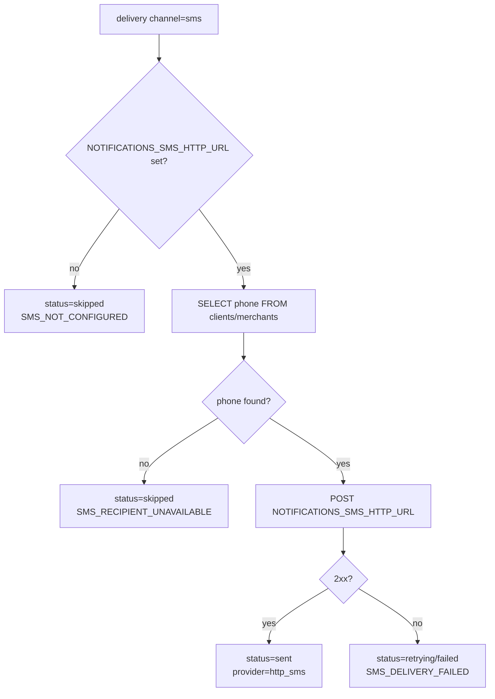

HTTP request to provider:

```http
POST <NOTIFICATIONS_SMS_HTTP_URL>
content-type: application/json
authorization: Bearer <NOTIFICATIONS_SMS_HTTP_TOKEN> // only if token configured
```

Body:

```json
{
  "to": "+992...",
  "message": "Payment for order DC-00000001 was received successfully.",
  "sender": "SecureDeal"
}
```

Provider response may include `messageId` or `id`; code reads it, but current delivery table does not persist provider message id.

## 13. Event catalog

Ниже — текущий registry + найденные producers. В таблице указаны типовые получатели; конкретный producer может пропустить получателя, если ID отсутствует, или расширить список активными admin/operator IDs.

| Event type | Domain | Source entity | Кто получает | Priority | Channels | Когда создается |
| --- | --- | --- | --- | --- | --- | --- |
| `order.created` | `orders` | `order` | `client` если есть `client_id`, `merchant` | `normal` | `in_app`, `ws` | Клиент создал заказ; heartbeat может создавать synthetic merchant event. |
| `order.status.changed` | `orders` | `order` | `client`, `merchant` в order/dispute/auto-confirm flows | `normal` или `high` | `in_app`, `ws` | Доставка, completion, auto-complete, dispute SLA close. |
| `order.inspection.started` | `orders` | `order` | `client`, `merchant`; cron heartbeat может client-only | `normal` или `high` | `in_app`, `ws` | Начался inspection period. |
| `payment.confirmed` | `payments` | `order` | `client`, `merchant` | `normal` | `in_app`, `ws`, иногда `sms` | Успешная оплата. |
| `payment.pending` | `payments` | `order` | `client` | `normal` | `in_app`, `ws` | Платеж ожидает подтверждения. |
| `payment.failed` | `payments` | `order` | `client` | `high` | `in_app`, `ws` | Платеж не прошел. |
| `payout.created` | `payments` | `order` или `dispute` | `merchant` | `normal` | `in_app`, `ws` | Создана выплата после order completion/dispute resolution/SLA. |
| `dispute.opened` | `disputes` | `dispute` | `client`, `merchant`, все active operators | `high`; operator может `critical` | `in_app`, `ws` | Открыт спор. |
| `dispute.assigned` | `disputes` | `dispute` | assigned `operator` | `high` | `in_app`, `ws` | Спор назначен оператору. |
| `dispute.status.changed` | `disputes` | `dispute` | `client`, `merchant`, assigned `operator` если есть | `high` или `normal` | `in_app`, `ws` | Спор перешел в review/resolved или закрыт SLA. |
| `dispute.message.created` | `disputes` | `dispute` | Все стороны кроме отправителя; assigned operator если не отправитель | `high` | `in_app`, `ws` | Новое сообщение в споре. |
| `dispute.sla.warning` | `disputes` | `dispute` | `client` если есть, `merchant` | `high` | `in_app`, `ws` | Cron предупреждает, что спор скоро закроется по SLA. |
| `dispute.sla.closed` | `disputes` | `dispute` | `client` если есть, `merchant` | `high` | `in_app`, `ws` | Cron автоматически закрыл спор по SLA. |
| `review.created` | `reviews` | `product_review` | `merchant` | `normal` | `in_app`, `ws` | Клиент оставил product review. |
| `merchant.review.created` | `reviews` | `merchant_review` | `merchant`, active operators | `normal` | `in_app`, `ws` | Клиент оставил merchant review; operator получает moderation notification. |
| `merchant.review.status.changed` | `reviews` | `merchant_review` | `client`, `merchant` | `normal` | `in_app`, `ws` | Статус merchant review обновлен. |
| `merchant.status.changed` | `verification` | `merchant` | `merchant` | `high` или `critical` при block в merchant profile flow | `in_app`, `ws` | Аккаунт merchant активирован/заблокирован/разблокирован. |
| `operator.created` | `security` | `operator` | сам `operator`, все active admins | `normal` | `in_app`, `ws` | Создан operator account. |
| `operator.updated` | `security` | `operator` | сам `operator`, все active admins | `normal` | `in_app`, `ws` | Обновлен профиль operator. |
| `operator.permissions.updated` | `security` | `operator` | сам `operator`, все active admins | `normal` | `in_app`, `ws` | Изменены permissions operator. |
| `system.jurataxi_request_failed` | `system` | `order` | active admins, active operators | `critical` | `in_app`, `ws` | Не удалось создать/повторить Jurataxi delivery request. Backend producer передает `kind=critical_alert`. |
| `system.jurataxi_delivery_failed` | `system` | `order` | active admins, active operators | `critical` | `in_app`, `ws` | Jurataxi webhook сообщил terminal delivery status. Backend producer передает `kind=critical_alert`. |
| `system.order_auto_confirm_failed` | `system` | `order` | active admins, active operators | `critical` | `in_app`, `ws` | Автоматическое подтверждение заказа упало. В registry это critical alert, но один backend producer сейчас не передает `kind`, поэтому DB default может быть `business`, если не исправлено producer'ом. |

## 14. Event payload shapes

### 14.1 Orders

`order.created`:

```json
{
  "orderId": "uuid",
  "orderNumber": "DC-00000001",
  "merchantId": "uuid",
  "clientId": "uuid или null",
  "totalAmount": 1200
}
```

`order.status.changed`:

```json
{
  "orderId": "uuid",
  "orderNumber": "DC-00000001",
  "status": "delivered | completed | refunded | ..."
}
```

`order.inspection.started`:

```json
{
  "orderId": "uuid",
  "orderNumber": "DC-00000001",
  "inspectionHours": 48
}
```

### 14.2 Payments / payouts

`payment.confirmed | payment.pending | payment.failed`:

```json
{
  "orderId": "uuid",
  "orderNumber": "DC-00000001",
  "paymentId": "uuid",
  "amount": 1250,
  "provider": "dcity",
  "status": "success | pending | failed"
}
```

`payout.created`:

```json
{
  "merchantId": "uuid",
  "amount": 1250,
  "orderId": "uuid",
  "orderNumber": "DC-00000001",
  "disputeId": "uuid"
}
```

`orderId`, `orderNumber`, `disputeId` зависят от source flow: payout может быть создан по заказу или спору.

### 14.3 Disputes

`dispute.opened`:

```json
{
  "disputeId": "uuid",
  "orderId": "uuid",
  "cause": "not-as-described"
}
```

`dispute.assigned`:

```json
{
  "disputeId": "uuid",
  "orderId": "uuid",
  "operatorId": "uuid"
}
```

`dispute.status.changed`:

```json
{
  "disputeId": "uuid",
  "orderId": "uuid",
  "status": "in_review | resolved | ...",
  "finalStatus": "completed | refunded"
}
```

`dispute.message.created`:

```json
{
  "disputeId": "uuid",
  "orderId": "uuid",
  "messageId": "string",
  "senderRole": "client | merchant | operator | admin"
}
```

`dispute.sla.warning`:

```json
{
  "disputeId": "uuid",
  "orderId": "uuid",
  "closesAt": "2026-05-07T06:41:23.429Z",
  "warningHours": 6
}
```

`dispute.sla.closed`:

```json
{
  "disputeId": "uuid",
  "orderId": "uuid",
  "status": "completed | refunded | ..."
}
```

### 14.4 Reviews

`review.created`:

```json
{
  "reviewId": "uuid",
  "productId": "uuid",
  "orderId": "uuid",
  "merchantId": "uuid",
  "rating": 5
}
```

`merchant.review.created`:

```json
{
  "reviewId": "uuid",
  "merchantId": "uuid",
  "clientId": "uuid",
  "rating": 5
}
```

`merchant.review.status.changed`:

```json
{
  "reviewId": "uuid",
  "merchantId": "uuid",
  "clientId": "uuid",
  "status": "approved | rejected | ..."
}
```

### 14.5 Security / verification

`merchant.status.changed`:

```json
{
  "merchantId": "uuid",
  "status": "active | blocked"
}
```

`operator.created | operator.updated | operator.permissions.updated`:

```json
{
  "operatorId": "uuid",
  "login": "operator-login",
  "status": "active | blocked | ...",
  "permissions": ["dashboard:view", "orders:list"]
}
```

Cron-worker heartbeat может добавлять в payload `emittedAt`, `sequence`, `source`, `reason`.

### 14.6 System alerts

`system.jurataxi_request_failed`:

```json
{
  "orderId": "uuid",
  "deliveryRequestRef": "string",
  "attempt": 1,
  "maxAttempts": 3,
  "willRetry": true,
  "lastError": "HTTP 500"
}
```

`system.jurataxi_delivery_failed`:

```json
{
  "orderId": "uuid",
  "deliveryId": "uuid",
  "externalDeliveryId": "provider-id",
  "providerStatus": "failed | cancelled | ...",
  "lastError": "optional error"
}
```

`system.order_auto_confirm_failed`:

```json
{
  "orderId": "uuid",
  "orderNumber": "DC-00000001",
  "error": "error message"
}
```

### 14.7 Internal / loose / test-only event types

Основной production catalog описан в разделе 13 и совпадает с backend `NotificationEventType`/`INotificationEventRegistry`, плюс cron-worker SLA events. При audit по коду также найдены loose event types, которые не являются отдельными пользовательскими notification types в production catalog, но важны для полноты картины:

| Event type | Где найден | Durable inbox? | Назначение / почему не в основной таблице |
| --- | --- | --- | --- |
| `dispute.chat.broadcast` | `DisputesService.broadcastChatRoom(...)` | Нет, если используется штатный rooms-only path `recipients=[] rooms=[...]` | Internal event для unified pipeline: нужен, чтобы отправить `dispute.chat.message.created/system` в `/disputes-chat` без создания notification rows. Сам пользователь получает не `dispute.chat.broadcast`, а gateway event `dispute.chat.message.created` или `dispute.chat.message.system`. |
| `promotion.published` | `notification-event-publisher.service.spec.ts` | Только в unit test | Тест loose event с domain `promotions`, проверяет, что publisher умеет принимать неизвестный registry event type. Production producer не найден. |
| `system.heartbeat` | `notification-delivery.worker.integration.spec.ts` | Только в integration test | Тест worker delivery pipeline. Production producer не найден. |
| `admin.gateway.probe` | `admin-notifications.realtime.spec.ts` | Только в realtime test | Тест gateway emit для admin. |
| `admin.visible.event` | `admin-notifications.realtime.spec.ts` | Только в realtime test | Тест изоляции admin recipients. |
| `admin.hidden.event` | `admin-notifications.realtime.spec.ts` | Только в realtime test | Тест, что чужой admin не получает событие. |
| `admin.isolation.negative` | `admin-notifications.realtime.spec.ts` | Только в realtime test | Negative test role/recipient isolation. |
| `admin.offline.target` | `admin-notifications.realtime.spec.ts` | Только в realtime test | Тест offline recipient behavior. |
| `admin.test.event` | `notification-delivery-queue.service.spec.ts` | Только в unit test | Тест Redis queue payload. |

Вывод по полноте типов: production event types перечислены в разделе 13, chat gateway events перечислены в разделе 8.4, а все найденные internal/test loose literals перечислены здесь, чтобы не было скрытых пропусков.

## 15. `body` shape for UI detail screens

`body` не имеет единой жесткой JSON schema, но текущие producers используют общий паттерн:

```json
{
  "summary": "Короткое описание для detail-screen",
  "facts": [
    { "label": "Номер заказа", "value": "DC-00000001" }
  ],
  "sections": [
    {
      "title": "Контекст",
      "items": [
        { "label": "Статус", "value": "Доставлен" }
      ]
    }
  ],
  "actions": [
    {
      "type": "open_order",
      "label": "Open order",
      "target": "/orders/<orderId>"
    }
  ],
  "orderId": "uuid",
  "orderNumber": "DC-00000001",
  "status": "delivered"
}
```

Общие поля:

| Поле | Тип | Использование |
| --- | --- | --- |
| `summary` | string | Основной текст detail-screen. |
| `facts` | array `{label,value}` | Короткие ключ-значения. |
| `sections` | array `{title,items}` | Группированные детали. |
| `actions` | array | Кнопки/CTA. REST также выносит их в top-level `actions`. |
| `imageUrl` | string | Поддерживается cron-worker types для UI, не обязателен. |
| `badge` | string | UI бейдж. |
| `amount` | number | Денежная сумма. |
| `orderId`, `orderNumber`, `paymentId`, `disputeId`, `reviewId`, `merchantId`, `operatorId` | string | IDs для навигации/деталей. |
| `status`, `cause`, `provider`, `permissions` | string/array | Доменный контекст. |

Action types из backend registry:

| Action type | Назначение |
| --- | --- |
| `open_order` | Открыть конкретный заказ. |
| `open_orders_list` | Открыть список заказов. |
| `open_dispute` | Открыть конкретный спор. |
| `open_disputes_list` | Открыть список споров. |
| `open_operator` | Открыть конкретного оператора. |
| `open_operators_list` | Открыть список операторов. |
| `open_notification_center` | Вернуться/перейти в notification center. |
| `open_admin_notification` | Открыть admin notifications. |

Замечание: в одном cron-worker heartbeat найден `open_reviews_list`, которого нет в backend `NotificationActionType` enum, но REST `NotificationActionResponse` принимает любой string action type. Поэтому фронт должен быть tolerant к новым action strings.

## 16. Кто получает и почему

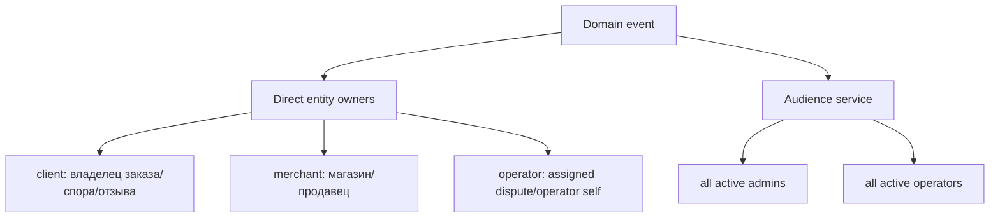

Правила:

- **Client** получает события, которые влияют на его заказ, платеж, спор или оставленный review.
- **Merchant** получает события, которые влияют на его магазин, заказ, выплату, отзыв или dispute side.
- **Operator** получает:
  - спор, если он активный operator и событие требует очереди/moderation;
  - спор, если он assigned operator;
  - собственные lifecycle notifications (`operator.created/updated/permissions.updated`);
  - critical system alerts.
- **Admin** получает:
  - operator lifecycle events по всем active admins;
  - critical system alerts.

Для массовой аудитории `NotificationAudienceService` читает active IDs из таблицы `admins`:

- `getActiveAdminIds()` → `role='admin' AND status='active'`;
- `getActiveOperatorIds()` → `role='operator' AND status='active'`.

## 17. Идемпотентность и deduplication

Идемпотентность построена на двух уровнях:

| Уровень | Constraint / SQL behavior | Результат |
| --- | --- | --- |
| Event | `notification_events.event_key UNIQUE`; insert uses `ON CONFLICT(event_key) DO UPDATE SET event_key = EXCLUDED.event_key RETURNING ...` | Повторная публикация с тем же `eventKey` возвращает тот же event row и не создает новый event. |
| Recipient | `UNIQUE(event_id, recipient_role, recipient_id)`; insert uses `ON CONFLICT DO UPDATE` | Повтор обновляет category/title/message/body/priority для того же получателя. |
| Delivery | `UNIQUE(recipient_notification_id, channel)`; insert uses `ON CONFLICT DO UPDATE` | Повтор не создает дубликат channel delivery; `sent` delivery не откатывается в pending. |

Почему delivery `sent` не перезаписывается:

```sql
status = CASE
  WHEN notification_deliveries.status = 'sent' THEN notification_deliveries.status
  ELSE EXCLUDED.status
END
```

Это защищает уже доставленный канал от случайного повторного enqueue как pending.

## 18. Ошибки доставки

| Code | Где возникает | Итоговый status | Значение |
| --- | --- | --- | --- |
| `WS_ROOM_EMPTY` | Backend inline `NotificationDeliveryService` | `skipped` | Получатель offline на этом backend instance. |
| `WS_DELIVERY_FAILED` | Backend inline или cron-worker WS publish | `retrying` или `failed` | Ошибка WS emit / Redis PubSub publish. |
| `SMS_NOT_CONFIGURED` | SMS dispatch | `skipped` | `NOTIFICATIONS_SMS_HTTP_URL` не задан. |
| `SMS_RECIPIENT_UNAVAILABLE` | SMS dispatch | `skipped` | Телефон получателя не найден. |
| `SMS_DELIVERY_FAILED` | SMS provider returned non-2xx / request failed | `retrying` или `failed` | Ошибка SMS provider'а. |
| `CHANNEL_NOT_SUPPORTED` | Dispatch channel не `ws`/`sms`/`in_app` | `skipped` | `push/email` пока не реализованы в V1; если такие delivery rows дошли до dispatch, они завершаются этим кодом. |
| `DELIVERY_NOT_FOUND` | Worker claim succeeded, but dispatch row не найден | `skipped` | Защитный случай рассинхронизации. |

## 19. Critical alerts

Critical alerts — это не отдельная таблица, а subset inbox-уведомлений:

```sql
ne.kind = 'critical_alert'
AND nr.priority = 'critical'
```

Admin critical endpoint:

```http
GET /api/admin/notifications/critical-alerts
```

Backend service также имеет `getManyRecipientCriticalAlerts(role, recipientId, query)` для `ADMIN | OPERATOR`, но отдельный operator critical-alerts route сейчас не найден.

Текущие critical candidates:

| Event type | Intended kind | Priority | Получатели |
| --- | --- | --- | --- |
| `system.jurataxi_request_failed` | `critical_alert` | `critical` | active admins + active operators |
| `system.jurataxi_delivery_failed` | `critical_alert` | `critical` | active admins + active operators |
| `system.order_auto_confirm_failed` | registry/migration считает critical | `critical` | active admins + active operators |

Migration backfill переводит существующие rows этих event types в `critical_alert`.

## 20. Heartbeat notifications

Heartbeat jobs в cron-worker предназначены для frontend smoke-тестов. Они **disabled by default** и создают реальные notification rows, если включены.

| Job | Env enabled flag | Recipient env | Interval env | События |
| --- | --- | --- | --- | --- |
| `AdminNotificationHeartbeatJob` | `NOTIFICATIONS_ADMIN_HEARTBEAT_ENABLED` | `NOTIFICATIONS_ADMIN_HEARTBEAT_RECIPIENT_ID` | `NOTIFICATIONS_ADMIN_HEARTBEAT_INTERVAL_MS`, default `2000` | `operator.created`, `operator.updated`, `operator.permissions.updated` |
| `ClientNotificationHeartbeatJob` | `NOTIFICATIONS_CLIENT_HEARTBEAT_ENABLED` | `NOTIFICATIONS_CLIENT_HEARTBEAT_RECIPIENT_ID` | `NOTIFICATIONS_CLIENT_HEARTBEAT_INTERVAL_MS`, default `2000` | `order.status.changed`, `order.inspection.started`, `payment.confirmed`, `dispute.opened` |
| `MerchantNotificationHeartbeatJob` | `NOTIFICATIONS_MERCHANT_HEARTBEAT_ENABLED` | `NOTIFICATIONS_MERCHANT_HEARTBEAT_RECIPIENT_ID` | `NOTIFICATIONS_MERCHANT_HEARTBEAT_INTERVAL_MS`, default `2000` | `order.created`, `payout.created`, `dispute.message.created`, `merchant.review.created` |

Назначение heartbeat:

- Проверить cron-worker → Postgres → Redis queue → delivery worker → Redis Pub/Sub → backend bridge → browser.
- Проверить list/detail rendering на фронте.
- Не использовать как production business logic.

## 21. Конфигурация

### 21.1 Backend env defaults

| Env | Default | Значение |
| --- | --- | --- |
| `RETRY_BACKOFF_MS` | `1000,2000,4000` | Backoff для backend inline fallback delivery. |
| `NOTIFICATIONS_DELIVERY_RETRY_POLL_MS` | `0` | Если >0, backend запускает retry polling loop через `NotificationDeliveryRetryService`. |
| `NOTIFICATIONS_DELIVERY_BATCH_SIZE` | `50` | Размер batch для backend `dispatchDue`. |
| `NOTIFICATIONS_DELIVERY_MAX_ATTEMPTS` | `3` | Максимум попыток доставки. |
| `NOTIFICATIONS_CLAIM_STUCK_SECONDS` | `60` | Через сколько claim считается зависшим в backend SQL paths. |
| `NOTIFICATIONS_SMS_HTTP_URL` | unset | URL SMS provider'а. |
| `NOTIFICATIONS_SMS_HTTP_TOKEN` | unset | Bearer token для SMS provider'а. |
| `NOTIFICATIONS_SMS_SENDER` | unset | Sender field для SMS body. |

### 21.2 Cron-worker env defaults

| Env | Default | Значение |
| --- | --- | --- |
| `NOTIFICATIONS_DELIVERY_MAX_ATTEMPTS` | `3` | Максимум worker attempts. |
| `NOTIFICATIONS_RETRY_BACKOFF_MS` | `1000,5000,30000` | Worker retry backoff. |
| `NOTIFICATIONS_QUEUE_BLOCK_TIMEOUT_SECONDS` | `5` | Timeout для `BRPOP`. |
| `NOTIFICATIONS_CLAIM_STUCK_SECONDS` | `300` | Stuck claim TTL worker'а. |
| `NOTIFICATIONS_SMS_HTTP_URL` | unset | URL SMS provider'а. |
| `NOTIFICATIONS_SMS_HTTP_TOKEN` | unset | Bearer token. |
| `NOTIFICATIONS_SMS_SENDER` | unset | Sender. |
| `NOTIFICATIONS_*_HEARTBEAT_ENABLED` | `false` | Включает synthetic notification traffic. |
| `NOTIFICATIONS_*_HEARTBEAT_INTERVAL_MS` | `2000` | Интервал heartbeat. |

## 22. Текущие ограничения и важные нюансы

1. **WS payload shape не полностью унифицирован**: REST возвращает camelCase, backend inline WS тоже camelCase, cron-worker WS bridge фактически отправляет snake_case и без `kind/actions`.
2. **Worker-side publish не пишет `kind`**: cron-worker SQL insert не включает column `kind`, поэтому default `business`.
3. **SMS только client/merchant**: phone lookup не поддерживает admin/operator.
4. **Push/email зарезервированы, но не реализованы**: delivery rows с этими каналами будут skipped при dispatch.
5. **`read-state` bulk PATCH есть только у client route**: merchant/admin/operator имеют `mark one read` и `read-all`, но не имеют bulk unread/read endpoint.
6. **Operator critical alerts service существует, route не найден**: есть service method для role `OPERATOR`, но отдельного `/api/operator/notifications/critical-alerts` сейчас нет.
7. **Rooms-only broadcasts не durable**: dispute chat broadcasts через `rooms` — best-effort realtime, не inbox notification.
8. **Socket.IO cluster behavior зависит от adapter**: bridge comment указывает, что при нескольких backend replicas нужен Socket.IO Redis adapter, иначе `server.to(room)` отправит только sockets на текущем instance.

## 23. Минимальные сценарии для проверки вручную

### 23.1 Получить inbox

```http
GET /api/client/notifications?page=1&limit=10&is_read=false
```

Ожидание:

- response содержит `metadata` и `items`;
- `items[].id` — это `notification_recipients.id`;
- `items[].actions` извлечены из `body.actions`;
- `items[].kind` есть в REST и default `business`, если DB kind отсутствует/не передан.

### 23.2 Realtime

1. Авторизоваться как нужная роль.
2. Подключиться к Socket.IO namespace `/notifications` с credentials.
3. Убедиться, что socket join'ится в room `notifications:<role>:<userId>`.
4. Создать событие producer'ом или включить heartbeat.
5. Получить `notification.created`.
6. После события перезапросить REST inbox при необходимости reconcile.

### 23.3 Read state

```http
POST /api/client/notifications/<notificationId>/read
```

Ожидание:

- только владелец уведомления может изменить state;
- `isRead=true`;
- `readAt` заполнен;
- повторный вызов не меняет исходный `readAt`, потому что используется `COALESCE(read_at, now())`.

### 23.4 SMS

Для события с `channels: ['in_app', 'ws', 'sms']`:

- если `NOTIFICATIONS_SMS_HTTP_URL` unset → delivery `skipped`, `last_error_code=SMS_NOT_CONFIGURED`;
- если у recipient нет phone → `skipped`, `SMS_RECIPIENT_UNAVAILABLE`;
- если provider вернул non-2xx → `retrying` до max attempts, затем `failed`;
- если provider вернул 2xx → `sent`, `provider=http_sms`, `sent_at` заполнен.
