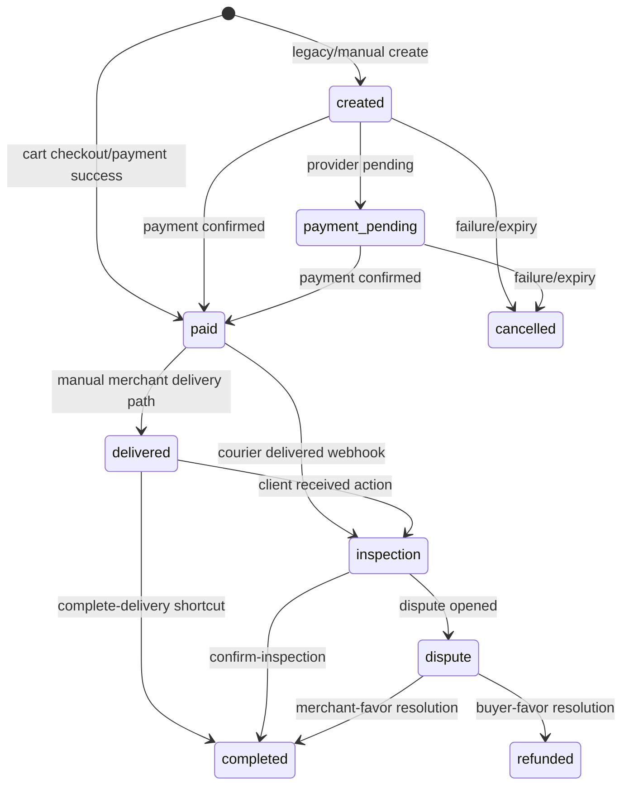

# Orders specification

This document describes the current implemented order behavior in `app/backend`.

## Scope

The orders domain owns:

- cart-based checkout into one or more merchant orders;
- payment state changes and webhook-driven transitions;
- delivery creation and delivery status tracking;
- client delivery confirmation and inspection flow;
- dispute entry from the order lifecycle;
- payout creation after terminal merchant-favor outcomes.

## Identifiers

| Field | Meaning |
| --- | --- |
| `orders.id` | Internal UUID used by APIs and UI routes. |
| `orders.order_id` | Public numeric order number for display. |
| `orders.delivery_location_id` | Saved client delivery-address UUID bound to the order. |

## Checkout routes

| Method | Route | Purpose |
| --- | --- | --- |
| `POST` | `/api/client/orders/batch_create` | Checkout the full current cart. Creates one order per merchant group. |
| `POST` | `/api/client/orders` | Checkout only the current cart slice for a selected `merchant_slug`. |

Request body:

```json
{
  "delivery_address_id": "uuid"
}
```

Single-merchant checkout:

```json
{
  "delivery_address_id": "uuid",
  "merchant_slug": "techno-plus"
}
```

## Checkout rules

1. Checkout requires an authenticated client.
2. Checkout is cart-based; it does not accept arbitrary line items in the request body.
3. `delivery_address_id` is required and must belong to the current client.
4. Backend groups cart items by merchant and creates one order per merchant group.
5. `delivery_fee` is currently `15` per created order.
6. Stock is validated and decremented transactionally.
7. Successful checkout creates paid orders and may create delivery rows immediately.
8. **Cart items are preserved after order creation. Checkout does not clear the cart automatically.**

## Buyer order detail

`GET /api/client/orders/:id` returns buyer-facing detail by order UUID.

Important fields:

- `id`, `order_id`
- `merchant_id`, `merchant_slug`, `merchant_store_name`
- `client_id`, `client_phone`, `client_name`
- `delivery_address_id`
- `delivery_address_location`
- `status`, `payment_status`
- `status_rendering`
- `dispute_reason`, `inspection_comment`
- `items`
- `paid_at`, `delivered_at`, `inspection_ends_at`, `completed_at`, `cancelled_at`

## Business statuses

- `created`
- `payment_pending`
- `paid`
- `merchant_pending`
- `delivered`
- `inspection`
- `completed`
- `dispute`
- `refunded`
- `cancelled`

## Payment statuses

- `unpaid`
- `pending`
- `paid`
- `failed`

## Main lifecycle



## Delivery rules

Provider: JuraTaxi.

| Delivery status | Order effect |
| --- | --- |
| `requested` | order stays `paid` |
| `accepted` | order stays `paid` |
| `picked_up` | order stays `paid` |
| `delivered` | order moves to `inspection` |
| `failed` | delivery row changes; order is not auto-completed |
| `cancelled` | delivery row changes; order is not auto-completed |

## Client actions

| Method | Route | Rule |
| --- | --- | --- |
| `GET` | `/api/client/orders` | Current-client list. |
| `GET` | `/api/client/orders/:id` | Current-client detail by UUID. |
| `PUT` | `/api/client/orders/:id/received` | Starts inspection when status is `delivered`. |
| `POST` | `/api/client/orders/:id/complete-delivery` | Immediately completes a delivered order. |
| `POST` | `/api/client/orders/:id/confirm-inspection` | Completes inspection when status is `inspection`. |
| `POST` | `/api/client/disputes` | Canonical dispute creation. |

## Notes

- `merchant_pending` still exists in the backend contract, but normal checkout is not fully switched to emit it by default.
- Use `orders.id` for all API calls and deep links; `order_id` is display-only.
- Delivery movement belongs to delivery rows, not to extra invented order statuses like `shipped`.
