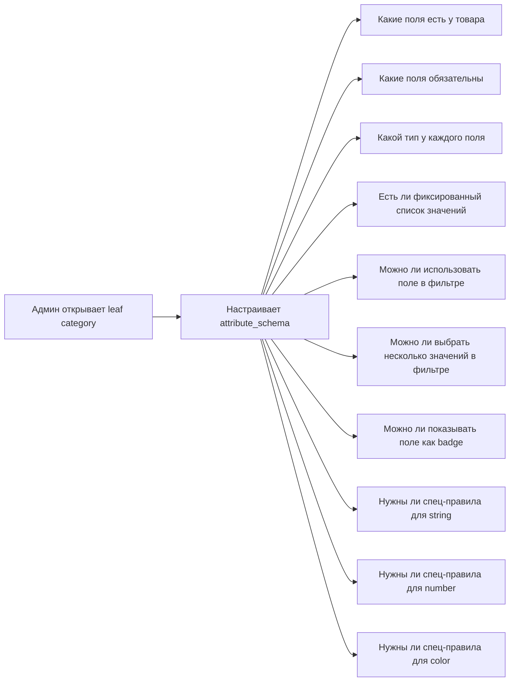
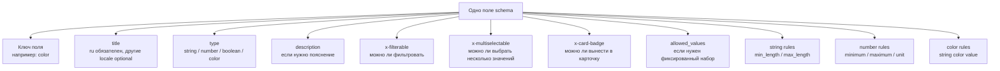
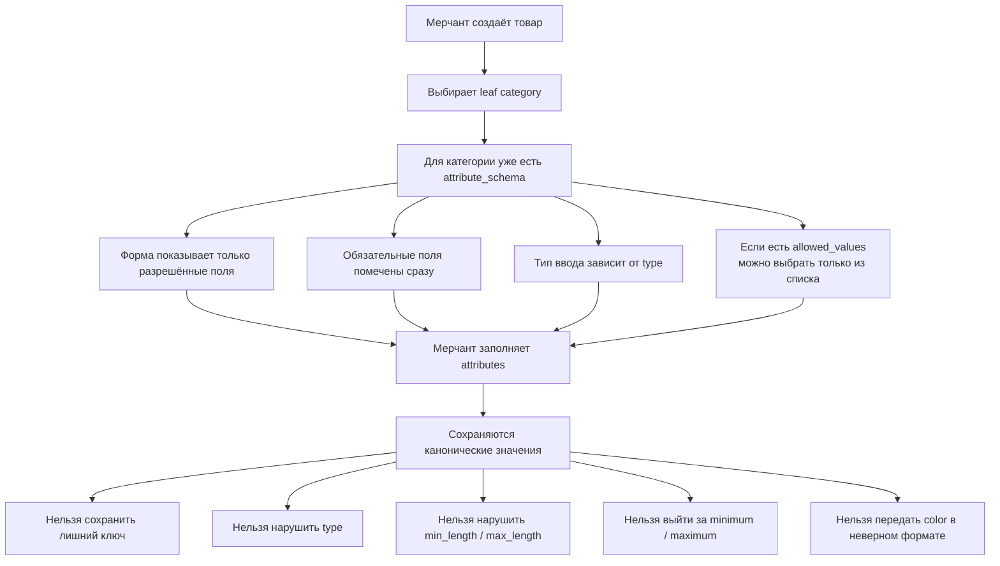
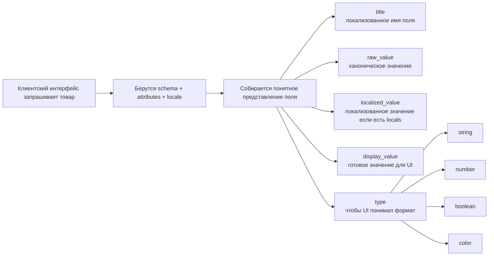

# Спецификация `category.attribute_schema` v2

## 1. Назначение

Этот документ фиксирует целевой контракт `categories.attribute_schema` для Secure Deal.

Он нужен как единый source of truth для:

- backend-валидации category schema;
- backend-валидации `products.attributes`;
- admin-panel category editor;
- merchant-panel product forms;
- catalog filters / product badges / product variants;
- presentation layer для локализованных значений.

Это не roadmap и не исследование. Это нормативная спецификация формы данных.

Для текущего admin-panel category editor также важно, что UI редактирования категории сейчас показывает флаги `x-filterable`, `x-multiselectable` и `x-card-badge`; ручная настройка `x-sortable` скрыта и не используется в обычном админском потоке.

---

## 2. Базовая модель

Система состоит из двух связанных сущностей:

1. `categories.attribute_schema` — контракт атрибутов для leaf category.
2. `products.attributes` — фактические значения атрибутов конкретного товара.

Дополнительные правила роли категории:

- родительская категория используется как структурный узел дерева и не должна иметь `attribute_schema`;
- дочерняя (leaf / product-facing) категория обязана иметь непустой `attribute_schema`;
- `slug` категории генерируется backend и не является частью ручного админского ввода;
- пустая родительская категория может существовать в admin tree, но не должна попадать в client-facing category tree/list, пока у неё нет активных дочерних категорий.

Правило источника истины:

- категория определяет, **какие** атрибуты допустимы и как они интерпретируются;
- товар хранит только **raw canonical values**;
- локализованные display values вычисляются на backend из schema metadata и кодовых словарей там, где это применимо.

---

## 3. Root contract

`attribute_schema` всегда должен быть объектом следующего вида:

```json
{
  "type": "object",
  "properties": {
    "attribute_key": {
      "...": "AttributeProperty"
    }
  },
  "required": ["attribute_key"]
}
```

### 3.1. Допустимые root-level поля

| Field        | Type                                | Required | Description                                                           |
| ------------ | ----------------------------------- | -------- | --------------------------------------------------------------------- |
| `type`       | `"object"`                          | Yes      | Корневой тип схемы. Любое другое значение запрещено.                  |
| `properties` | `Record<string, AttributeProperty>` | Yes      | Map атрибутов категории.                                              |
| `required`   | `string[]`                          | No       | Список обязательных атрибутов. Если поле отсутствует, считается `[]`. |

### 3.2. Ограничения root-level

- Дополнительные root-level поля не допускаются.
- Любые root-level legacy/ad-hoc поля также запрещены.
- Каждый ключ из `required` обязан существовать в `properties`.
- `properties` не может быть `null`.
- Для leaf category, используемой в product flows, `properties` не должен быть пустым.
- Если категория выбрана как дочерняя/product-facing в admin flow, пустой `attribute_schema` считается невалидным состоянием и не должен сохраняться.

---

## 4. Attribute key rules

Ключ атрибута внутри `properties` — это стабильный технический идентификатор.

### 4.1. Рекомендации по ключам

- использовать `snake_case` как базовый стандарт;
- только латиница, цифры и `_`;
- без пробелов, локализации и специальных символов;
- ключ должен быть стабильным и не зависеть от UI-текста.

### 4.2. Примеры допустимых ключей

- `brand`
- `model`
- `color`
- `warranty_months`
- `engine_type`
- `weight_kg`
- `for_gender`

### 4.3. Примеры недопустимых ключей

- `Цвет`
- `Color Name`
- `brand-name`
- `Размер товара`

---

## 5. `AttributeProperty` contract

Каждый объект внутри `properties` обязан соответствовать следующему shape.

### 5.1. Обязательные поля

| Field   | Type                                                     | Required | Description                                          |
| ------- | -------------------------------------------------------- | -------- | ---------------------------------------------------- |
| `type`  | `"string" \| "number" \| "boolean" \| "color" \| "date"` | Yes      | Доменный тип атрибута.                               |
| `title` | `{ ru: string, tj?: string }`                            | Yes      | Локализованное имя поля для UI и presentation layer. |

### 5.2. Допустимые необязательные поля

#### Метаданные поля

| Field         | Type                          | Allowed for | Description                                                                            |
| ------------- | ----------------------------- | ----------- | -------------------------------------------------------------------------------------- |
| `description` | `{ ru: string, tj?: string }` | all         | Подсказка/описание для формы и отображения. Если `description` задан, `ru` обязателен. |

#### x-флаги (поведение в UI и каталоге)

| Field                   | Type                                                   | Allowed for                    | Description                                                                                                                                                                                                                                                                |
| ----------------------- | ------------------------------------------------------ | ------------------------------ | -------------------------------------------------------------------------------------------------------------------------------------------------------------------------------------------------------------------------------------------------------------------------- |
| `x-filterable`          | `boolean`                                              | all                            | Поле можно использовать в catalog filters.                                                                                                                                                                                                                                 |
| `x-multiselectable`     | `boolean`                                              | all                            | Поле можно фильтровать сразу по нескольким значениям. Разрешено только вместе с `x-filterable: true`.                                                                                                                                                                      |
| `x-sortable`            | `boolean`                                              | string, number, boolean        | Legacy-флаг для sorting. Backend может его читать, но текущий admin category editor его не показывает.                                                                                                                                                                     |
| `x-card-badge`          | `boolean`                                              | string, number, boolean, color | Поле можно показывать как badge в product card.                                                                                                                                                                                                                            |
| `x-is-array`            | `boolean`                                              | all                            | Поле принимает массив значений вместо одного. По умолчанию `false`. Если `true`, product value для этого атрибута хранится как JSON array; валидация применяется к каждому элементу массива по отдельности.                                                                |
| `x-grouping-identifier` | `{ key: string, locals: { ru: string, tj?: string } }` | all                            | Сугубо визуальный идентификатор группы. `key` — стабильный технический идентификатор группы; `locals` — локализованное название группы для UI (`ru` обязателен). Используется только для визуальной группировки нескольких свойств в форме; backend его не интерпретирует. |

#### Ограничения для `string`

| Field        | Type     | Description                |
| ------------ | -------- | -------------------------- |
| `min_length` | `number` | Минимальная длина строки.  |
| `max_length` | `number` | Максимальная длина строки. |

#### Ограничения для `number`

| Field     | Type     | Description                                                                                                                        |
| --------- | -------- | ---------------------------------------------------------------------------------------------------------------------------------- |
| `unit`    | `string` | Единица измерения: `kg`, `ml`, `months`, `km`, `hours`.                                                                            |
| `minimum` | `number` | Нижняя граница значения.                                                                                                           |
| `maximum` | `number` | Верхняя граница значения.                                                                                                          |
| `step`    | `number` | Шаг изменения значения. По умолчанию `1`. Если `step: 100`, допустимы только `100`, `200`, `300` и т.д.; значение `123` невалидно. |

#### Ограничения для `date`

| Field      | Type     | Description                                                         |
| ---------- | -------- | ------------------------------------------------------------------- |
| `min_date` | `string` | Опциональная нижняя граница даты в каноническом строковом формате.  |
| `max_date` | `string` | Опциональная верхняя граница даты в каноническом строковом формате. |

#### Ограничения значений

| Field            | Type             | Allowed for           | Description                                                                                                 |
| ---------------- | ---------------- | --------------------- | ----------------------------------------------------------------------------------------------------------- |
| `allowed_values` | `AllowedValue[]` | string, number, color | Optional список допустимых значений. Если поле не задано, допустимо любое значение, соответствующее `type`. |

Любые другие поля внутри `AttributeProperty` запрещены.

### 5.3. `AllowedValue`

`allowed_values` задаёт ограниченный список значений для поля.

Если `allowed_values` отсутствует, поле принимает любое значение, подходящее по `type`.

Если `allowed_values` задан, значение товара должно совпадать с одним из элементов списка.

```json
{
  "value": "new",
  "locals": {
    "ru": "Новый",
    "tj": "Нав"
  }
}
```

### 5.4. Допустимый shape `AllowedValue`

| Field    | Type                          | Required | Description                                                                                                               |
| -------- | ----------------------------- | -------- | ------------------------------------------------------------------------------------------------------------------------- |
| `value`  | `string \| number`            | Yes      | Каноническое значение, которое реально хранится в `products.attributes`.                                                  |
| `locals` | `{ ru: string, tj?: string }` | No\*     | Локализованное представление значения, если для него нужен отдельный display label. Если `locals` задан, `ru` обязателен. |

\* Для `color.allowed_values[*]` поле `locals` обязательно.

### 5.5. Правила локализованных объектов

- базовая locale по умолчанию - `ru`;
- `ru` обязателен для `title`;
- если задан `description`, в нём обязателен `ru`;
- если задан `locals`, в нём обязателен `ru`;
- вторичные локали, включая `tj`, опциональны;
- если запрошенная locale отсутствует, используется fallback на `ru`.

---

## 6. Supported types

## 6.1. `string`

Используется для свободного текстового значения без словаря.

### Допустимые поля

- `type`
- `title`
- `description`
- `x-filterable`
- `x-multiselectable`
- `x-card-badge`
- `min_length`
- `max_length`
- `allowed_values`

### Пример

```json
{
  "type": "string",
  "title": { "ru": "Бренд", "tj": "Бренд" },
  "x-filterable": true,
  "x-multiselectable": true,
  "min_length": 1,
  "max_length": 120
}
```

### Пример product value

```json
{ "brand": "Samsung" }
```

### Правила

- пустая строка недопустима;
- если строка присутствует, её длина должна быть не меньше `1`;
- `x-multiselectable` разрешён только если одновременно задано `x-filterable: true`;
- `min_length` и `max_length` задаются как неотрицательные целые числа;
- `min_length` и `max_length` разрешены только у `string`;
- если заданы оба ограничения, то `min_length <= max_length`.

---

## 6.2. `number`

Используется для числового значения, где важны диапазон и/или единица измерения.

### Допустимые поля

- все общие поля;
- `minimum`;
- `maximum`;
- `unit`;
- `step`;
- `allowed_values`.

### Пример

```json
{
  "type": "number",
  "title": { "ru": "Вес (кг)", "tj": "Вазн (кг)" },
  "x-sortable": true,
  "minimum": 0,
  "unit": "kg"
}
```

### Пример product value

```json
{ "weight_kg": 1.5 }
```

### Правила

- legacy `integer` из старых схем мигрируется в `number`;
- `minimum <= maximum`, если оба заданы;
- product value должен быть JSON number, не строкой;
- число с нулевой дробной частью нормализуется к целому виду: `12.0` -> `12`;
- `step` должен быть положительным числом; если не задан, считается `1`;
- product value должен быть кратен `step` относительно `minimum` (или нуля, если `minimum` не задан): `(value - base) % step === 0`;
- `step` разрешён только при `type = "number"`.

---

## 6.3. `boolean`

Используется для `true/false` признаков.

### Допустимые поля

- все общие поля;

### Пример

```json
{
  "type": "boolean",
  "title": { "ru": "Органический", "tj": "Органикӣ" },
  "x-filterable": true,
  "x-multiselectable": true
}
```

### Пример product value

```json
{ "organic": true }
```

---

## 6.4. `date`

Используется для канонического строкового значения даты.

### Допустимые поля

- `type`
- `title`
- `description`
- `x-filterable`
- `x-multiselectable`
- `x-card-badge`
- `min_date`
- `max_date`

### Пример

```json
{
  "type": "date",
  "title": { "ru": "Дата доставки", "tj": "Санаи таҳвил" },
  "min_date": "2026-01-01",
  "max_date": "2026-12-31"
}
```

### Пример product value

```json
{ "delivery_date": "2026-05-12" }
```

### Правила

- product value хранится как каноническая строка даты;
- `min_date` и `max_date` опциональны;
- если заданы оба ограничения, то `min_date <= max_date`;
- `min_date` и `max_date` разрешены только у `date`.

---

## 6.5. Ограничение значений через `allowed_values`

`allowed_values` можно использовать у `string`, `number` и `color`, чтобы ограничить набор допустимых значений.

### Базовое правило

- если `allowed_values` отсутствует, принимается любое значение подходящего типа;
- если `allowed_values` присутствует, принимаются только значения из списка.

### Пример для `string`

```json
{
  "type": "string",
  "title": { "ru": "Состояние", "tj": "Ҳолат" },
  "x-filterable": true,
  "x-sortable": true,
  "allowed_values": [
    { "value": "new", "locals": { "ru": "Новый", "tj": "Нав" } },
    { "value": "used", "locals": { "ru": "Б/у", "tj": "Истифодашуда" } }
  ]
}
```

### Пример для `number`

```json
{
  "type": "number",
  "title": { "ru": "Объём памяти", "tj": "Ҳаҷми хотира" },
  "allowed_values": [{ "value": 64 }, { "value": 128 }, { "value": 256 }]
}
```

### Пример product value

```json
{ "condition": "new" }
```

### Правила

- `allowed_values[*].value` должен соответствовать `type` свойства;
- для `string`, `number` и `color` в товаре хранится только `value`;
- для `number` сравнение с `allowed_values` выполняется после нормализации `12.0` -> `12`;
- если у элемента есть `locals`, localized display value вычисляется из `locals`;
- для `color` при использовании `allowed_values` каждый элемент обязан содержать `locals`, потому что цвет должен иметь человекочитаемое название;
- `x-sortable` для поля с `allowed_values` допустим только при детерминированном backend sorting;
- старый формат `enum: ["new", "used"]` считается legacy и должен быть нормализован в `allowed_values`.

---

## 6.6. `color`

Используется для цвета как first-class атрибута, а не как обычной строки.

### Допустимые поля

- все общие поля;

### Пример property

```json
{
  "type": "color",
  "title": { "ru": "Цвет", "tj": "Ранг" },
  "x-filterable": true,
  "allowed_values": [
    { "value": "black", "locals": { "ru": "Черный", "tj": "Сиёҳ" } },
    { "value": "white", "locals": { "ru": "Белый", "tj": "Сафед" } },
    { "value": "#1f1f1f", "locals": { "ru": "Графитовый", "tj": "Графитӣ" } }
  ]
}
```

### Canonical product value

```json
"#1f1f1f"
```

### Правила

- product value для `color` всегда хранится как одна строка;
- если задан `allowed_values`, значение должно совпадать с одним из элементов списка;
- если задан `allowed_values`, у каждого color-элемента обязателен `locals` с названием цвета;
- canonical `color` value нормализуется в lowercase;
- literal color key хранится в lowercase;
- hex-значение хранится в lowercase виде: `#ffffff`;
- rgb-значение хранится в lowercase виде: `rgb(255,255,255)`;
- проверка допустимых color formats и literal colors выполняется кодовым валидатором;
- display/localized value для color с `allowed_values` берется из `locals`; для raw color без словаря fallback остается за кодовым представлением.

---

## 7. Cross-field rules

## 7.1. Root rules

- `type` на root всегда `"object"`;
- `required` не может ссылаться на неизвестные ключи;
- дубли ключей в `properties` невозможны;
- неизвестные дополнительные поля должны отклоняться валидатором.

## 7.2. Property rules

- `title.ru` обязателен для всех типов;
- `title.tj` и другие вторичные локали опциональны;
- если задан `description`, в нём обязателен `description.ru`;
- если задан `locals`, в нём обязателен `locals.ru`;
- `min_length` и `max_length` разрешены только при `type = "string"`;
- `unit`, `minimum`, `maximum`, `step` разрешены только при `type = "number"`;
- `allowed_values` разрешён только при `type = "string"`, `type = "number"` или `type = "color"`;
- `x-sortable` разрешён только при `type = "string"`, `type = "number"` или `type = "boolean"`;
- `x-card-badge` нельзя применять там, где значение невозможно безопасно отобразить как короткий badge без product-specific formatting;
- если `x-is-array: true`, product value должен быть JSON array; если `false` или не задан, product value должен быть скаляром.

## 7.3. Category tree rules

- schema допустима только для leaf category;
- parent category со schema не может иметь children;
- если категория перестаёт быть leaf, schema должна быть удалена или запрещена.

---

## 8. Existing category examples from current data

Ниже перечислены типы атрибутов, уже встречающиеся в seed category data.

| Category      | Existing attributes                                                            | Final interpretation                                                                                                 |
| ------------- | ------------------------------------------------------------------------------ | -------------------------------------------------------------------------------------------------------------------- |
| `electronics` | `brand`, `model`, `color`, `warranty_months`, `condition`                      | `brand`/`model` = `string`, `warranty_months` = `number`, `condition` = `string + allowed_values`, `color` = `color` |
| `clothing`    | `size`, `color`, `material`, `gender`, `season`                                | `size`/`gender`/`season` = `string + allowed_values`, `material` = `string`, `color` = `color`                       |
| `auto`        | `brand`, `model`, `year`, `mileage_km`, `engine_type`, `color`, `transmission` | `year`/`mileage_km` = `number`, `engine_type`/`transmission` = `string + allowed_values`, `color` = `color`          |
| `food`        | `weight_kg`, `organic`, `expiry_days`                                          | `weight_kg`/`expiry_days` = `number`, `organic` = `boolean`                                                          |
| `services`    | `duration_hours`, `location`, `remote`                                         | `duration_hours` = `number`, `location` = `string`, `remote` = `boolean`                                             |
| `home`        | `material`, `dimensions`, `color`, `weight_kg`                                 | `material`/`dimensions` = `string`, `weight_kg` = `number`, `color` = `color`                                        |
| `beauty`      | `brand`, `volume_ml`, `for_gender`                                             | `brand` = `string`, `volume_ml` = `number`, `for_gender` = `string + allowed_values`                                 |

---

## 9. Full normalized examples

## 9.1. Electronics schema

```json
{
  "type": "object",
  "properties": {
    "brand": {
      "type": "string",
      "title": { "ru": "Бренд", "tj": "Бренд" },
      "x-filterable": true,
      "x-sortable": true,
      "min_length": 1,
      "max_length": 120
    },
    "model": {
      "type": "string",
      "title": { "ru": "Модель", "tj": "Модел" }
    },
    "color": {
      "type": "color",
      "title": { "ru": "Цвет", "tj": "Ранг" },
      "x-filterable": true,
      "allowed_values": [
        { "value": "black" },
        { "value": "white" },
        { "value": "silver" }
      ]
    },
    "warranty_months": {
      "type": "number",
      "title": { "ru": "Гарантия (мес.)", "tj": "Кафолат (моҳ)" },
      "x-sortable": true,
      "minimum": 0,
      "unit": "months"
    },
    "condition": {
      "type": "string",
      "title": { "ru": "Состояние", "tj": "Ҳолат" },
      "x-filterable": true,
      "x-sortable": true,
      "allowed_values": [
        { "value": "new", "locals": { "ru": "Новый", "tj": "Нав" } },
        {
          "value": "like_new",
          "locals": { "ru": "Как новый", "tj": "Мисли нав" }
        },
        { "value": "used", "locals": { "ru": "Б/у", "tj": "Истифодашуда" } },
        {
          "value": "refurbished",
          "locals": { "ru": "Восстановленный", "tj": "Барқароршуда" }
        }
      ]
    }
  },
  "required": ["brand", "condition"]
}
```

## 9.2. Clothing schema

```json
{
  "type": "object",
  "properties": {
    "size": {
      "type": "string",
      "title": { "ru": "Размер", "tj": "Андоза" },
      "x-filterable": true,
      "x-sortable": true,
      "min_length": 1,
      "max_length": 10,
      "allowed_values": [
        { "value": "XS", "locals": { "ru": "XS", "tj": "XS" } },
        { "value": "S", "locals": { "ru": "S", "tj": "S" } },
        { "value": "M", "locals": { "ru": "M", "tj": "M" } },
        { "value": "L", "locals": { "ru": "L", "tj": "L" } },
        { "value": "XL", "locals": { "ru": "XL", "tj": "XL" } }
      ]
    },
    "color": {
      "type": "color",
      "title": { "ru": "Цвет", "tj": "Ранг" },
      "x-filterable": true,
      "allowed_values": [{ "value": "black" }, { "value": "blue" }]
    },
    "material": {
      "type": "string",
      "title": { "ru": "Материал", "tj": "Мавод" }
    },
    "gender": {
      "type": "string",
      "title": { "ru": "Пол", "tj": "Ҷинс" },
      "x-filterable": true,
      "x-sortable": true,
      "allowed_values": [
        { "value": "male", "locals": { "ru": "Мужской", "tj": "Мардона" } },
        { "value": "female", "locals": { "ru": "Женский", "tj": "Занона" } },
        { "value": "unisex", "locals": { "ru": "Унисекс", "tj": "Унисекс" } }
      ]
    }
  },
  "required": ["size", "gender"]
}
```

---

## 10. Product attribute examples

Ниже примеры canonical `products.attributes`, которые должен принимать backend.

| Category      | Example payload                                                                                                                                                 |
| ------------- | --------------------------------------------------------------------------------------------------------------------------------------------------------------- |
| `electronics` | `{ "brand": "Apple", "model": "iPhone 15 Pro", "color": "black", "warranty_months": 12, "condition": "new" }`                                                   |
| `electronics` | `{ "brand": "Samsung", "model": "Galaxy S24", "color": "#1f1f1f", "warranty_months": 24, "condition": "like_new" }`                                             |
| `clothing`    | `{ "size": "M", "color": "blue", "material": "cotton", "gender": "unisex" }`                                                                                    |
| `auto`        | `{ "brand": "Toyota", "model": "Camry", "year": 2020, "mileage_km": 54000, "engine_type": "hybrid", "color": "rgb(255,255,255)", "transmission": "automatic" }` |
| `food`        | `{ "weight_kg": 1.5, "organic": true, "expiry_days": 20 }`                                                                                                      |
| `services`    | `{ "duration_hours": 2.5, "location": "Dushanbe", "remote": false }`                                                                                            |
| `beauty`      | `{ "brand": "L'Oreal", "volume_ml": 50, "for_gender": "female" }`                                                                                               |

---

## 11. Resolved attribute contract

`resolved_attributes` не хранятся в товаре. Они собираются backend presentation layer из:

- `attribute_schema`;
- raw `products.attributes`;
- `locale`.

### 11.1. Resolved item shape

```json
{
  "key": "color",
  "type": "color",
  "title": "Цвет",
  "raw_value": "black",
  "localized_value": "Черный",
  "display_value": "Черный",
  "hex": "#000000"
}
```

### 11.2. Примеры

| Locale | Raw input                     | Resolved output                                                                                                             |
| ------ | ----------------------------- | --------------------------------------------------------------------------------------------------------------------------- |
| `ru`   | `{ "color": "black" }`        | `{ "key": "color", "type": "color", "title": "Цвет", "raw_value": "black", "localized_value": "Черный", "hex": "#000000" }` |
| `tj`   | `{ "condition": "new" }`      | `{ "key": "condition", "type": "string", "title": "Ҳолат", "raw_value": "new", "localized_value": "Нав" }`                  |
| `ru`   | `{ "engine_type": "hybrid" }` | `{ "key": "engine_type", "type": "string", "title": "Двигатель", "raw_value": "hybrid", "localized_value": "Гибрид" }`      |

---

## 12. Графическая репрезентация

Ниже упрощённая визуализация без привязки к внутренним backend-слоям. Цель секции - быстро показать, кто настраивает схему, как она влияет на товар и что в итоге получает клиентский интерфейс.

### 12.1. Что именно настраивает админ в категории



### 12.2. Из чего состоит одно поле в схеме



### 12.3. Как схема категории управляет созданием товара



### 12.4. Что в итоге получает клиентский интерфейс



---

## 13. Code-level guardrails

Следующие ограничения должны задаваться в коде и валидаторах, но не описываются как часть shape самой category schema:

- максимальное количество attributes в одной category;
- максимальная длина attribute key;
- максимальная длина `title` и `description`;
- максимальное количество элементов в `allowed_values`;
- ограничения для кодовых color dictionaries и валидаторов.
